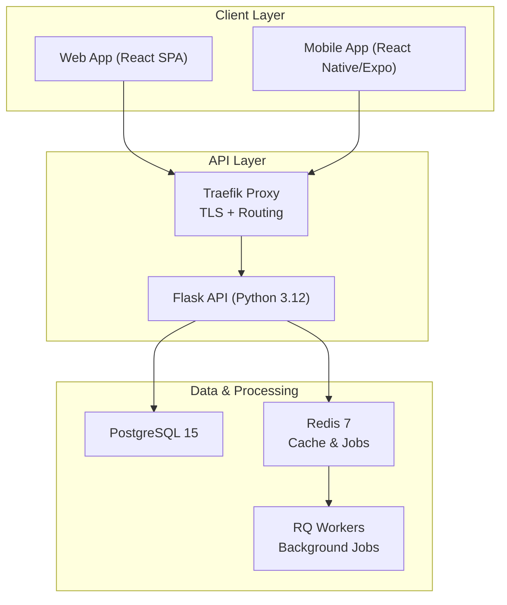
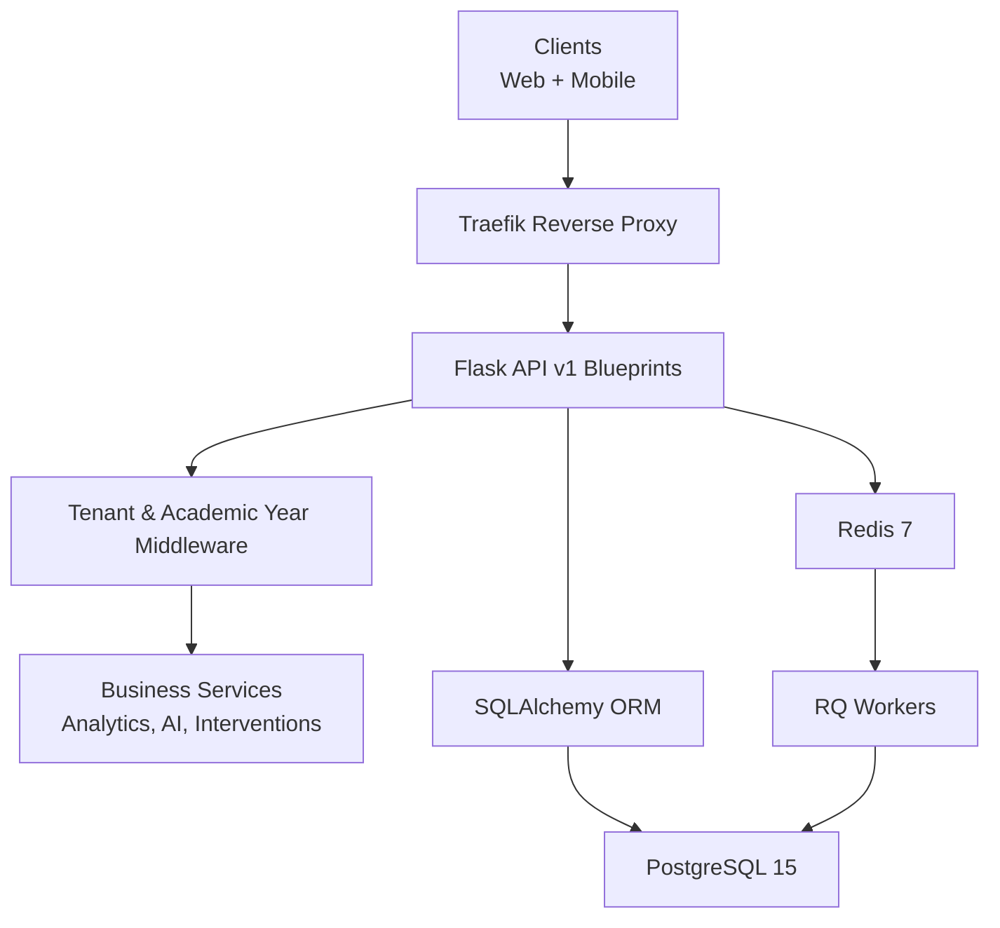
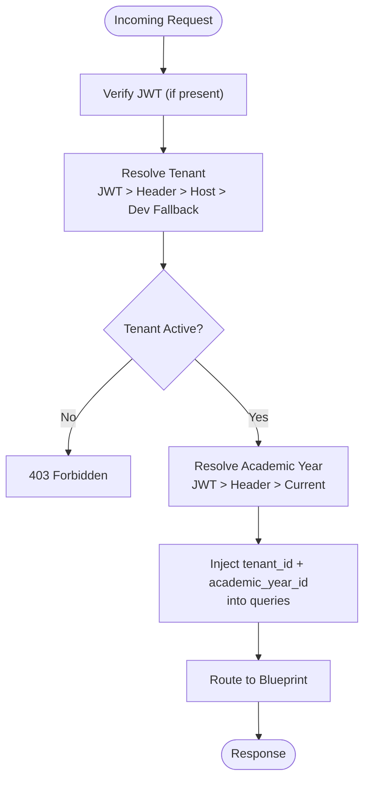
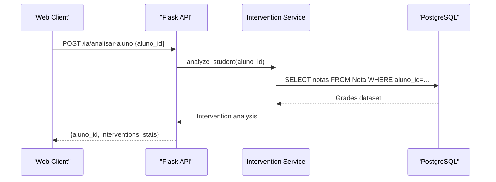
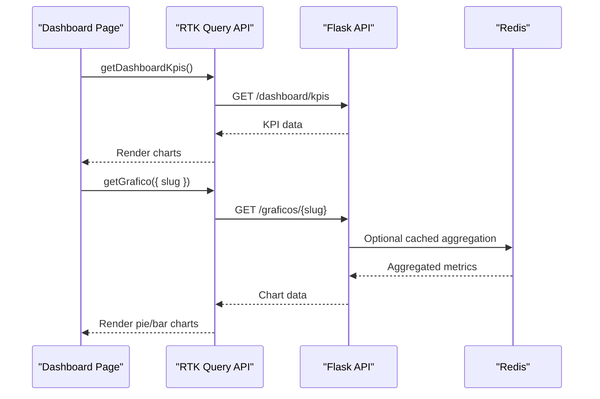
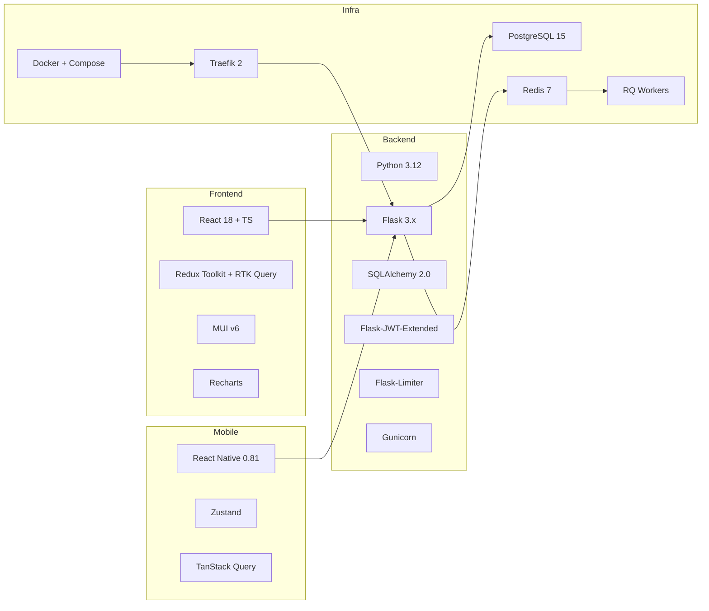

# Project Overview

<cite>
**Referenced Files in This Document**
- [README.md](file://README.md)
- [ARCHITECTURE.md](file://docs/ARCHITECTURE.md)
- [API.md](file://docs/API.md)
- [backend/README.md](file://backend/README.md)
- [frontend/README.md](file://frontend/README.md)
- [backend/app/api/v1/__init__.py](file://backend/app/api/v1/__init__.py)
- [backend/app/core/middleware.py](file://backend/app/core/middleware.py)
- [backend/app/models/tenant.py](file://backend/app/models/tenant.py)
- [backend/app/services/intervention_service.py](file://backend/app/services/intervention_service.py)
- [frontend/src/lib/api.ts](file://frontend/src/lib/api.ts)
- [frontend/src/main.tsx](file://frontend/src/main.tsx)
- [frontend/src/app/store.ts](file://frontend/src/app/store.ts)
- [frontend/src/features/dashboard/DashboardPage.tsx](file://frontend/src/features/dashboard/DashboardPage.tsx)
- [frontend/src/features/ai-chat/ChatWidget.tsx](file://frontend/src/features/ai-chat/ChatWidget.tsx)
</cite>

## Table of Contents
1. [Introduction](#introduction)
2. [Project Structure](#project-structure)
3. [Core Components](#core-components)
4. [Architecture Overview](#architecture-overview)
5. [Detailed Component Analysis](#detailed-component-analysis)
6. [Dependency Analysis](#dependency-analysis)
7. [Performance Considerations](#performance-considerations)
8. [Troubleshooting Guide](#troubleshooting-guide)
9. [Conclusion](#conclusion)

## Introduction
ColaboraEdu is a Software-as-a-Service (SaaS) multi-tenant school management platform designed to modernize academic administration for educational institutions. It provides a unified system for academic management, behavioral oversight, communication, reporting, and AI-powered interventions, while maintaining strict data isolation across schools.

Key value propositions for schools:
- Centralized academic management with transparent dashboards and reports
- AI-powered early warning and targeted intervention suggestions
- Seamless ingestion of academic transcripts via automated PDF processing
- Secure, scalable infrastructure supporting multiple schools under shared infrastructure
- Unified web and mobile experiences for administrators, teachers, and students

Relationship to the broader education technology ecosystem:
- Integrates with existing school workflows and document formats (PDF transcripts)
- Provides standardized APIs and multi-tenant architecture enabling SaaS delivery
- Supports modern developer practices with containerized deployment and CI/CD-friendly tooling

## Project Structure
The project follows a clear separation of concerns across three primary layers:
- Backend: Flask REST API with multi-tenancy, security, and business logic
- Frontend: React SPA with MUI, Redux Toolkit, and real-time dashboards
- Mobile: React Native/Expo app for on-the-go access

**Diagram sources**
- [ARCHITECTURE.md:7-70](file://docs/ARCHITECTURE.md#L7-L70)

**Section sources**
- [README.md:195-232](file://README.md#L195-L232)
- [ARCHITECTURE.md:1-70](file://docs/ARCHITECTURE.md#L1-L70)

## Core Components
- Multi-tenant architecture ensuring complete data isolation per school with automatic tenant and academic year scoping
- Academic management: student records, class enrollment, grading, transcript generation, and bulk PDF ingestion
- Behavioral and communication tools: discipline occurrences, announcements, and reading tracking
- AI-powered insights: risk analysis, targeted intervention suggestions, and conversational AI assistant
- Security: JWT-based authentication with silent refresh, RBAC, rate limiting, and fail-closed token blocklist
- Observability: audit logs, health checks, and comprehensive API reference

Practical examples:
- A teacher can quickly identify students at risk using AI-driven insights and create targeted intervention plans
- An administrator can generate cross-classroom performance reports and visualize trends with interactive dashboards
- A school can automate transcript ingestion from PDFs, reducing manual data entry and errors

**Section sources**
- [README.md:26-51](file://README.md#L26-L51)
- [ARCHITECTURE.md:74-136](file://docs/ARCHITECTURE.md#L74-L136)
- [API.md:25-161](file://docs/API.md#L25-L161)

## Architecture Overview
The platform implements a layered, horizontally scalable architecture:
- Client apps (web and mobile) communicate with the backend via HTTPS
- Traefik serves as reverse proxy and handles TLS termination
- Flask microservices expose REST endpoints grouped by functional domains
- SQLAlchemy ORM enforces tenant and academic year scoping automatically
- Redis and RQ power caching, background jobs, and asynchronous processing
- PostgreSQL stores normalized academic and administrative data

**Diagram sources**
- [ARCHITECTURE.md:22-70](file://docs/ARCHITECTURE.md#L22-L70)
- [backend/app/api/v1/__init__.py:8-21](file://backend/app/api/v1/__init__.py#L8-L21)
- [backend/app/core/middleware.py:6-109](file://backend/app/core/middleware.py#L6-L109)

**Section sources**
- [ARCHITECTURE.md:3-70](file://docs/ARCHITECTURE.md#L3-L70)
- [backend/app/api/v1/__init__.py:1-39](file://backend/app/api/v1/__init__.py#L1-L39)
- [backend/app/core/middleware.py:1-125](file://backend/app/core/middleware.py#L1-L125)

## Detailed Component Analysis

### Multi-Tenancy Implementation
Multi-tenancy is enforced at runtime and persisted in the database:
- Tenant resolution order: JWT claims → HTTP header → host-based mapping → fallback in development
- Automatic ORM filtering injects tenant_id and academic_year_id into all queries
- Academic year scoping ensures historical data integrity and accurate reporting

**Diagram sources**
- [backend/app/core/middleware.py:6-109](file://backend/app/core/middleware.py#L6-L109)
- [backend/app/api/v1/__init__.py:8-21](file://backend/app/api/v1/__init__.py#L8-L21)

**Section sources**
- [ARCHITECTURE.md:74-100](file://docs/ARCHITECTURE.md#L74-L100)
- [backend/app/core/middleware.py:1-125](file://backend/app/core/middleware.py#L1-L125)
- [backend/app/models/tenant.py:1-22](file://backend/app/models/tenant.py#L1-L22)

### Academic Management and AI Interventions
The system supports end-to-end academic workflows:
- Student, class, and grade management with paginated lists and filters
- Transcript generation and bulk PDF ingestion with background processing
- AI-powered student risk analysis and suggested actions
- Conversational AI assistant for ad-hoc insights and report generation

**Diagram sources**
- [API.md:632-660](file://docs/API.md#L632-L660)
- [backend/app/services/intervention_service.py:27-125](file://backend/app/services/intervention_service.py#L27-L125)

**Section sources**
- [API.md:263-467](file://docs/API.md#L263-L467)
- [API.md:632-660](file://docs/API.md#L632-L660)
- [backend/app/services/intervention_service.py:1-128](file://backend/app/services/intervention_service.py#L1-L128)

### Frontend Integration Patterns
The React frontend integrates with the backend using Redux Toolkit Query:
- Centralized API client with automatic token injection and tenant/year headers
- Silent refresh flow on 401 responses
- Tag-based caching and invalidation for optimal performance
- Dashboard and AI chat widgets demonstrate real-time data visualization and conversational AI

**Diagram sources**
- [frontend/src/features/dashboard/DashboardPage.tsx:46-82](file://frontend/src/features/dashboard/DashboardPage.tsx#L46-L82)
- [frontend/src/lib/api.ts:409-446](file://frontend/src/lib/api.ts#L409-L446)
- [frontend/src/lib/api.ts:493-498](file://frontend/src/lib/api.ts#L493-L498)

**Section sources**
- [frontend/src/lib/api.ts:336-407](file://frontend/src/lib/api.ts#L336-L407)
- [frontend/src/app/store.ts:1-21](file://frontend/src/app/store.ts#L1-L21)
- [frontend/src/main.tsx:1-28](file://frontend/src/main.tsx#L1-L28)
- [frontend/src/features/dashboard/DashboardPage.tsx:1-334](file://frontend/src/features/dashboard/DashboardPage.tsx#L1-L334)

### Mobile Experience
The React Native mobile app provides essential features for on-the-go access:
- Tabbed navigation for core workflows
- Authentication and secure token handling
- Offline-aware data fetching with TanStack Query
- Tailored UI components optimized for small screens

**Section sources**
- [README.md:74-78](file://README.md#L74-L78)

## Dependency Analysis
The platform’s dependencies align with modern, production-grade practices:
- Backend: Flask, SQLAlchemy 2, Pydantic v2, Flask-JWT-Extended, Flask-Limiter, Gunicorn
- Frontend: React 18, TypeScript, Redux Toolkit + RTK Query, MUI v6, Recharts
- Infrastructure: Docker, Traefik, PostgreSQL, Redis, RQ

**Diagram sources**
- [README.md:54-83](file://README.md#L54-L83)
- [ARCHITECTURE.md:139-217](file://docs/ARCHITECTURE.md#L139-L217)

**Section sources**
- [README.md:54-83](file://README.md#L54-L83)
- [ARCHITECTURE.md:139-217](file://docs/ARCHITECTURE.md#L139-L217)

## Performance Considerations
- Frontend: code-splitting, intelligent caching, and tag-based invalidation minimize network overhead
- Backend: connection pooling, pagination, Redis caching for heavy reports, and background job processing
- Scalability: stateless backend behind Traefik, shared Redis queues, and read replicas for reporting

[No sources needed since this section provides general guidance]

## Troubleshooting Guide
Common operational issues and resolutions:
- Authentication failures: verify JWT presence and refresh token flow; check silent refresh logic
- Multi-tenancy errors: confirm tenant resolution order and tenant activation status
- PDF ingestion delays: monitor RQ workers and Redis connectivity
- CORS and proxy issues: ensure Traefik routes and environment-specific backend URLs are configured

**Section sources**
- [ARCHITECTURE.md:112-114](file://docs/ARCHITECTURE.md#L112-L114)
- [frontend/src/lib/api.ts:359-407](file://frontend/src/lib/api.ts#L359-L407)
- [backend/app/core/middleware.py:61-72](file://backend/app/core/middleware.py#L61-L72)

## Conclusion
ColaboraEdu delivers a modern, secure, and scalable SaaS solution for school management. Its multi-tenant architecture, comprehensive academic workflows, and AI-driven insights differentiate it from traditional systems by enabling centralized operations with strong data isolation, proactive student support, and efficient administrative processes.