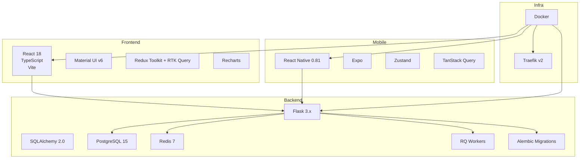
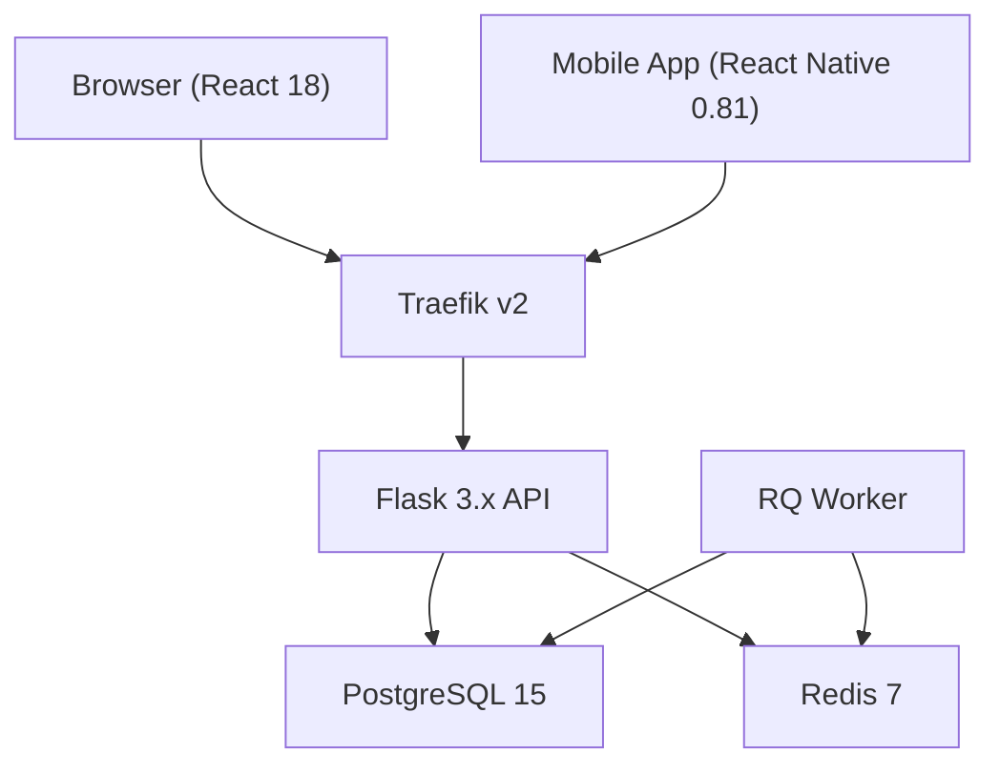
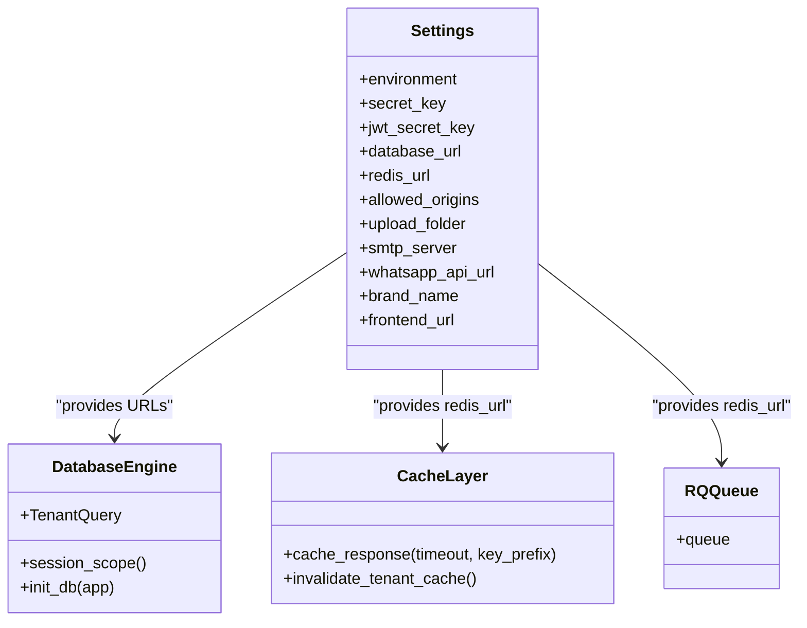
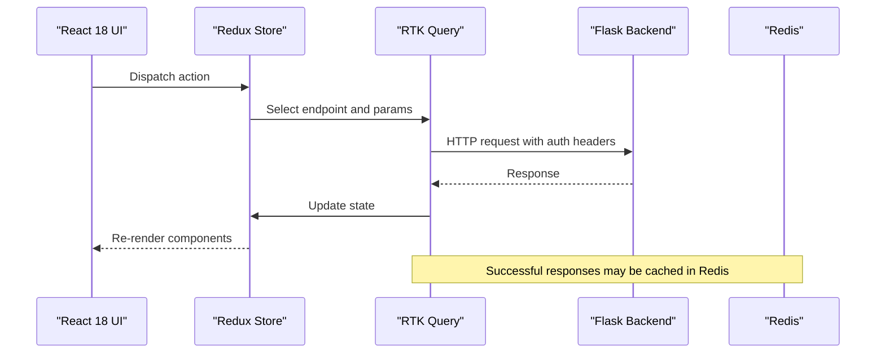
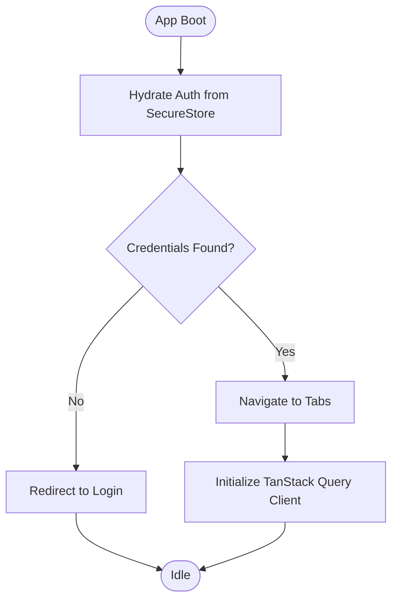
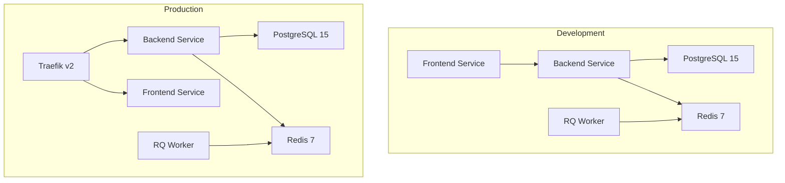
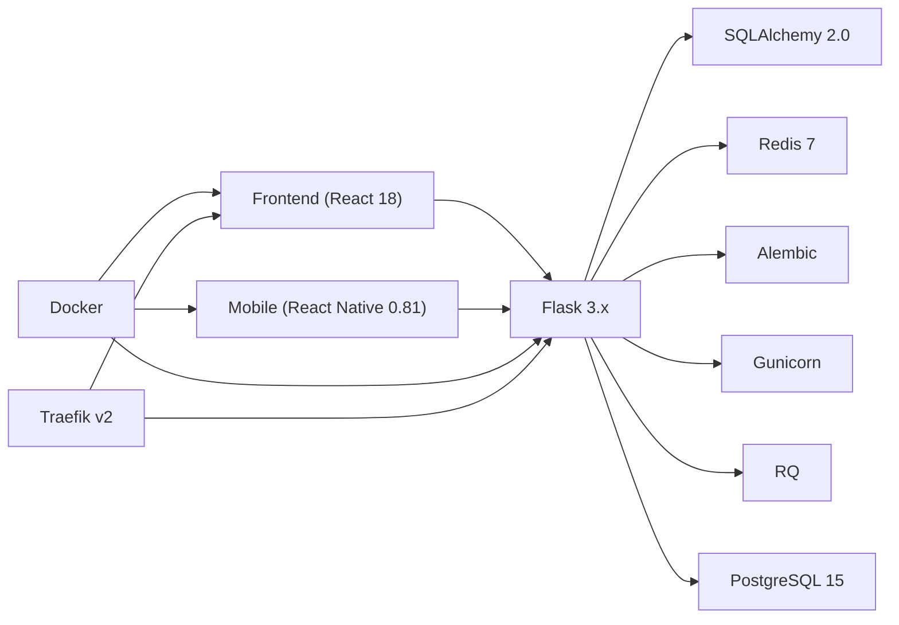

# Technology Stack

<cite>
**Referenced Files in This Document**
- [pyproject.toml](file://backend/pyproject.toml)
- [docker-compose.yml](file://docker-compose.yml)
- [docker-compose.prod.yml](file://docker-compose.prod.yml)
- [config.py](file://backend/app/core/config.py)
- [database.py](file://backend/app/core/database.py)
- [extensions.py](file://backend/app/core/extensions.py)
- [cache.py](file://backend/app/core/cache.py)
- [queue.py](file://backend/app/core/queue.py)
- [alembic.ini](file://backend/alembic.ini)
- [package.json (frontend)](file://frontend/package.json)
- [vite.config.ts](file://frontend/vite.config.ts)
- [store.ts](file://frontend/src/app/store.ts)
- [api.ts](file://frontend/src/lib/api.ts)
- [package.json (mobile)](file://mobile/package.json)
- [app/_layout.tsx](file://mobile/app/_layout.tsx)
- [lib/auth.store.ts](file://mobile/lib/auth.store.ts)
</cite>

## Table of Contents
1. [Introduction](#introduction)
2. [Project Structure](#project-structure)
3. [Core Components](#core-components)
4. [Architecture Overview](#architecture-overview)
5. [Detailed Component Analysis](#detailed-component-analysis)
6. [Dependency Analysis](#dependency-analysis)
7. [Performance Considerations](#performance-considerations)
8. [Troubleshooting Guide](#troubleshooting-guide)
9. [Conclusion](#conclusion)

## Introduction
This document presents the complete technology stack of the ColaboraEdu platform, detailing the backend, frontend, mobile, and infrastructure components. It explains version compatibility, architectural decisions, and how each technology contributes to performance, scalability, and maintainability. The content is structured for both developers and stakeholders, focusing on practical outcomes and technical foundations.

## Project Structure
The platform is organized into three primary layers:
- Backend: Python 3.12, Flask 3.x, SQLAlchemy 2.0, PostgreSQL 15, Redis 7, and RQ workers
- Frontend: React 18, TypeScript, Vite, Material UI v6, Redux Toolkit + RTK Query, Recharts
- Mobile: React Native 0.81, Expo, Zustand, TanStack Query
- Infrastructure: Docker, Traefik v2, Alembic migrations, and security controls

**Diagram sources**
- [docker-compose.yml:1-103](file://docker-compose.yml#L1-L103)
- [docker-compose.prod.yml:1-173](file://docker-compose.prod.yml#L1-L173)
- [pyproject.toml:15-41](file://backend/pyproject.toml#L15-L41)
- [package.json (frontend):12-32](file://frontend/package.json#L12-L32)
- [package.json (mobile):11-34](file://mobile/package.json#L11-L34)

**Section sources**
- [docker-compose.yml:1-103](file://docker-compose.yml#L1-L103)
- [docker-compose.prod.yml:1-173](file://docker-compose.prod.yml#L1-L173)
- [pyproject.toml:15-41](file://backend/pyproject.toml#L15-L41)
- [package.json (frontend):12-32](file://frontend/package.json#L12-L32)
- [package.json (mobile):11-34](file://mobile/package.json#L11-L34)

## Core Components
This section outlines the foundational technologies and their roles across the stack.

- Backend runtime and framework
  - Python 3.12: Required by the backend project configuration, ensuring modern language features and performance characteristics.
  - Flask 3.x: Application framework providing routing, middleware, and WSGI support.
  - Gunicorn: Production WSGI server used in production compose configuration for concurrency and stability.
  - Alembic: Database migration tool integrated into the backend project dependencies.

- Persistence and ORM
  - SQLAlchemy 2.0: ORM and SQL toolkit enabling typed database operations and multi-tenant query filtering.
  - PostgreSQL 15: Relational database for data persistence, health-checked and configured in both development and production compose files.

- Caching and background jobs
  - Redis 7: In-memory data store for caching and RQ-backed job queues.
  - RQ (Redis Queue): Background job processing managed by RQ workers.

- Security and rate limiting
  - Flask-Limiter: Rate limiting applied at the Flask level.
  - Pydantic Settings: Centralized configuration management with environment-based validation.

- Frontend stack
  - React 18 + TypeScript: UI framework and type safety.
  - Vite: Build tool and fast development server with proxying to backend.
  - Material UI v6: Design system and components.
  - Redux Toolkit + RTK Query: Predictable state management and API data fetching.
  - Recharts: Data visualization components.

- Mobile stack
  - React Native 0.81 + Expo: Cross-platform mobile runtime and toolchain.
  - Zustand: Lightweight state management for authentication and app state.
  - TanStack Query: Server state management and caching for offline-friendly experiences.

- Infrastructure
  - Docker: Containerization for backend, frontend, and supporting services.
  - Traefik v2: Reverse proxy and TLS termination with ACME HTTP challenge for automatic certificates.

**Section sources**
- [pyproject.toml:14-41](file://backend/pyproject.toml#L14-L41)
- [docker-compose.yml:1-103](file://docker-compose.yml#L1-L103)
- [docker-compose.prod.yml:1-173](file://docker-compose.prod.yml#L1-L173)
- [package.json (frontend):12-32](file://frontend/package.json#L12-L32)
- [package.json (mobile):11-34](file://mobile/package.json#L11-L34)
- [config.py:9-42](file://backend/app/core/config.py#L9-L42)
- [extensions.py:1-8](file://backend/app/core/extensions.py#L1-L8)

## Architecture Overview
The platform follows a containerized microservice-like architecture with clear separation of concerns:
- Backend exposes REST APIs consumed by both the web and mobile clients.
- Frontend and mobile clients communicate with the backend through HTTP endpoints.
- Redis serves dual purposes: caching and background job queue.
- PostgreSQL stores relational data with multi-tenant and academic-year scoping.
- Traefik handles external traffic, SSL/TLS, and routing to backend and frontend services.

**Diagram sources**
- [docker-compose.prod.yml:2-173](file://docker-compose.prod.yml#L2-L173)
- [docker-compose.yml:1-103](file://docker-compose.yml#L1-L103)
- [pyproject.toml:31-32](file://backend/pyproject.toml#L31-L32)

**Section sources**
- [docker-compose.prod.yml:2-173](file://docker-compose.prod.yml#L2-L173)
- [docker-compose.yml:1-103](file://docker-compose.yml#L1-L103)

## Detailed Component Analysis

### Backend: Flask, SQLAlchemy, PostgreSQL, Redis, RQ
- Flask 3.x and WSGI
  - Development uses Flask CLI; production uses Gunicorn with configurable workers and threads.
  - Environment variables manage secrets, origins, and upload paths.

- SQLAlchemy 2.0 and multi-tenant filtering
  - Custom ORM execution hook applies tenant and academic-year filters automatically during query compilation.
  - Scoped sessions and context-managed transactions ensure isolation and reliability.

- Redis and caching
  - Redis-backed caching decorator supports tenant-aware keys and selective caching of successful responses.
  - Cache invalidation helpers simplify cache management during writes.

- Background jobs with RQ
  - RQ queue initialized against Redis; workers consume jobs from the default queue.

- Security and configuration
  - Pydantic-based settings load environment variables and enforce production-grade secret validation.
  - Flask-Limiter provides default rate limits.

**Diagram sources**
- [config.py:9-60](file://backend/app/core/config.py#L9-L60)
- [database.py:10-130](file://backend/app/core/database.py#L10-L130)
- [cache.py:10-65](file://backend/app/core/cache.py#L10-L65)
- [queue.py:1-12](file://backend/app/core/queue.py#L1-L12)

**Section sources**
- [config.py:9-60](file://backend/app/core/config.py#L9-L60)
- [database.py:10-130](file://backend/app/core/database.py#L10-L130)
- [cache.py:10-65](file://backend/app/core/cache.py#L10-L65)
- [queue.py:1-12](file://backend/app/core/queue.py#L1-L12)
- [extensions.py:1-8](file://backend/app/core/extensions.py#L1-L8)

### Frontend: React 18, TypeScript, Vite, Material UI v6, Redux Toolkit + RTK Query, Recharts
- Build and dev server
  - Vite provides fast development with hot module replacement and a proxy to the backend API.

- State and API layer
  - Redux Toolkit centralizes UI state; RTK Query manages API base query, authentication headers, and caching.
  - Automatic re-authentication flow refreshes tokens on 401 responses.

- UI components
  - Material UI v6 offers a modern design system; Recharts integrates for data visualization.

**Diagram sources**
- [store.ts:1-21](file://frontend/src/app/store.ts#L1-L21)
- [api.ts:336-407](file://frontend/src/lib/api.ts#L336-L407)
- [vite.config.ts:8-14](file://frontend/vite.config.ts#L8-L14)

**Section sources**
- [vite.config.ts:1-19](file://frontend/vite.config.ts#L1-L19)
- [store.ts:1-21](file://frontend/src/app/store.ts#L1-L21)
- [api.ts:1-790](file://frontend/src/lib/api.ts#L1-L790)
- [package.json (frontend):12-32](file://frontend/package.json#L12-L32)

### Mobile: React Native 0.81, Expo, Zustand, TanStack Query
- Authentication state
  - Zustand store persists tokens and user data in Expo Secure Store, hydrating on app launch.

- Data fetching
  - TanStack Query provides caching, retries, and optimistic updates with a short staleness window.

- Navigation and theming
  - Expo Router coordinates navigation; React Navigation themes adapt to system preferences.

**Diagram sources**
- [app/_layout.tsx:16-55](file://mobile/app/_layout.tsx#L16-L55)
- [lib/auth.store.ts:45-63](file://mobile/lib/auth.store.ts#L45-L63)
- [package.json (mobile):11-34](file://mobile/package.json#L11-L34)

**Section sources**
- [app/_layout.tsx:1-73](file://mobile/app/_layout.tsx#L1-L73)
- [lib/auth.store.ts:1-65](file://mobile/lib/auth.store.ts#L1-L65)
- [package.json (mobile):11-34](file://mobile/package.json#L11-L34)

### Infrastructure: Docker, Traefik v2, Alembic
- Docker orchestration
  - Development compose defines backend, frontend, Redis, PostgreSQL, and RQ worker services with health checks and shared networks.
  - Production compose adds Traefik for reverse proxying, TLS with ACME HTTP challenge, and production-ready environment variables.

- Database migrations
  - Alembic is included as a backend dependency, enabling structured schema evolution aligned with PostgreSQL.

**Diagram sources**
- [docker-compose.yml:1-103](file://docker-compose.yml#L1-L103)
- [docker-compose.prod.yml:1-173](file://docker-compose.prod.yml#L1-L173)

**Section sources**
- [docker-compose.yml:1-103](file://docker-compose.yml#L1-L103)
- [docker-compose.prod.yml:1-173](file://docker-compose.prod.yml#L1-L173)
- [pyproject.toml:20-20](file://backend/pyproject.toml#L20-L20)

## Dependency Analysis
The backend’s dependency graph centers on Flask, SQLAlchemy, Redis, and Alembic. The frontend and mobile depend on their respective ecosystems, while Docker and Traefik orchestrate the runtime.

**Diagram sources**
- [pyproject.toml:15-41](file://backend/pyproject.toml#L15-L41)
- [docker-compose.yml:1-103](file://docker-compose.yml#L1-L103)
- [docker-compose.prod.yml:1-173](file://docker-compose.prod.yml#L1-L173)
- [package.json (frontend):12-32](file://frontend/package.json#L12-L32)
- [package.json (mobile):11-34](file://mobile/package.json#L11-L34)

**Section sources**
- [pyproject.toml:15-41](file://backend/pyproject.toml#L15-L41)
- [docker-compose.yml:1-103](file://docker-compose.yml#L1-L103)
- [docker-compose.prod.yml:1-173](file://docker-compose.prod.yml#L1-L173)
- [package.json (frontend):12-32](file://frontend/package.json#L12-L32)
- [package.json (mobile):11-34](file://mobile/package.json#L11-L34)

## Performance Considerations
- Backend
  - Use of SQLAlchemy 2.0 enables efficient ORM operations and query compilation hooks for tenant scoping.
  - Redis caching reduces database load for repeated reads; cache keys incorporate tenant and academic year identifiers.
  - Gunicorn workers and threads improve throughput in production environments.

- Frontend
  - RTK Query’s caching and tagging reduce redundant network calls and enable targeted invalidations.
  - Vite’s optimized build pipeline accelerates development and production builds.

- Mobile
  - TanStack Query’s short stale window balances freshness and performance; retries minimize transient failure impact.
  - Zustand keeps authentication state lightweight and responsive.

- Infrastructure
  - Traefik’s reverse proxy and ACME automation streamline scaling and secure access.
  - Docker ensures consistent deployments across environments.

[No sources needed since this section provides general guidance]

## Troubleshooting Guide
- Configuration validation
  - Production requires strong secrets; the settings validator enforces minimum length and non-default values.

- Database connectivity
  - Health checks for PostgreSQL and Redis ensure services are ready before dependent containers start.

- Rate limiting
  - Default rate limit is applied via Flask-Limiter; adjust as needed for specific endpoints.

- Cache behavior
  - Cache keys include tenant and academic year; ensure headers are set correctly to avoid cache misses.

- Worker jobs
  - RQ workers consume the default queue; verify Redis connectivity and queue configuration.

**Section sources**
- [config.py:44-51](file://backend/app/core/config.py#L44-L51)
- [docker-compose.yml:14-18](file://docker-compose.yml#L14-L18)
- [docker-compose.yml:74-78](file://docker-compose.yml#L74-L78)
- [extensions.py:4-7](file://backend/app/core/extensions.py#L4-L7)
- [cache.py:21-27](file://backend/app/core/cache.py#L21-L27)
- [queue.py:5-11](file://backend/app/core/queue.py#L5-L11)

## Conclusion
The ColaboraEdu technology stack combines modern, battle-tested technologies to deliver a scalable, maintainable, and secure platform. Python 3.12, Flask 3.x, SQLAlchemy 2.0, PostgreSQL 15, Redis 7, and RQ form a robust backend foundation. React 18, TypeScript, Vite, Material UI v6, Redux Toolkit + RTK Query, and Recharts power a responsive and efficient frontend. React Native 0.81, Expo, Zustand, and TanStack Query enable a native-like mobile experience. Docker and Traefik v2 provide reliable deployment and secure ingress. Together, these choices balance developer productivity, system performance, and long-term maintainability.