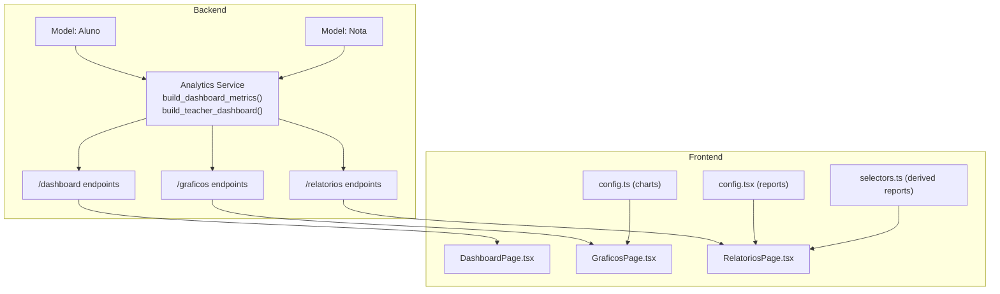
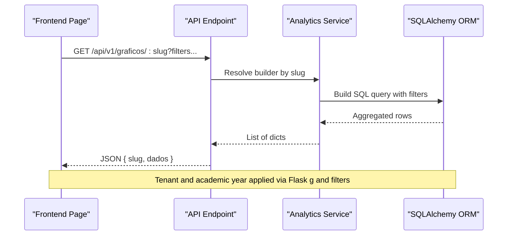
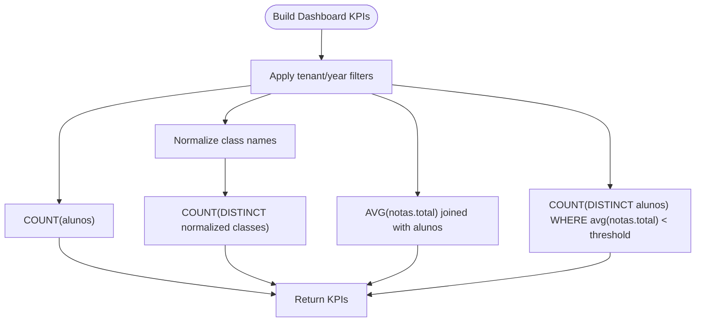
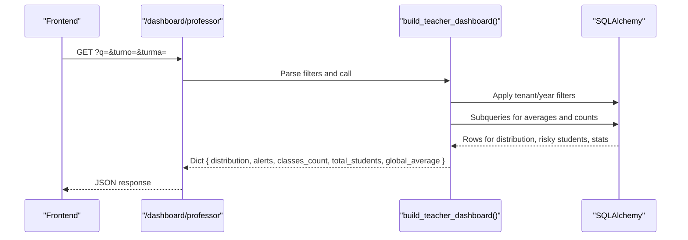
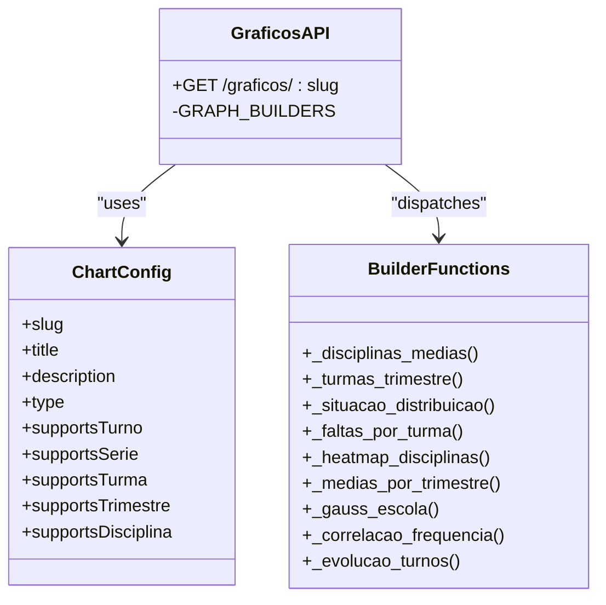
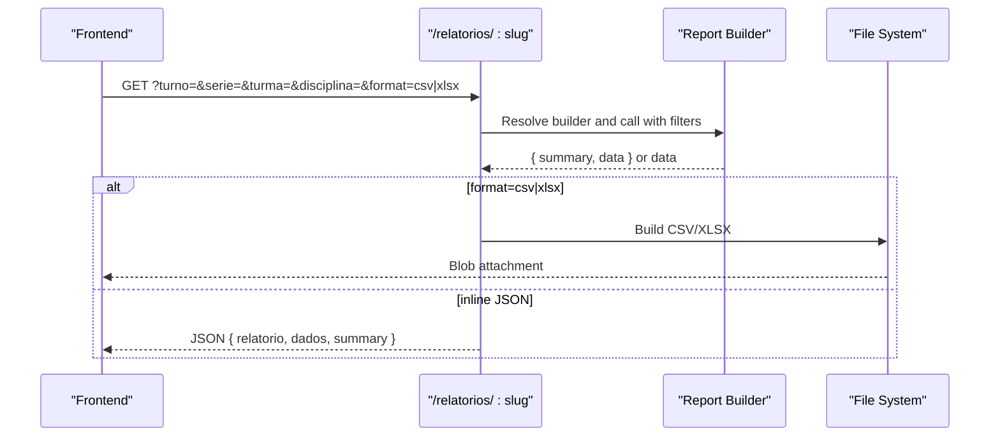
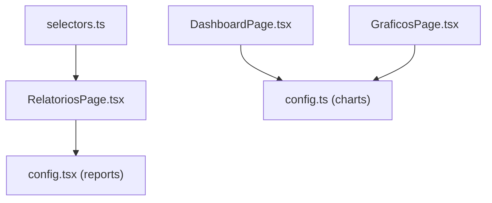
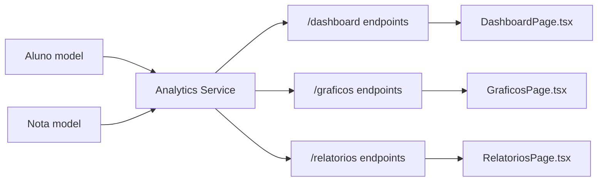
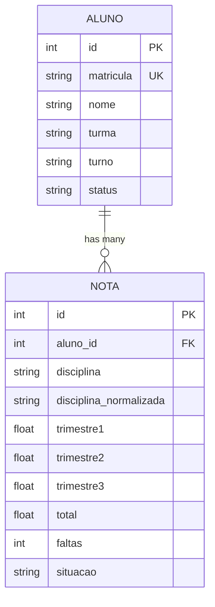

# Reporting & Analytics

<cite>
**Referenced Files in This Document**
- [analytics.py](file://backend/app/services/analytics.py)
- [dashboard.py](file://backend/app/api/v1/dashboard.py)
- [graficos.py](file://backend/app/api/v1/graficos.py)
- [relatorios.py](file://backend/app/api/v1/relatorios.py)
- [aluno.py](file://backend/app/models/aluno.py)
- [nota.py](file://backend/app/models/nota.py)
- [config.ts](file://frontend/src/features/graficos/config.ts)
- [GraficosPage.tsx](file://frontend/src/features/graficos/GraficosPage.tsx)
- [config.tsx](file://frontend/src/features/relatorios/config.tsx)
- [RelatoriosPage.tsx](file://frontend/src/features/relatorios/RelatoriosPage.tsx)
- [selectors.ts](file://frontend/src/features/relatorios/selectors.ts)
- [DashboardPage.tsx](file://frontend/src/features/dashboard/DashboardPage.tsx)
</cite>

## Table of Contents
1. [Introduction](#introduction)
2. [Project Structure](#project-structure)
3. [Core Components](#core-components)
4. [Architecture Overview](#architecture-overview)
5. [Detailed Component Analysis](#detailed-component-analysis)
6. [Dependency Analysis](#dependency-analysis)
7. [Performance Considerations](#performance-considerations)
8. [Troubleshooting Guide](#troubleshooting-guide)
9. [Conclusion](#conclusion)
10. [Appendices](#appendices)

## Introduction
This document explains the reporting and analytics capabilities of the platform, focusing on dashboard creation, data visualization, performance metrics, and analytical reporting. It covers how dashboards and charts are built server-side via SQL queries, how frontend components render visualizations and support export, and how reports are generated with optional CSV/XLSX exports. It also documents chart configurations, data aggregation logic, and the relationships with data models, user permissions, and multitenancy/year scoping.

## Project Structure
The analytics stack spans backend endpoints and services, and frontend pages and configuration:
- Backend
  - Services compute KPIs and teacher-specific dashboards
  - API endpoints expose KPIs, charts, and reports
  - SQLAlchemy models define the data schema used by aggregations
- Frontend
  - Chart configuration defines available chart types and supported filters
  - Pages orchestrate fetching, rendering, and exporting visualizations
  - Report configuration enumerates available report types and UI metadata

**Diagram sources**
- [analytics.py:35-84](file://backend/app/services/analytics.py#L35-L84)
- [graficos.py:36-58](file://backend/app/api/v1/graficos.py#L36-L58)
- [relatorios.py:457-537](file://backend/app/api/v1/relatorios.py#L457-L537)
- [aluno.py:8-35](file://backend/app/models/aluno.py#L8-L35)
- [nota.py:9-24](file://backend/app/models/nota.py#L9-L24)
- [GraficosPage.tsx:101-191](file://frontend/src/features/graficos/GraficosPage.tsx#L101-L191)
- [RelatoriosPage.tsx:19-60](file://frontend/src/features/relatorios/RelatoriosPage.tsx#L19-L60)
- [config.ts:28-121](file://frontend/src/features/graficos/config.ts#L28-L121)
- [config.tsx:67-275](file://frontend/src/features/relatorios/config.tsx#L67-L275)

**Section sources**
- [analytics.py:10-84](file://backend/app/services/analytics.py#L10-L84)
- [graficos.py:36-58](file://backend/app/api/v1/graficos.py#L36-L58)
- [relatorios.py:457-537](file://backend/app/api/v1/relatorios.py#L457-L537)
- [aluno.py:8-35](file://backend/app/models/aluno.py#L8-L35)
- [nota.py:9-24](file://backend/app/models/nota.py#L9-L24)
- [GraficosPage.tsx:101-191](file://frontend/src/features/graficos/GraficosPage.tsx#L101-L191)
- [RelatoriosPage.tsx:19-60](file://frontend/src/features/relatorios/RelatoriosPage.tsx#L19-L60)
- [config.ts:28-121](file://frontend/src/features/graficos/config.ts#L28-L121)
- [config.tsx:67-275](file://frontend/src/features/relatorios/config.tsx#L67-L275)

## Core Components
- Dashboard KPIs endpoint
  - Returns total students, active classes, overall average, and at-risk student counts scoped by tenant and academic year
- Teacher dashboard
  - Provides performance distribution buckets, top risky students, class counts, totals, and averages filtered by role and query parameters
- Chart builders
  - Dynamic chart endpoints keyed by slug, supporting filters (turno, série, turma, trimestre, disciplina), normalization, and aggregation
- Report builders
  - Predefined report slugs returning structured data with summaries and optional CSV/XLSX export
- Frontend chart configuration
  - Defines chart types, keys, supported filters, and UI metadata
- Frontend report configuration
  - Defines report types, columns, icons, variants, and supported filters
- Derived report selectors
  - Compute derived datasets client-side from raw grade records

**Section sources**
- [dashboard.py:14-33](file://backend/app/api/v1/dashboard.py#L14-L33)
- [analytics.py:35-84](file://backend/app/services/analytics.py#L35-L84)
- [analytics.py:86-195](file://backend/app/services/analytics.py#L86-L195)
- [graficos.py:386-396](file://backend/app/api/v1/graficos.py#L386-L396)
- [relatorios.py:442-454](file://backend/app/api/v1/relatorios.py#L442-L454)
- [config.ts:12-26](file://frontend/src/features/graficos/config.ts#L12-L26)
- [config.tsx:46-56](file://frontend/src/features/relatorios/config.tsx#L46-L56)
- [selectors.ts:38-164](file://frontend/src/features/relatorios/selectors.ts#L38-L164)

## Architecture Overview
The analytics architecture follows a clean separation:
- Backend services encapsulate SQL-driven aggregations and return Python dictionaries suitable for JSON serialization
- API endpoints enforce role-based access, apply tenant/year scoping, and cache responses
- Frontend pages consume endpoints, render charts and tables, and support export to CSV/XLSX

**Diagram sources**
- [graficos.py:39-57](file://backend/app/api/v1/graficos.py#L39-L57)
- [graficos.py:75-93](file://backend/app/api/v1/graficos.py#L75-L93)
- [graficos.py:96-127](file://backend/app/api/v1/graficos.py#L96-L127)
- [GraficosPage.tsx:181-191](file://frontend/src/features/graficos/GraficosPage.tsx#L181-L191)

**Section sources**
- [graficos.py:39-57](file://backend/app/api/v1/graficos.py#L39-L57)
- [graficos.py:75-93](file://backend/app/api/v1/graficos.py#L75-L93)
- [graficos.py:96-127](file://backend/app/api/v1/graficos.py#L96-L127)
- [GraficosPage.tsx:181-191](file://frontend/src/features/graficos/GraficosPage.tsx#L181-L191)

## Detailed Component Analysis

### Dashboard KPIs
- Purpose: Serve high-level KPIs for the main dashboard
- Data sources: Students and grades, with tenant and academic year scoping
- Metrics:
  - Total active students
  - Distinct normalized class names
  - Overall average grade
  - Count of students with average below threshold

**Diagram sources**
- [analytics.py:35-84](file://backend/app/services/analytics.py#L35-L84)

**Section sources**
- [analytics.py:35-84](file://backend/app/services/analytics.py#L35-L84)
- [dashboard.py:14-22](file://backend/app/api/v1/dashboard.py#L14-L22)

### Teacher Dashboard
- Purpose: Provide teacher-focused insights including performance distribution, risky students, and class statistics
- Features:
  - Performance distribution buckets by average grade
  - Top risky students with risk score from predictor
  - Class count, total students, and global average filtered by turno, turma, and query

**Diagram sources**
- [analytics.py:86-195](file://backend/app/services/analytics.py#L86-L195)
- [dashboard.py:24-33](file://backend/app/api/v1/dashboard.py#L24-L33)

**Section sources**
- [analytics.py:86-195](file://backend/app/services/analytics.py#L86-L195)
- [dashboard.py:24-33](file://backend/app/api/v1/dashboard.py#L24-L33)

### Chart Builders and Configurations
- Chart configuration
  - Defines slugs, titles, descriptions, chart types, and supported filters
  - Provides trimester and turno lists for UI controls
- Builder functions
  - Each slug maps to a builder that:
    - Normalizes disciplines
    - Applies tenant/year and filter conditions
    - Aggregates data (sum/count/avg) and sorts appropriately
    - Returns ordered lists consumable by frontend charts

**Diagram sources**
- [config.ts:28-121](file://frontend/src/features/graficos/config.ts#L28-L121)
- [graficos.py:386-396](file://backend/app/api/v1/graficos.py#L386-L396)
- [graficos.py:96-127](file://backend/app/api/v1/graficos.py#L96-L127)
- [graficos.py:130-145](file://backend/app/api/v1/graficos.py#L130-L145)
- [graficos.py:148-209](file://backend/app/api/v1/graficos.py#L148-L209)
- [graficos.py:212-231](file://backend/app/api/v1/graficos.py#L212-L231)
- [graficos.py:234-268](file://backend/app/api/v1/graficos.py#L234-L268)
- [graficos.py:271-291](file://backend/app/api/v1/graficos.py#L271-L291)
- [graficos.py:294-319](file://backend/app/api/v1/graficos.py#L294-L319)
- [graficos.py:322-349](file://backend/app/api/v1/graficos.py#L322-L349)
- [graficos.py:352-383](file://backend/app/api/v1/graficos.py#L352-L383)

**Section sources**
- [config.ts:28-121](file://frontend/src/features/graficos/config.ts#L28-L121)
- [graficos.py:386-396](file://backend/app/api/v1/graficos.py#L386-L396)
- [graficos.py:96-127](file://backend/app/api/v1/graficos.py#L96-L127)
- [graficos.py:130-145](file://backend/app/api/v1/graficos.py#L130-L145)
- [graficos.py:148-209](file://backend/app/api/v1/graficos.py#L148-L209)
- [graficos.py:212-231](file://backend/app/api/v1/graficos.py#L212-L231)
- [graficos.py:234-268](file://backend/app/api/v1/graficos.py#L234-L268)
- [graficos.py:271-291](file://backend/app/api/v1/graficos.py#L271-L291)
- [graficos.py:294-319](file://backend/app/api/v1/graficos.py#L294-L319)
- [graficos.py:322-349](file://backend/app/api/v1/graficos.py#L322-L349)
- [graficos.py:352-383](file://backend/app/api/v1/graficos.py#L352-L383)

### Report Builders and Export Workflow
- Report configuration
  - Defines report slugs, titles, descriptions, types, columns, icons, variants, and supported filters
- Builder functions
  - Each slug computes a summary and a dataset; some derive data client-side
- Export
  - Reports support CSV and XLSX export when requested

**Diagram sources**
- [relatorios.py:457-537](file://backend/app/api/v1/relatorios.py#L457-L537)
- [relatorios.py:442-454](file://backend/app/api/v1/relatorios.py#L442-L454)
- [config.tsx:46-56](file://frontend/src/features/relatorios/config.tsx#L46-L56)

**Section sources**
- [relatorios.py:457-537](file://backend/app/api/v1/relatorios.py#L457-L537)
- [relatorios.py:442-454](file://backend/app/api/v1/relatorios.py#L442-L454)
- [config.tsx:46-56](file://frontend/src/features/relatorios/config.tsx#L46-L56)

### Frontend Visualization Components
- Dashboard page
  - Renders KPI cards and two charts: discipline averages and student status distribution
- Charts page
  - Presents a configurable gallery of charts with dynamic filters and export menu
- Reports page
  - Lists available reports with icons, types, and variants
- Derived report selectors
  - Computes derived datasets (e.g., efficiency comparison, top movers, radar of abandonment) client-side from raw grade records

**Diagram sources**
- [DashboardPage.tsx:46-118](file://frontend/src/features/dashboard/DashboardPage.tsx#L46-L118)
- [GraficosPage.tsx:101-191](file://frontend/src/features/graficos/GraficosPage.tsx#L101-L191)
- [RelatoriosPage.tsx:19-60](file://frontend/src/features/relatorios/RelatoriosPage.tsx#L19-L60)
- [config.ts:28-121](file://frontend/src/features/graficos/config.ts#L28-L121)
- [config.tsx:67-275](file://frontend/src/features/relatorios/config.tsx#L67-L275)
- [selectors.ts:38-164](file://frontend/src/features/relatorios/selectors.ts#L38-L164)

**Section sources**
- [DashboardPage.tsx:46-118](file://frontend/src/features/dashboard/DashboardPage.tsx#L46-L118)
- [GraficosPage.tsx:101-191](file://frontend/src/features/graficos/GraficosPage.tsx#L101-L191)
- [RelatoriosPage.tsx:19-60](file://frontend/src/features/relatorios/RelatoriosPage.tsx#L19-L60)
- [config.ts:28-121](file://frontend/src/features/graficos/config.ts#L28-L121)
- [config.tsx:67-275](file://frontend/src/features/relatorios/config.tsx#L67-L275)
- [selectors.ts:38-164](file://frontend/src/features/relatorios/selectors.ts#L38-L164)

## Dependency Analysis
- Backend models
  - Aluno and Nota define the schema used by analytics services and chart/report builders
- Permissions and scoping
  - JWT roles restrict access to certain endpoints
  - Tenant and academic year are injected via Flask g and applied to queries
- Caching
  - KPIs endpoint caches responses for 10 minutes; teacher dashboard caches for 5 minutes

**Diagram sources**
- [aluno.py:8-35](file://backend/app/models/aluno.py#L8-L35)
- [nota.py:9-24](file://backend/app/models/nota.py#L9-L24)
- [analytics.py:35-84](file://backend/app/services/analytics.py#L35-L84)
- [graficos.py:39-57](file://backend/app/api/v1/graficos.py#L39-L57)
- [relatorios.py:457-537](file://backend/app/api/v1/relatorios.py#L457-L537)
- [DashboardPage.tsx:46-118](file://frontend/src/features/dashboard/DashboardPage.tsx#L46-L118)
- [GraficosPage.tsx:101-191](file://frontend/src/features/graficos/GraficosPage.tsx#L101-L191)
- [RelatoriosPage.tsx:19-60](file://frontend/src/features/relatorios/RelatoriosPage.tsx#L19-L60)

**Section sources**
- [aluno.py:8-35](file://backend/app/models/aluno.py#L8-L35)
- [nota.py:9-24](file://backend/app/models/nota.py#L9-L24)
- [analytics.py:35-84](file://backend/app/services/analytics.py#L35-L84)
- [graficos.py:39-57](file://backend/app/api/v1/graficos.py#L39-L57)
- [relatorios.py:457-537](file://backend/app/api/v1/relatorios.py#L457-L537)
- [DashboardPage.tsx:46-118](file://frontend/src/features/dashboard/DashboardPage.tsx#L46-L118)
- [GraficosPage.tsx:101-191](file://frontend/src/features/graficos/GraficosPage.tsx#L101-L191)
- [RelatoriosPage.tsx:19-60](file://frontend/src/features/relatorios/RelatoriosPage.tsx#L19-L60)

## Performance Considerations
- Query efficiency
  - Prefer grouped aggregations and subqueries to minimize data transfer
  - Use LIMIT where appropriate (e.g., top-N rankings)
- Caching
  - KPIs cached for 10 minutes; teacher dashboard cached for 5 minutes
- Network and rendering
  - Frontend limits visible items per chart (e.g., top 10)
  - Export builds CSV/XLSX server-side to avoid large client-side payloads

[No sources needed since this section provides general guidance]

## Troubleshooting Guide
- Access denied
  - Certain endpoints restrict access to non-staff roles
- Empty or missing data
  - Verify tenant and academic year headers are set
  - Confirm filters match available data (turno, série, turma, disciplina)
- Export errors
  - Ensure data exists and is a non-empty list of dictionaries
  - Confirm requested format is supported (csv/xlsx)

**Section sources**
- [dashboard.py:18-19](file://backend/app/api/v1/dashboard.py#L18-L19)
- [graficos.py:42-43](file://backend/app/api/v1/graficos.py#L42-L43)
- [relatorios.py:463-464](file://backend/app/api/v1/relatorios.py#L463-L464)
- [relatorios.py:482-489](file://backend/app/api/v1/relatorios.py#L482-L489)
- [relatorios.py:505-524](file://backend/app/api/v1/relatorios.py#L505-L524)

## Conclusion
The platform provides a robust analytics foundation with:
- Server-side aggregations and caching for efficient KPI delivery
- Flexible chart builders with tenant/year scoping and rich filters
- Comprehensive report builders with optional export
- Rich frontend visualizations and curated report galleries
This enables administrators to monitor performance, identify risks, and drive decisions, while offering developers a clear extension surface for custom dashboards and visualizations.

## Appendices

### Data Model Relationships

**Diagram sources**
- [aluno.py:8-35](file://backend/app/models/aluno.py#L8-L35)
- [nota.py:9-24](file://backend/app/models/nota.py#L9-L24)

### Example Workflows

#### Dashboard Setup
- Load KPIs and two charts on the dashboard page
- Use tenant and academic year headers for scoping

**Section sources**
- [DashboardPage.tsx:46-118](file://frontend/src/features/dashboard/DashboardPage.tsx#L46-L118)
- [dashboard.py:14-22](file://backend/app/api/v1/dashboard.py#L14-L22)

#### Visualization Component Usage
- Choose a chart from the gallery, apply filters, and export results

**Section sources**
- [GraficosPage.tsx:101-191](file://frontend/src/features/graficos/GraficosPage.tsx#L101-L191)
- [config.ts:28-121](file://frontend/src/features/graficos/config.ts#L28-L121)

#### Report Generation and Export
- Navigate to a report, optionally apply filters, and export to CSV/XLSX

**Section sources**
- [RelatoriosPage.tsx:19-60](file://frontend/src/features/relatorios/RelatoriosPage.tsx#L19-L60)
- [relatorios.py:457-537](file://backend/app/api/v1/relatorios.py#L457-L537)
- [config.tsx:46-56](file://frontend/src/features/relatorios/config.tsx#L46-L56)