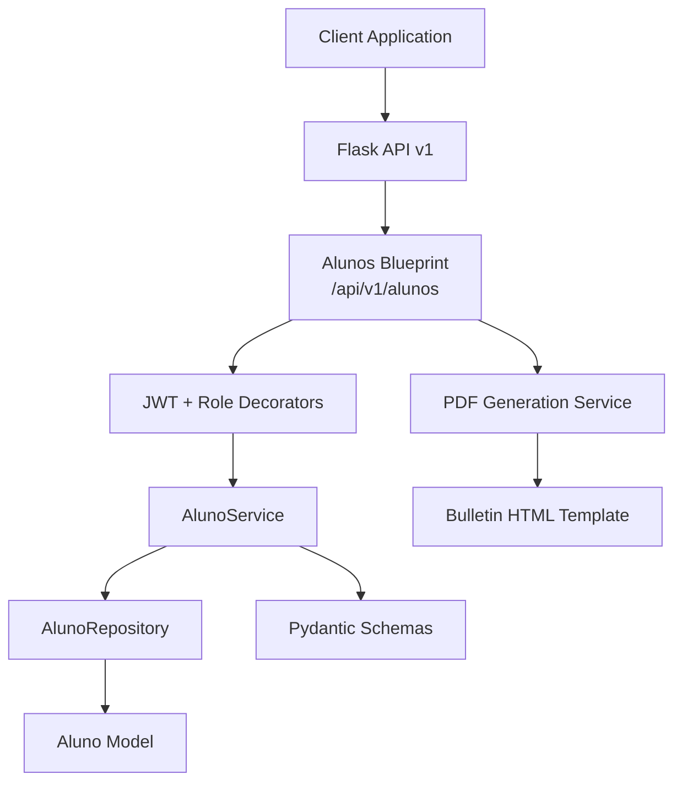
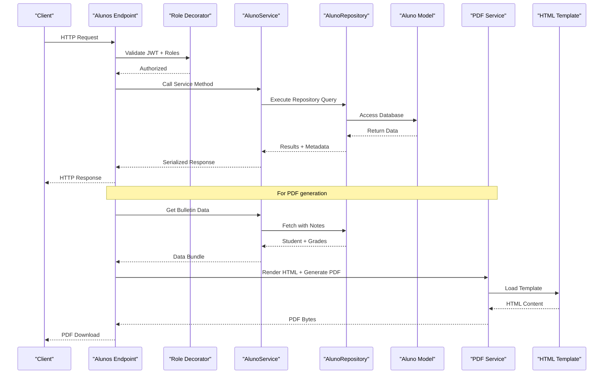
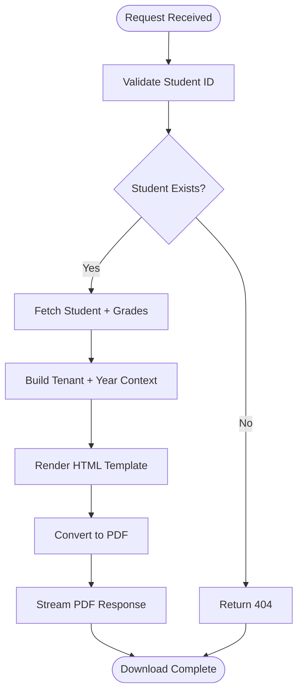
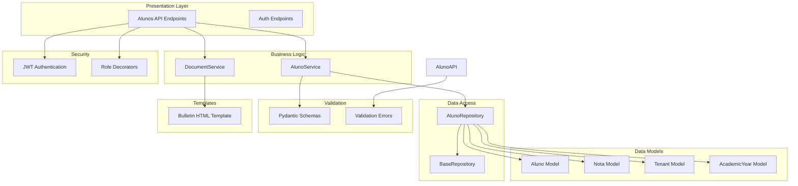

# Student API Endpoints

<cite>
**Referenced Files in This Document**
- [alunos.py](file://backend/app/api/v1/alunos.py)
- [aluno_service.py](file://backend/app/services/aluno_service.py)
- [aluno_repository.py](file://backend/app/repositories/aluno_repository.py)
- [aluno.py](file://backend/app/models/aluno.py)
- [aluno.py](file://backend/app/schemas/aluno.py)
- [decorators.py](file://backend/app/core/decorators.py)
- [document_service.py](file://backend/app/services/document_service.py)
- [bulletin.html](file://backend/app/templates/documents/bulletin.html)
- [v1_init.py](file://backend/app/api/v1/__init__.py)
- [auth.py](file://backend/app/api/v1/auth.py)
</cite>

## Table of Contents
1. [Introduction](#introduction)
2. [Project Structure](#project-structure)
3. [Core Components](#core-components)
4. [Architecture Overview](#architecture-overview)
5. [Detailed Component Analysis](#detailed-component-analysis)
6. [Dependency Analysis](#dependency-analysis)
7. [Performance Considerations](#performance-considerations)
8. [Troubleshooting Guide](#troubleshooting-guide)
9. [Conclusion](#conclusion)

## Introduction
This document provides comprehensive API documentation for student management endpoints in the backend system. It covers all RESTful endpoints for managing students, including listing with pagination and filters, retrieving individual records with role-based access, creating, updating, deleting students, and generating PDF reports. The documentation specifies HTTP methods, URL patterns, request/response schemas, authentication requirements, authorization roles, parameter descriptions, pagination parameters, error response codes, and the complete process for PDF report generation.

## Project Structure
The student management functionality is organized within the Flask application's API v1 module. The key components include:
- API endpoints definition under `/api/v1/alunos`
- Business logic encapsulated in the AlunoService
- Data access through AlunoRepository
- Data models and schemas for validation and serialization
- Authorization decorators for role-based access control
- PDF generation service and HTML template for bulletin reports



**Diagram sources**
- [alunos.py:12-148](file://backend/app/api/v1/alunos.py#L12-L148)
- [aluno_service.py:15-156](file://backend/app/services/aluno_service.py#L15-L156)
- [aluno_repository.py:8-105](file://backend/app/repositories/aluno_repository.py#L8-L105)
- [aluno.py:8-36](file://backend/app/models/aluno.py#L8-L36)
- [aluno.py](file://backend/app/schemas/aluno.py)
- [decorators.py:5-30](file://backend/app/core/decorators.py#L5-L30)
- [document_service.py:6-27](file://backend/app/services/document_service.py#L6-L27)
- [bulletin.html:1-345](file://backend/app/templates/documents/bulletin.html#L1-L345)

**Section sources**
- [alunos.py:12-148](file://backend/app/api/v1/alunos.py#L12-L148)
- [v1_init.py:1-39](file://backend/app/api/v1/__init__.py#L1-L39)

## Core Components
This section outlines the primary components involved in student management operations:

- **Alunos Blueprint**: Defines all student-related endpoints and applies JWT authentication and role-based authorization
- **AlunoService**: Orchestrates business logic for CRUD operations, pagination, filtering, and data aggregation
- **AlunoRepository**: Handles database operations with tenant and academic year scoping
- **Pydantic Schemas**: Validates request payloads and serializes responses with type safety
- **Authorization Decorators**: Enforce role-based access control for different operations
- **PDF Generation Service**: Converts HTML templates to downloadable PDF documents

**Section sources**
- [alunos.py:12-148](file://backend/app/api/v1/alunos.py#L12-L148)
- [aluno_service.py:15-156](file://backend/app/services/aluno_service.py#L15-L156)
- [aluno_repository.py:8-105](file://backend/app/repositories/aluno_repository.py#L8-L105)
- [aluno.py](file://backend/app/schemas/aluno.py)
- [decorators.py:5-30](file://backend/app/core/decorators.py#L5-L30)
- [document_service.py:6-27](file://backend/app/services/document_service.py#L6-L27)

## Architecture Overview
The student management architecture follows a layered approach with clear separation of concerns:



**Diagram sources**
- [alunos.py:15-148](file://backend/app/api/v1/alunos.py#L15-L148)
- [aluno_service.py:20-156](file://backend/app/services/aluno_service.py#L20-L156)
- [aluno_repository.py:12-105](file://backend/app/repositories/aluno_repository.py#L12-L105)
- [document_service.py:17-27](file://backend/app/services/document_service.py#L17-L27)

## Detailed Component Analysis

### Authentication and Authorization
All student endpoints require JWT authentication. The system enforces role-based access control with different permission levels for various operations.

**Authentication Requirements:**
- All endpoints require a valid JWT bearer token
- Token must contain user identity and role claims
- Specific endpoints require additional role permissions

**Authorization Roles:**
- GET /alunos: admin, super_admin, coordenador, diretor, orientador, professor
- GET /alunos/{id}: admin, super_admin, coordenador, diretor, orientador, professor, aluno (self-access)
- POST /alunos: admin, super_admin, coordenador, diretor, orientador
- PATCH /alunos/{id}: admin, super_admin, coordenador, diretor, orientador
- DELETE /alunos/{id}: admin, super_admin, coordenador, diretor

**Section sources**
- [alunos.py:17-101](file://backend/app/api/v1/alunos.py#L17-L101)
- [decorators.py:5-30](file://backend/app/core/decorators.py#L5-L30)
- [auth.py:44-56](file://backend/app/api/v1/auth.py#L44-L56)

### GET /api/v1/alunos (List Students with Pagination and Filters)
Lists students with comprehensive filtering and pagination capabilities.

**Endpoint:** `GET /api/v1/alunos`

**Query Parameters:**
- `page` (integer, optional): Page number (default: 1, min: 1)
- `per_page` (integer, optional): Items per page (default: 20, max: 200)
- `turno` (string, optional): Filter by shift (e.g., "manha", "tarde", "noite")
- `turma` (string, optional): Filter by class
- `q` (string, optional): Search query for name, registration number, or class

**Response Schema:**
```json
{
  "items": [
    {
      "id": 1,
      "matricula": "string",
      "nome": "string",
      "turma": "string",
      "turno": "string",
      "status": "string",
      "media": 0,
      "faltas": 0
    }
  ],
  "meta": {
    "page": 1,
    "per_page": 20,
    "total": 0,
    "pages": 0
  }
}
```

**Common Usage Scenarios:**
- Paginated listing: `/api/v1/alunos?page=2&per_page=50`
- Filter by shift: `/api/v1/alunos?turno=manha`
- Filter by class: `/api/v1/alunos?turma=A`
- Combined filters: `/api/v1/alunos?turno=noite&turma=3EF&q=Silva`

**Error Responses:**
- 400: Invalid pagination parameters (invalid integers)
- 403: Insufficient permissions
- 401: Invalid or missing JWT token

**Section sources**
- [alunos.py:15-42](file://backend/app/api/v1/alunos.py#L15-L42)
- [aluno_service.py:20-61](file://backend/app/services/aluno_service.py#L20-L61)
- [aluno_repository.py:12-74](file://backend/app/repositories/aluno_repository.py#L12-L74)
- [aluno.py](file://backend/app/schemas/aluno.py)

### GET /api/v1/alunos/{id} (Retrieve Student Details)
Retrieves detailed information about a specific student with role-based access control.

**Endpoint:** `GET /api/v1/alunos/{id}`

**Path Parameters:**
- `id` (integer): Student identifier

**Response Schema:**
```json
{
  "id": 1,
  "matricula": "string",
  "nome": "string",
  "turma": "string",
  "turno": "string",
  "status": "string",
  "media": 0,
  "notas": [
    {
      "disciplina": "string",
      "trimestre1": 0,
      "trimestre2": 0,
      "trimestre3": 0,
      "total": 0,
      "faltas": 0,
      "situacao": "string"
    }
  ],
  "sexo": "string",
  "data_nascimento": "string",
  "naturalidade": "string",
  "zona": "string",
  "endereco": "string",
  "filiacao": "string",
  "telefones": "string",
  "cpf": "string",
  "nis": "string",
  "inep": "string",
  "situacao_anterior": "string",
  "email": "string"
}
```

**Access Control Rules:**
- Users with role "aluno" can only access their own record
- Other authorized roles can access any student record
- Self-access validation ensures student users cannot view others' profiles

**Error Responses:**
- 404: Student not found
- 403: Access denied for unauthorized users
- 401: Invalid or missing JWT token

**Section sources**
- [alunos.py:43-61](file://backend/app/api/v1/alunos.py#L43-L61)
- [aluno_service.py:63-93](file://backend/app/services/aluno_service.py#L63-L93)
- [aluno_repository.py:76-105](file://backend/app/repositories/aluno_repository.py#L76-L105)

### POST /api/v1/alunos (Create Student)
Creates a new student record with comprehensive validation.

**Endpoint:** `POST /api/v1/alunos`

**Request Body Schema:**
```json
{
  "matricula": "string",
  "nome": "string",
  "turma": "string",
  "turno": "string",
  "status": "string",
  "sexo": "string",
  "data_nascimento": "string",
  "naturalidade": "string",
  "zona": "string",
  "endereco": "string",
  "filiacao": "string",
  "telefones": "string",
  "cpf": "string",
  "nis": "string",
  "inep": "string",
  "situacao_anterior": "string",
  "email": "string"
}
```

**Validation Rules:**
- Required fields: matricula, nome, turma, turno
- matricula must be unique
- All string fields are optional except required ones
- Personal information fields are optional

**Response:**
- 201 Created with the created student data
- 400 Bad Request with validation errors
- 403 Forbidden for insufficient permissions
- 401 Unauthorized for invalid tokens

**Section sources**
- [alunos.py:63-78](file://backend/app/api/v1/alunos.py#L63-L78)
- [aluno_service.py:95-105](file://backend/app/services/aluno_service.py#L95-L105)
- [aluno.py](file://backend/app/schemas/aluno.py)

### PATCH /api/v1/alunos/{id} (Update Student)
Updates an existing student's information with partial updates support.

**Endpoint:** `PATCH /api/v1/alunos/{id}`

**Path Parameters:**
- `id` (integer): Student identifier to update

**Request Body Schema:**
All fields from the creation schema are optional for updates, allowing partial updates.

**Response:**
- 200 OK with updated student data
- 404 Not Found if student does not exist
- 400 Bad Request with validation errors
- 403 Forbidden for insufficient permissions
- 401 Unauthorized for invalid tokens

**Section sources**
- [alunos.py:80-97](file://backend/app/api/v1/alunos.py#L80-L97)
- [aluno_service.py:107-122](file://backend/app/services/aluno_service.py#L107-L122)

### DELETE /api/v1/alunos/{id} (Delete Student)
Deletes a student record permanently.

**Endpoint:** `DELETE /api/v1/alunos/{id}`

**Path Parameters:**
- `id` (integer): Student identifier to delete

**Response:**
- 204 No Content on successful deletion
- 404 Not Found if student does not exist
- 403 Forbidden for insufficient permissions
- 401 Unauthorized for invalid tokens

**Section sources**
- [alunos.py:99-109](file://backend/app/api/v1/alunos.py#L99-L109)
- [aluno_service.py:124-128](file://backend/app/services/aluno_service.py#L124-L128)

### GET /api/v1/alunos/{id}/boletim/pdf (Generate PDF Report)
Generates and downloads a printable PDF report for a student's academic performance.

**Endpoint:** `GET /api/v1/alunos/{id}/boletim/pdf`

**Path Parameters:**
- `id` (integer): Student identifier

**Processing Workflow:**
1. Retrieve student data with grades and averages
2. Fetch tenant and academic year context
3. Render HTML template with student information
4. Convert HTML to PDF using xhtml2pdf
5. Stream PDF as attachment

**PDF Generation Process:**


**PDF Output Features:**
- Academic year header (current year or configured academic year)
- Student personal information card
- Performance summary with GPA, discipline count, and total absences
- Comprehensive grade table with color-coded performance indicators
- Signature section for school authorities
- Automatic filename: "Boletim_{StudentName}.pdf"

**Error Responses:**
- 404: Student not found
- 401: Invalid or missing JWT token
- 500: PDF generation errors

**Section sources**
- [alunos.py:111-145](file://backend/app/api/v1/alunos.py#L111-L145)
- [aluno_service.py:130-154](file://backend/app/services/aluno_service.py#L130-L154)
- [document_service.py:6-27](file://backend/app/services/document_service.py#L6-L27)
- [bulletin.html:1-345](file://backend/app/templates/documents/bulletin.html#L1-L345)

## Dependency Analysis
The student management system exhibits clean architectural separation with well-defined dependencies:



**Diagram sources**
- [alunos.py:12-148](file://backend/app/api/v1/alunos.py#L12-L148)
- [aluno_service.py:15-156](file://backend/app/services/aluno_service.py#L15-L156)
- [aluno_repository.py:8-105](file://backend/app/repositories/aluno_repository.py#L8-L105)
- [aluno.py](file://backend/app/schemas/aluno.py)
- [decorators.py:5-30](file://backend/app/core/decorators.py#L5-L30)
- [document_service.py:6-27](file://backend/app/services/document_service.py#L6-L27)
- [bulletin.html:1-345](file://backend/app/templates/documents/bulletin.html#L1-L345)

**Section sources**
- [alunos.py:12-148](file://backend/app/api/v1/alunos.py#L12-L148)
- [aluno_service.py:15-156](file://backend/app/services/aluno_service.py#L15-L156)
- [aluno_repository.py:8-105](file://backend/app/repositories/aluno_repository.py#L8-L105)

## Performance Considerations
The system implements several performance optimizations:

- **Database Aggregation**: Uses SQL aggregation functions to calculate averages and totals in the database layer
- **Pagination Limits**: Enforces maximum page size (200 items) to prevent excessive memory usage
- **Tenant and Academic Year Filtering**: Applies scoping at the database level for multitenancy support
- **Lazy Loading**: Uses outer joins to efficiently load student data with optional grades
- **Memory Management**: PDF generation streams bytes directly without storing intermediate files

**Optimization Opportunities:**
- Add database indexes on frequently filtered columns (turno, turma, nome)
- Implement caching for frequently accessed student lists
- Consider database-level pagination with LIMIT/OFFSET optimization
- Add query result caching for PDF generation requests

## Troubleshooting Guide

### Common Authentication Issues
- **401 Unauthorized**: Verify JWT token validity and expiration
- **403 Forbidden**: Check user role permissions for the specific endpoint
- **Invalid Token Claims**: Ensure token contains required roles and context data

### Student Data Issues
- **404 Not Found**: Verify student ID exists and belongs to the current tenant/year context
- **Validation Errors (400)**: Check request payload against schema requirements
- **Access Denied**: Student users can only access their own records

### PDF Generation Problems
- **Template Rendering Errors**: Verify HTML template exists and is properly formatted
- **PDF Conversion Failures**: Check xhtml2pdf library installation and HTML validity
- **Empty Reports**: Ensure student has associated grade records for the current academic year

### Database Context Issues
- **Tenant Filtering**: Verify tenant context is properly set for multi-tenant environments
- **Academic Year Scope**: Ensure academic year context is correctly applied to queries
- **Cross-Tenant Access**: Prevents unauthorized access between different tenant instances

**Section sources**
- [alunos.py:17-101](file://backend/app/api/v1/alunos.py#L17-L101)
- [aluno_repository.py:12-105](file://backend/app/repositories/aluno_repository.py#L12-L105)
- [document_service.py:8-15](file://backend/app/services/document_service.py#L8-L15)

## Conclusion
The student management API provides a comprehensive, secure, and scalable solution for educational institution data management. The implementation demonstrates strong architectural principles with clear separation of concerns, robust validation, and comprehensive role-based access control. The PDF generation capability offers practical value for academic reporting while maintaining system performance through efficient database queries and streaming responses. The modular design allows for easy maintenance and extension of functionality as requirements evolve.