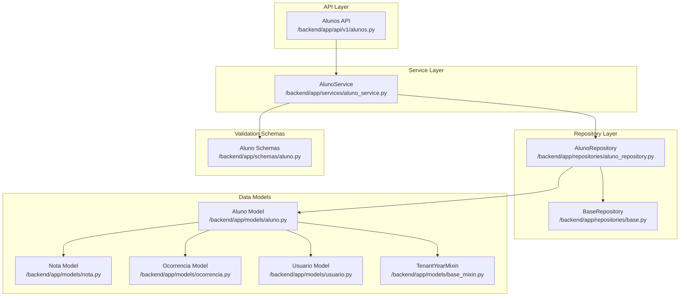
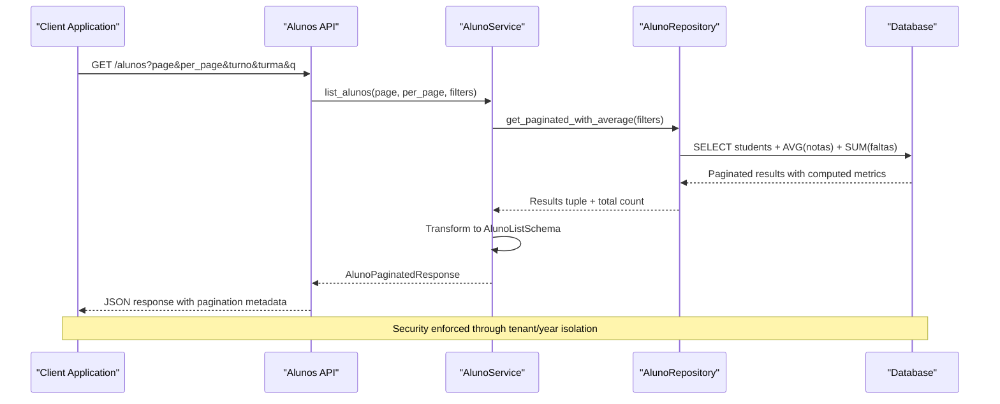
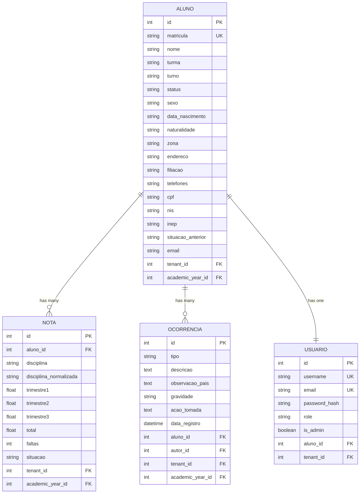
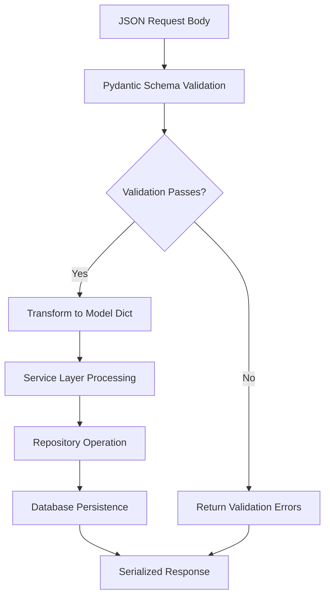
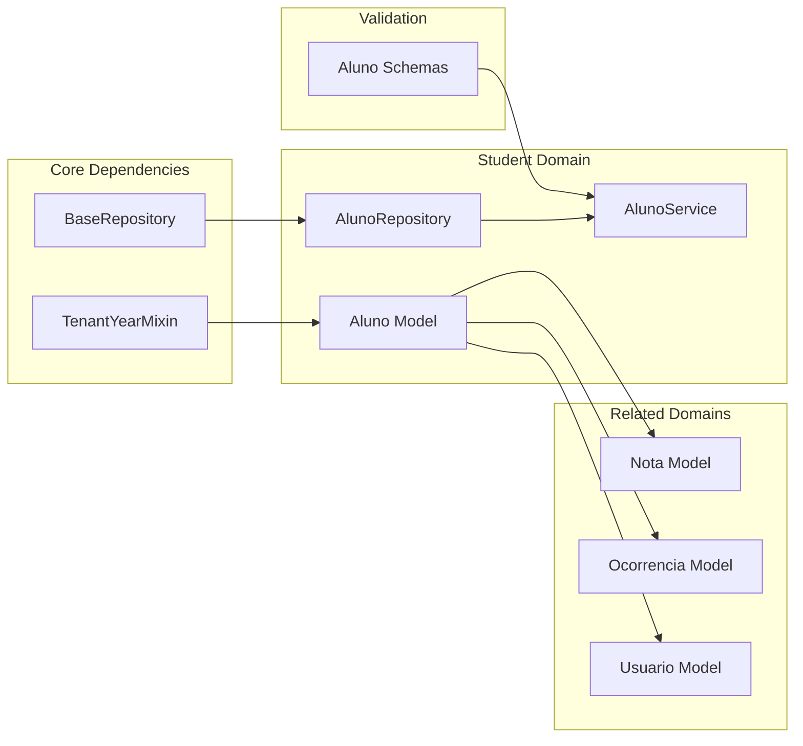

# Student Data Models & Schema

<cite>
**Referenced Files in This Document**
- [aluno.py](file://backend/app/models/aluno.py)
- [aluno.py](file://backend/app/schemas/aluno.py)
- [aluno_repository.py](file://backend/app/repositories/aluno_repository.py)
- [base.py](file://backend/app/repositories/base.py)
- [base_mixin.py](file://backend/app/models/base_mixin.py)
- [nota.py](file://backend/app/models/nota.py)
- [ocorrencia.py](file://backend/app/models/ocorrencia.py)
- [usuario.py](file://backend/app/models/usuario.py)
- [aluno_service.py](file://backend/app/services/aluno_service.py)
- [alunos.py](file://backend/app/api/v1/alunos.py)
- [turmas.py](file://backend/app/api/v1/turmas.py)
</cite>

## Table of Contents
1. [Introduction](#introduction)
2. [Project Structure](#project-structure)
3. [Core Components](#core-components)
4. [Architecture Overview](#architecture-overview)
5. [Detailed Component Analysis](#detailed-component-analysis)
6. [Dependency Analysis](#dependency-analysis)
7. [Performance Considerations](#performance-considerations)
8. [Troubleshooting Guide](#troubleshooting-guide)
9. [Conclusion](#conclusion)

## Introduction
This document provides comprehensive data model documentation for the student entity (Aluno) within the ColaboraEDU platform. It covers the Aluno model structure, Pydantic validation schemas, repository pattern implementation, and relationships with academic records (Notas), class enrollments (Turmas), and disciplinary actions (Ocorrencias). The documentation includes field definitions, data types, constraints, business rules, and practical examples of model instantiation, serialization, and data transformation patterns used throughout the system.

## Project Structure
The student data model is organized across several layers:
- Data models: SQLAlchemy ORM models for persistence
- Schemas: Pydantic models for validation and serialization
- Repository: Data access layer implementing CRUD operations
- Service: Business logic orchestrating repository operations
- API: HTTP endpoints validating requests and returning responses

**Diagram sources**
- [alunos.py:1-148](file://backend/app/api/v1/alunos.py#L1-L148)
- [aluno_service.py:1-156](file://backend/app/services/aluno_service.py#L1-L156)
- [aluno_repository.py:1-105](file://backend/app/repositories/aluno_repository.py#L1-L105)
- [base.py:1-41](file://backend/app/repositories/base.py#L1-L41)
- [aluno.py:1-36](file://backend/app/models/aluno.py#L1-L36)
- [nota.py:1-24](file://backend/app/models/nota.py#L1-L24)
- [ocorrencia.py:1-45](file://backend/app/models/ocorrencia.py#L1-L45)
- [usuario.py:1-30](file://backend/app/models/usuario.py#L1-L30)
- [base_mixin.py:1-22](file://backend/app/models/base_mixin.py#L1-L22)
- [aluno.py:1-85](file://backend/app/schemas/aluno.py#L1-L85)

**Section sources**
- [alunos.py:1-148](file://backend/app/api/v1/alunos.py#L1-L148)
- [aluno_service.py:1-156](file://backend/app/services/aluno_service.py#L1-L156)
- [aluno_repository.py:1-105](file://backend/app/repositories/aluno_repository.py#L1-L105)
- [base.py:1-41](file://backend/app/repositories/base.py#L1-L41)
- [aluno.py:1-36](file://backend/app/models/aluno.py#L1-L36)
- [nota.py:1-24](file://backend/app/models/nota.py#L1-L24)
- [ocorrencia.py:1-45](file://backend/app/models/ocorrencia.py#L1-L45)
- [usuario.py:1-30](file://backend/app/models/usuario.py#L1-L30)
- [base_mixin.py:1-22](file://backend/app/models/base_mixin.py#L1-L22)
- [aluno.py:1-85](file://backend/app/schemas/aluno.py#L1-L85)

## Core Components
This section documents the Aluno model, validation schemas, and repository implementation.

### Aluno Model Structure
The Aluno model defines the student entity with comprehensive personal and academic information:

**Primary Fields:**
- `id`: Auto-incremented primary key
- `matricula`: Unique student registration number (String, 32 chars, required)
- `nome`: Student full name (String, 255 chars, required)
- `turma`: Classroom identifier (String, 32 chars, required)
- `turno`: School period (String, 32 chars, required)
- `status`: Student enrollment status (String, 32 chars, optional)

**Personal Information (Matrícula Inicial):**
- `sexo`: Gender (String, 10 chars, optional)
- `data_nascimento`: Date of birth (String, 20 chars, optional)
- `naturalidade`: Place of birth (String, 100 chars, optional)
- `zona`: Residence zone (String, 50 chars, optional)
- `endereco`: Address (String, 500 chars, optional)
- `filiacao`: Parentage information (String, 500 chars, optional)
- `telefones`: Phone numbers (String, 100 chars, optional)
- `cpf`: CPF number (String, 20 chars, optional)
- `nis`: Social identification number (String, 20 chars, optional)
- `inep`: INEP identifier (String, 32 chars, optional)
- `situacao_anterior`: Previous situation (String, 100 chars, optional)
- `email`: Contact email (String, 255 chars, optional)

**Constraints and Relationships:**
- Unique constraint on `matricula`
- Foreign key relationships through TenantYearMixin for multitenancy and academic year isolation
- Bidirectional relationships with Notas and Usuario models
- Cascade deletion for orphaned academic records

**Section sources**
- [aluno.py:8-36](file://backend/app/models/aluno.py#L8-L36)
- [base_mixin.py:4-22](file://backend/app/models/base_mixin.py#L4-L22)

### Pydantic Validation Schemas
The validation layer provides structured input/output definitions:

**Base Schemas:**
- `AlunoBase`: Core student information fields
- `NotaBase`: Academic record structure with trimester grades, absences, and status
- `AlunoListSchema`: Student list view with computed average and absence counts
- `AlunoDetailSchema`: Complete student profile including academic records

**Validation Schemas:**
- `AlunoCreate`: Full student data for creation (extends AlunoBase)
- `AlunoUpdate`: Partial student data for updates (all fields optional)
- `PaginationMeta`: Standard pagination metadata structure

**Key Validation Rules:**
- All Pydantic models configured with `from_attributes=True` for seamless ORM integration
- Optional fields allow partial updates while maintaining data integrity
- Automatic type coercion and validation during deserialization
- Nested validation for academic records within detail schemas

**Section sources**
- [aluno.py:1-85](file://backend/app/schemas/aluno.py#L1-L85)

### Repository Pattern Implementation
The AlunoRepository implements the BaseRepository pattern with specialized query methods:

**Core Operations:**
- Standard CRUD operations inherited from BaseRepository
- `get_paginated_with_average`: Advanced paginated query with computed averages and absence totals
- `get_with_notes`: Detailed student retrieval with academic records and computed metrics

**Advanced Query Features:**
- Multitenancy support through tenant_id filtering
- Academic year isolation via academic_year_id
- Dynamic filtering by turn, classroom, and search text
- Aggregation queries for performance optimization
- Outer joins for comprehensive data retrieval

**Data Transformation:**
- Tuple-based results combining student data with computed metrics
- Automatic tenant and year validation for security
- Ordered results with configurable pagination

**Section sources**
- [aluno_repository.py:8-105](file://backend/app/repositories/aluno_repository.py#L8-L105)
- [base.py:7-41](file://backend/app/repositories/base.py#L7-L41)

## Architecture Overview
The student data architecture follows a layered pattern with clear separation of concerns:

**Diagram sources**
- [alunos.py:18-41](file://backend/app/api/v1/alunos.py#L18-L41)
- [aluno_service.py:20-61](file://backend/app/services/aluno_service.py#L20-L61)
- [aluno_repository.py:12-74](file://backend/app/repositories/aluno_repository.py#L12-L74)

**Section sources**
- [alunos.py:18-41](file://backend/app/api/v1/alunos.py#L18-L41)
- [aluno_service.py:20-61](file://backend/app/services/aluno_service.py#L20-L61)
- [aluno_repository.py:12-74](file://backend/app/repositories/aluno_repository.py#L12-L74)

## Detailed Component Analysis

### Entity Relationship Diagram
The student entity participates in three primary relationships:

**Diagram sources**
- [aluno.py:8-36](file://backend/app/models/aluno.py#L8-L36)
- [nota.py:9-24](file://backend/app/models/nota.py#L9-L24)
- [ocorrencia.py:9-29](file://backend/app/models/ocorrencia.py#L9-L29)
- [usuario.py:8-25](file://backend/app/models/usuario.py#L8-L25)
- [base_mixin.py:4-22](file://backend/app/models/base_mixin.py#L4-L22)

### Academic Records Integration
The Aluno model maintains a comprehensive relationship with academic performance data:

**Grade Management:**
- One-to-many relationship with Nota entities
- Automatic cascade deletion for orphaned records
- Normalized discipline names for consistent reporting
- Trimester-based grade tracking with numeric precision
- Attendance tracking through absence counts

**Computed Metrics:**
- Average grade calculation per student
- Total absence aggregation
- Academic status determination
- Performance analytics across multiple disciplines

**Section sources**
- [aluno.py:33-34](file://backend/app/models/aluno.py#L33-L34)
- [nota.py:13-23](file://backend/app/models/nota.py#L13-L23)
- [aluno_repository.py:28-32](file://backend/app/repositories/aluno_repository.py#L28-L32)

### Disciplinary Actions Integration
Student disciplinary records provide behavioral oversight:

**Action Types:**
- Warning, commendation, and severity-based classifications
- Detailed descriptions and observations for parents
- Action taken documentation and tracking
- Timestamped recording of incidents

**Authorization:**
- Relationship with Usuario model for author attribution
- Role-based access control for disciplinary actions
- Notification status tracking for parent communication

**Section sources**
- [ocorrencia.py:14-28](file://backend/app/models/ocorrencia.py#L14-L28)
- [ocorrencia.py:27-28](file://backend/app/models/ocorrencia.py#L27-L28)

### Class Enrollment Context
While the Aluno model stores basic classroom information, the system provides comprehensive enrollment management:

**Enrollment Details:**
- Classroom identifier stored at student level
- Period (turn) classification for scheduling
- Multi-tenant support for separate institutional contexts
- Academic year isolation for historical tracking

**External Integration:**
- Turmas API provides detailed enrollment lists
- Cross-referencing between student records and class rosters
- Administrative access controls for enrollment management

**Section sources**
- [aluno.py:13-17](file://backend/app/models/aluno.py#L13-L17)
- [turmas.py:24-39](file://backend/app/api/v1/turmas.py#L24-L39)

### Data Validation Logic
The validation system ensures data integrity across all operations:

**Diagram sources**
- [alunos.py:68-78](file://backend/app/api/v1/alunos.py#L68-L78)
- [aluno.py:59-80](file://backend/app/schemas/aluno.py#L59-L80)

**Validation Rules:**
- Field-level type checking and conversion
- Optional field handling for partial updates
- Nested object validation for academic records
- Automatic serialization/deserialization support

**Section sources**
- [alunos.py:68-97](file://backend/app/api/v1/alunos.py#L68-L97)
- [aluno.py:59-80](file://backend/app/schemas/aluno.py#L59-L80)

### Business Rules and Constraints
The system enforces several business rules:

**Data Integrity:**
- Unique student registration numbers
- Required fields for core identification
- Tenant and academic year isolation
- Cascade deletion for orphaned records

**Security:**
- Role-based access control for student operations
- Student self-service limitations for profile access
- Tenant isolation preventing cross-institutional data access

**Performance:**
- Aggregated queries reducing database round trips
- Indexing on foreign keys and frequently queried fields
- Efficient pagination with total count calculation

**Section sources**
- [aluno.py:13](file://backend/app/models/aluno.py#L13)
- [aluno_repository.py:34-40](file://backend/app/repositories/aluno_repository.py#L34-L40)
- [alunos.py:49-51](file://backend/app/api/v1/alunos.py#L49-L51)

## Dependency Analysis
The student data model exhibits well-structured dependencies:

**Diagram sources**
- [base_mixin.py:4-22](file://backend/app/models/base_mixin.py#L4-L22)
- [base.py:7-41](file://backend/app/repositories/base.py#L7-L41)
- [aluno.py:8-36](file://backend/app/models/aluno.py#L8-L36)
- [aluno_repository.py:8-10](file://backend/app/repositories/aluno_repository.py#L8-L10)
- [aluno_service.py:15-18](file://backend/app/services/aluno_service.py#L15-L18)
- [nota.py:9-23](file://backend/app/models/nota.py#L9-L23)
- [ocorrencia.py:9-28](file://backend/app/models/ocorrencia.py#L9-L28)
- [usuario.py:8-25](file://backend/app/models/usuario.py#L8-L25)
- [aluno.py:1-85](file://backend/app/schemas/aluno.py#L1-L85)

**Cohesion and Coupling:**
- High cohesion within the student domain
- Loose coupling through interface-based repository pattern
- Clear separation between validation, persistence, and business logic
- Minimal circular dependencies

**Section sources**
- [base_mixin.py:4-22](file://backend/app/models/base_mixin.py#L4-L22)
- [base.py:7-41](file://backend/app/repositories/base.py#L7-L41)
- [aluno.py:8-36](file://backend/app/models/aluno.py#L8-L36)
- [aluno_repository.py:8-10](file://backend/app/repositories/aluno_repository.py#L8-L10)
- [aluno_service.py:15-18](file://backend/app/services/aluno_service.py#L15-L18)

## Performance Considerations
The student data model incorporates several performance optimizations:

**Query Optimization:**
- Aggregated queries compute averages and totals in a single database operation
- Outer joins prevent data loss while maintaining performance
- Selective field projection reduces memory usage
- Proper indexing on foreign keys and frequently filtered fields

**Memory Efficiency:**
- Generator-based pagination prevents loading large datasets into memory
- Tuple-based results minimize object overhead
- Lazy loading for related entities

**Scalability:**
- Tenant and academic year isolation enables horizontal scaling
- Caching opportunities through computed metrics
- Optimized join strategies for complex queries

## Troubleshooting Guide
Common issues and their resolutions:

**Validation Errors:**
- Ensure all required fields are present for AlunoCreate operations
- Use AlunoUpdate schema for partial field updates
- Validate JSON structure matches schema definitions

**Data Integrity Issues:**
- Check unique constraint violations for matricula field
- Verify tenant and academic year context for multi-tenant deployments
- Confirm foreign key relationships for related entities

**Performance Issues:**
- Use pagination parameters appropriately
- Apply filters to reduce result sets
- Monitor query execution plans for complex aggregations

**Section sources**
- [alunos.py:68-97](file://backend/app/api/v1/alunos.py#L68-L97)
- [aluno_repository.py:12-74](file://backend/app/repositories/aluno_repository.py#L12-L74)

## Conclusion
The student data model in ColaboraEDU demonstrates robust architectural principles with clear separation of concerns, comprehensive validation, and efficient data access patterns. The Aluno model provides a complete foundation for student management while maintaining strong relationships with academic records, disciplinary actions, and user accounts. The repository pattern implementation ensures maintainable data access, while Pydantic schemas guarantee data integrity and provide seamless integration with the API layer. The system's multitenant and academic year isolation capabilities enable scalable deployment across multiple institutions while maintaining data security and organizational boundaries.