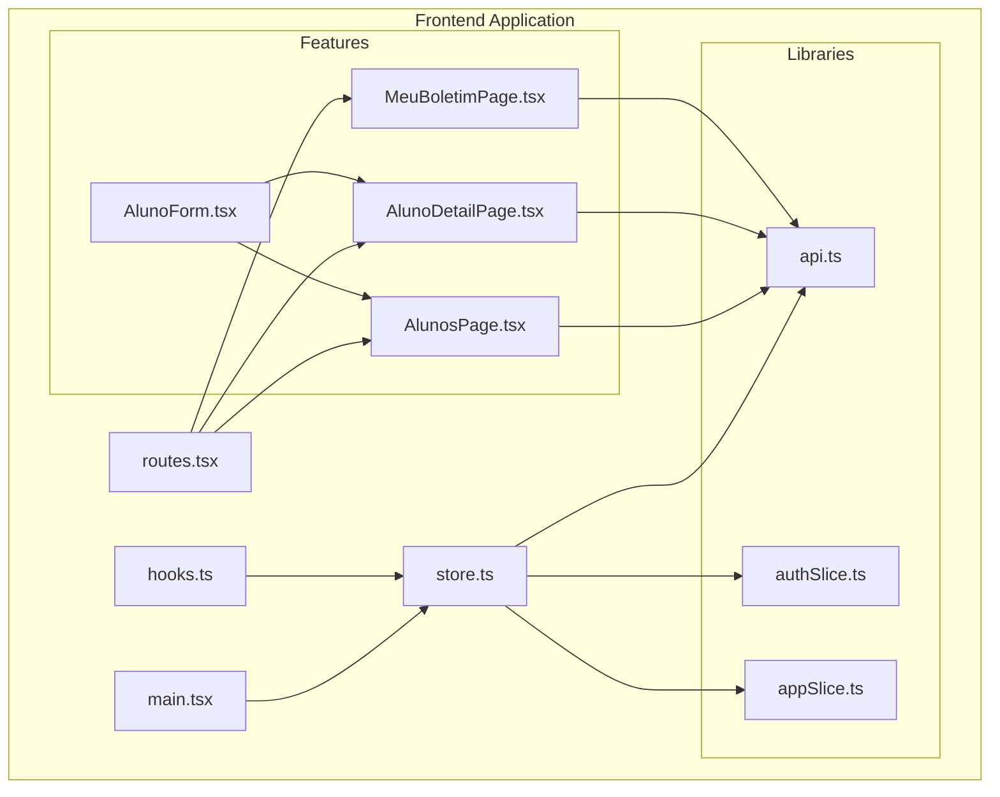
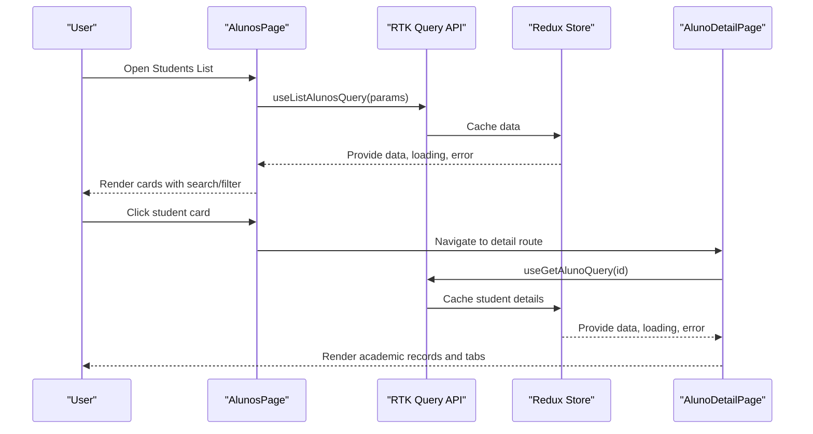
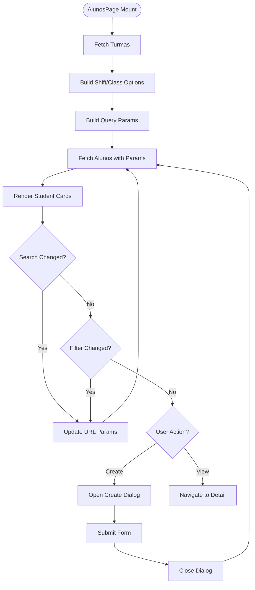
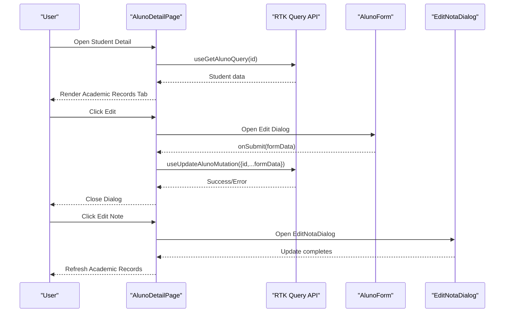
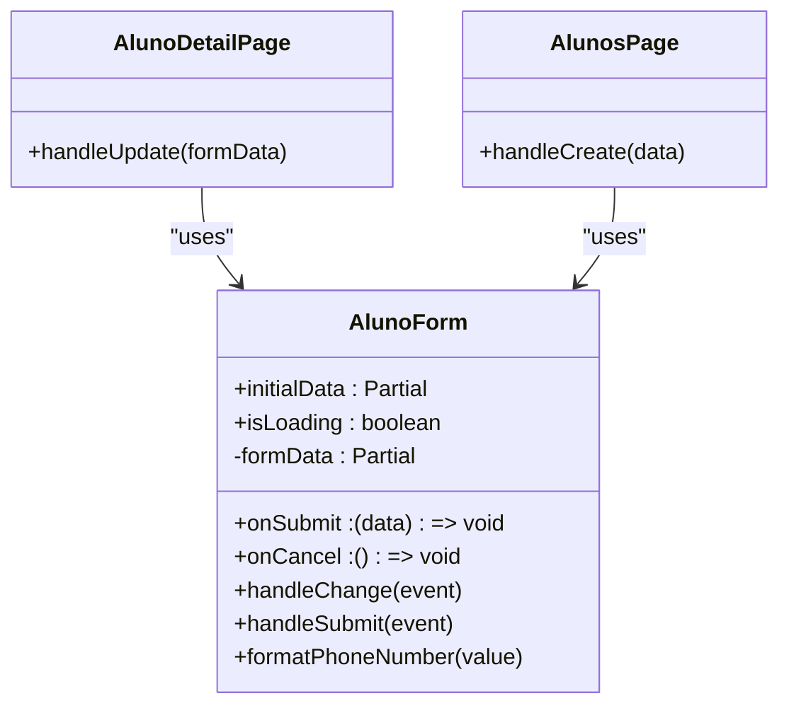
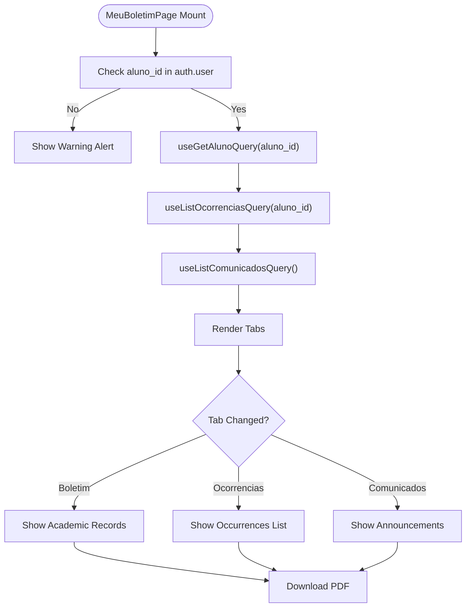
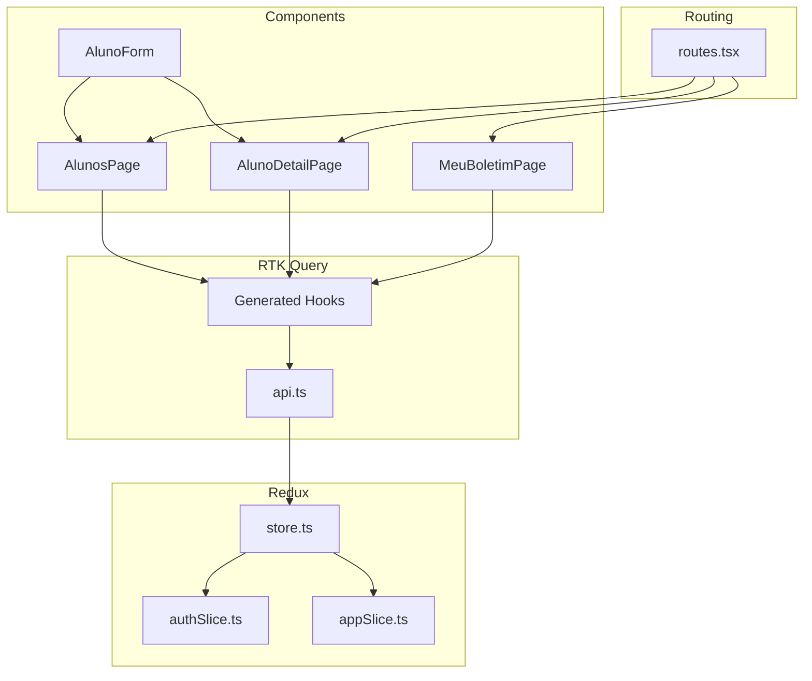

# Student Frontend Components

<cite>
**Referenced Files in This Document**
- [AlunosPage.tsx](file://frontend/src/features/alunos/AlunosPage.tsx)
- [AlunoDetailPage.tsx](file://frontend/src/features/alunos/AlunoDetailPage.tsx)
- [AlunoForm.tsx](file://frontend/src/features/alunos/AlunoForm.tsx)
- [MeuBoletimPage.tsx](file://frontend/src/features/alunos/MeuBoletimPage.tsx)
- [api.ts](file://frontend/src/lib/api.ts)
- [store.ts](file://frontend/src/app/store.ts)
- [hooks.ts](file://frontend/src/app/hooks.ts)
- [routes.tsx](file://frontend/src/app/routes.tsx)
- [authSlice.ts](file://frontend/src/features/auth/authSlice.ts)
- [appSlice.ts](file://frontend/src/features/app/appSlice.ts)
- [main.tsx](file://frontend/src/main.tsx)
</cite>

## Table of Contents
1. [Introduction](#introduction)
2. [Project Structure](#project-structure)
3. [Core Components](#core-components)
4. [Architecture Overview](#architecture-overview)
5. [Detailed Component Analysis](#detailed-component-analysis)
6. [Dependency Analysis](#dependency-analysis)
7. [Performance Considerations](#performance-considerations)
8. [Troubleshooting Guide](#troubleshooting-guide)
9. [Conclusion](#conclusion)

## Introduction
This document provides comprehensive technical documentation for the student management frontend components in the ColaboraEdu platform. It covers four key components: AlunosPage for listing students with search, filtering, and pagination; AlunoDetailPage for displaying student information, academic records, and related data; AlunoForm for creating and editing student records with form validation and error handling; and MeuBoletimPage for student/parent access to personal grade reports. The documentation explains component props, state management patterns using Redux, API integration with RTK Query, and user interaction flows. It also details data fetching strategies, loading states, error handling, and form submission processes, along with examples of component composition, routing integration, and responsive design implementation.

## Project Structure
The student management features are organized under the frontend/src/features/alunos directory, with each component serving a distinct purpose in the student lifecycle. The components integrate with a centralized API client built on RTK Query, a Redux store for state management, and React Router for navigation.

**Diagram sources**
- [main.tsx:11-26](file://frontend/src/main.tsx#L11-L26)
- [store.ts:7-17](file://frontend/src/app/store.ts#L7-L17)
- [routes.tsx:41-96](file://frontend/src/app/routes.tsx#L41-L96)
- [AlunosPage.tsx:51-340](file://frontend/src/features/alunos/AlunosPage.tsx#L51-L340)
- [AlunoDetailPage.tsx:95-484](file://frontend/src/features/alunos/AlunoDetailPage.tsx#L95-L484)
- [MeuBoletimPage.tsx:49-277](file://frontend/src/features/alunos/MeuBoletimPage.tsx#L49-L277)
- [api.ts:409-739](file://frontend/src/lib/api.ts#L409-L739)
- [authSlice.ts:25-46](file://frontend/src/features/auth/authSlice.ts#L25-L46)
- [appSlice.ts:13-24](file://frontend/src/features/app/appSlice.ts#L13-L24)

**Section sources**
- [main.tsx:11-26](file://frontend/src/main.tsx#L11-L26)
- [store.ts:7-17](file://frontend/src/app/store.ts#L7-L17)
- [routes.tsx:41-96](file://frontend/src/app/routes.tsx#L41-L96)

## Core Components
This section provides an overview of each component's responsibilities, props, and integration points.

- **AlunosPage**: Lists students with search, filtering by shift and class, pagination, and creation dialog. Uses RTK Query for fetching students and classes, manages local search parameters via URL, and displays cards with status chips and average grades.
- **AlunoDetailPage**: Displays detailed student information, academic records, personal data, and AI insights. Provides edit/delete dialogs for administrators and allows PDF downloads. Integrates with RTK Query for student data and related resources.
- **AlunoForm**: A reusable form component for creating and editing student records. Handles field validation, formatting (phone numbers), and submission callbacks. Used within dialogs in both AlunosPage and AlunoDetailPage.
- **MeuBoletimPage**: Enables students and parents to access personal grade reports, view occurrences, and read announcements. Fetches student data, occurrences, and announcements using RTK Query and provides PDF download functionality.

**Section sources**
- [AlunosPage.tsx:51-340](file://frontend/src/features/alunos/AlunosPage.tsx#L51-L340)
- [AlunoDetailPage.tsx:95-484](file://frontend/src/features/alunos/AlunoDetailPage.tsx#L95-L484)
- [AlunoForm.tsx:14-292](file://frontend/src/features/alunos/AlunoForm.tsx#L14-L292)
- [MeuBoletimPage.tsx:49-277](file://frontend/src/features/alunos/MeuBoletimPage.tsx#L49-L277)

## Architecture Overview
The components follow a unidirectional data flow pattern:
- Components trigger RTK Query endpoints via generated hooks.
- API responses populate the Redux store through RTK Query's automatic caching and invalidation.
- React components subscribe to store slices using typed hooks for selective re-rendering.
- Authentication and tenant context are injected into API requests via a custom base query wrapper.

**Diagram sources**
- [AlunosPage.tsx:114-122](file://frontend/src/features/alunos/AlunosPage.tsx#L114-L122)
- [AlunoDetailPage.tsx:98-100](file://frontend/src/features/alunos/AlunoDetailPage.tsx#L98-L100)
- [api.ts:447-451](file://frontend/src/lib/api.ts#L447-L451)

**Section sources**
- [api.ts:336-407](file://frontend/src/lib/api.ts#L336-L407)
- [store.ts:7-17](file://frontend/src/app/store.ts#L7-L17)

## Detailed Component Analysis

### AlunosPage Component
Purpose: Manage student listing with search, filtering, pagination, and creation capabilities.

Key Features:
- URL-based search parameter synchronization using useSearchParams.
- Filtering by shift and class derived from fetched class data.
- Responsive grid layout with skeleton loaders during loading states.
- Conditional rendering for administrative actions (create student).
- Integration with AlunoForm for new student creation.

Props and State:
- Props: None (uses RTK Query hooks and Redux selectors).
- State: Local state for search term, shift filter, class filter, and dialog visibility.

Data Fetching Strategy:
- useListAlunosQuery with refetchOnMountOrArgChange and refetchOnFocus for real-time updates.
- useListTurmasQuery to populate shift/class filter options dynamically.

Loading and Error Handling:
- Displays error alert on fetch failure.
- Shows skeleton cards while data is loading or fetching.

Form Submission:
- Uses AlunoForm with onSubmit callback to create new students via useCreateAlunoMutation.

Routing Integration:
- Links to individual student detail pages using react-router-dom.

Responsive Design:
- Grid layout adapts from 1 to 4 columns based on screen size.
- Chips and typography scale appropriately for different devices.

**Diagram sources**
- [AlunosPage.tsx:51-340](file://frontend/src/features/alunos/AlunosPage.tsx#L51-L340)
- [api.ts:453-458](file://frontend/src/lib/api.ts#L453-L458)
- [api.ts:460-464](file://frontend/src/lib/api.ts#L460-L464)

**Section sources**
- [AlunosPage.tsx:51-340](file://frontend/src/features/alunos/AlunosPage.tsx#L51-L340)
- [api.ts:453-458](file://frontend/src/lib/api.ts#L453-L458)
- [api.ts:460-464](file://frontend/src/lib/api.ts#L460-L464)

### AlunoDetailPage Component
Purpose: Display comprehensive student information, academic records, personal data, and AI insights.

Key Features:
- Tabbed interface for Academic Records, Personal Information, and AI Insights.
- Edit and delete dialogs for administrators with mutation hooks.
- PDF download functionality using authenticated fetch.
- Role-based visibility of administrative controls.

Props and State:
- Props: None (uses RTK Query hooks and Redux selectors).
- State: Local state for active tab, editing note dialog, editing student dialog, and deletion confirmation.

Data Fetching Strategy:
- useGetAlunoQuery for detailed student data.
- useUpdateAlunoMutation and useDeleteAlunoMutation for administrative actions.
- Integration with EditNotaDialog for grade updates.

Loading and Error Handling:
- Circular progress indicator during loading.
- Error alert if data cannot be loaded.

Form Submission:
- Uses AlunoForm with onSubmit callback to update existing student records.

**Diagram sources**
- [AlunoDetailPage.tsx:95-484](file://frontend/src/features/alunos/AlunoDetailPage.tsx#L95-L484)
- [api.ts:447-451](file://frontend/src/lib/api.ts#L447-L451)
- [api.ts:672-678](file://frontend/src/lib/api.ts#L672-L678)

**Section sources**
- [AlunoDetailPage.tsx:95-484](file://frontend/src/features/alunos/AlunoDetailPage.tsx#L95-L484)
- [api.ts:447-451](file://frontend/src/lib/api.ts#L447-L451)
- [api.ts:672-678](file://frontend/src/lib/api.ts#L672-L678)

### AlunoForm Component
Purpose: Provide a reusable form for creating and editing student records with validation and formatting.

Props:
- initialData: Partial student data for pre-populating the form.
- onSubmit: Callback invoked with form data upon submission.
- onCancel: Callback invoked to cancel form actions.
- isLoading: Boolean indicating submission in progress.

State Management:
- Local state for form data with useEffect to initialize from initialData.
- Phone number formatting logic for Brazilian phone numbers.

Validation and Formatting:
- Required fields for essential student information.
- Phone number masking logic for consistent formatting.

**Diagram sources**
- [AlunoForm.tsx:14-292](file://frontend/src/features/alunos/AlunoForm.tsx#L14-L292)
- [AlunoDetailPage.tsx:112-119](file://frontend/src/features/alunos/AlunoDetailPage.tsx#L112-L119)
- [AlunosPage.tsx:71-78](file://frontend/src/features/alunos/AlunosPage.tsx#L71-L78)

**Section sources**
- [AlunoForm.tsx:14-292](file://frontend/src/features/alunos/AlunoForm.tsx#L14-L292)

### MeuBoletimPage Component
Purpose: Enable students and parents to access personal grade reports, view occurrences, and read announcements.

Key Features:
- Tabbed interface for Grade Report, My Occurrences, and My Messages.
- PDF download functionality using authenticated fetch.
- Conditional rendering based on user association to a student profile.

Props and State:
- Props: None (uses RTK Query hooks and Redux selectors).
- State: Local state for active tab.

Data Fetching Strategy:
- useGetAlunoQuery for current user's student data.
- useListOcorrenciasQuery for occurrence history.
- useListComunicadosQuery for announcements.

Loading and Error Handling:
- Circular progress indicator during loading.
- Error alerts if data cannot be loaded.
- Warning alert if user is not associated with a student.

**Diagram sources**
- [MeuBoletimPage.tsx:49-277](file://frontend/src/features/alunos/MeuBoletimPage.tsx#L49-L277)
- [api.ts:447-451](file://frontend/src/lib/api.ts#L447-L451)
- [api.ts:622-627](file://frontend/src/lib/api.ts#L622-L627)
- [api.ts:585-590](file://frontend/src/lib/api.ts#L585-L590)

**Section sources**
- [MeuBoletimPage.tsx:49-277](file://frontend/src/features/alunos/MeuBoletimPage.tsx#L49-L277)
- [api.ts:447-451](file://frontend/src/lib/api.ts#L447-L451)
- [api.ts:622-627](file://frontend/src/lib/api.ts#L622-L627)
- [api.ts:585-590](file://frontend/src/lib/api.ts#L585-L590)

## Dependency Analysis
The components share common dependencies and integration points:

- RTK Query API: Centralized API client with typed endpoints for students, classes, grades, and related resources.
- Redux Store: Global state management with authentication and application context.
- React Router: Navigation and route protection with authentication guards.
- Material UI: Consistent UI components and responsive design patterns.

**Diagram sources**
- [api.ts:409-739](file://frontend/src/lib/api.ts#L409-L739)
- [store.ts:7-17](file://frontend/src/app/store.ts#L7-L17)
- [authSlice.ts:25-46](file://frontend/src/features/auth/authSlice.ts#L25-L46)
- [appSlice.ts:13-24](file://frontend/src/features/app/appSlice.ts#L13-L24)
- [routes.tsx:41-96](file://frontend/src/app/routes.tsx#L41-L96)

**Section sources**
- [api.ts:409-739](file://frontend/src/lib/api.ts#L409-L739)
- [store.ts:7-17](file://frontend/src/app/store.ts#L7-L17)
- [routes.tsx:41-96](file://frontend/src/app/routes.tsx#L41-L96)

## Performance Considerations
- Caching and Invalidation: RTK Query automatically caches responses and invalidates them on mutations, reducing redundant network calls.
- Lazy Loading: Components render skeletons during initial load to improve perceived performance.
- Refetch Strategies: useListAlunosQuery and useListTurmasQuery use refetchOnMountOrArgChange and refetchOnFocus to keep data fresh.
- Tag-Based Invalidation: API endpoints define tag types to invalidate related cached data efficiently.
- Responsive Design: Grid layouts and component sizing adapt to different screen sizes, minimizing layout thrashing.

## Troubleshooting Guide
Common Issues and Resolutions:
- Authentication Failures: The base query wrapper handles 401 responses by attempting token refresh; if refresh fails, users are logged out automatically.
- Data Fetching Errors: Components display error alerts when data cannot be loaded; verify network connectivity and API endpoint availability.
- Form Submission Errors: Validation errors and submission failures are handled by catching exceptions in submit callbacks; ensure required fields are populated.
- PDF Download Failures: Verify that the user has a valid access token and that the API endpoint for PDF generation is reachable.

**Section sources**
- [api.ts:363-407](file://frontend/src/lib/api.ts#L363-L407)
- [AlunosPage.tsx:222](file://frontend/src/features/alunos/AlunosPage.tsx#L222)
- [AlunoDetailPage.tsx:171-173](file://frontend/src/features/alunos/AlunoDetailPage.tsx#L171-L173)
- [MeuBoletimPage.tsx:105-107](file://frontend/src/features/alunos/MeuBoletimPage.tsx#L105-L107)

## Conclusion
The student management frontend components demonstrate a robust architecture leveraging RTK Query for data fetching, Redux for state management, and React Router for navigation. The components provide comprehensive functionality for listing, viewing, editing, and creating student records, along with personalized grade report access for students and parents. The design emphasizes responsive layouts, efficient caching, and clear user interaction flows, ensuring a smooth and reliable user experience across different roles and devices.