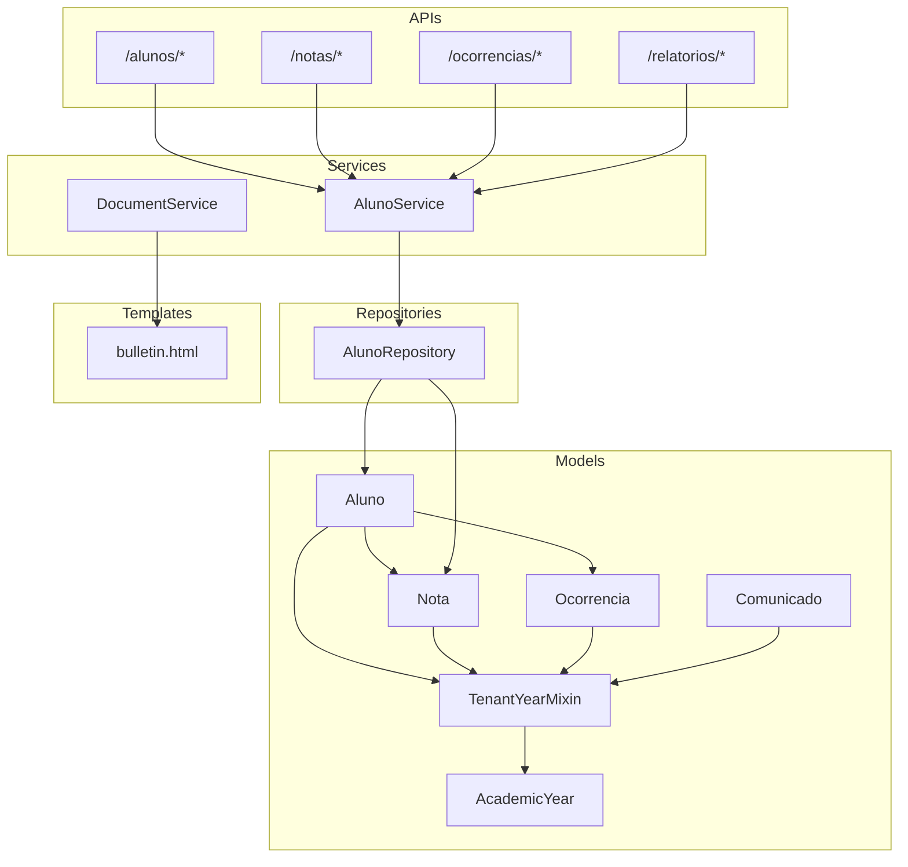
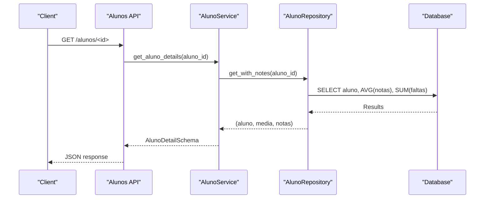
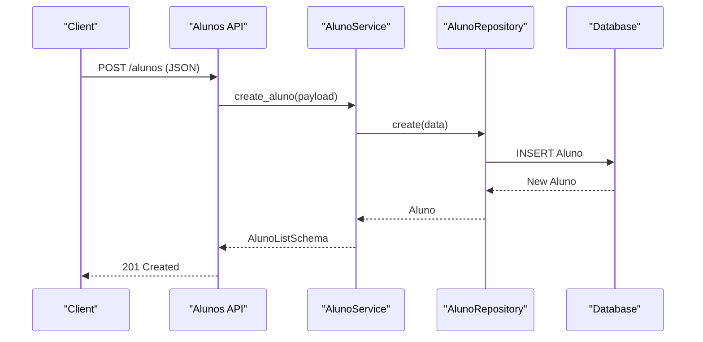
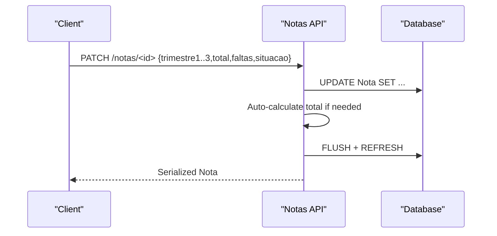
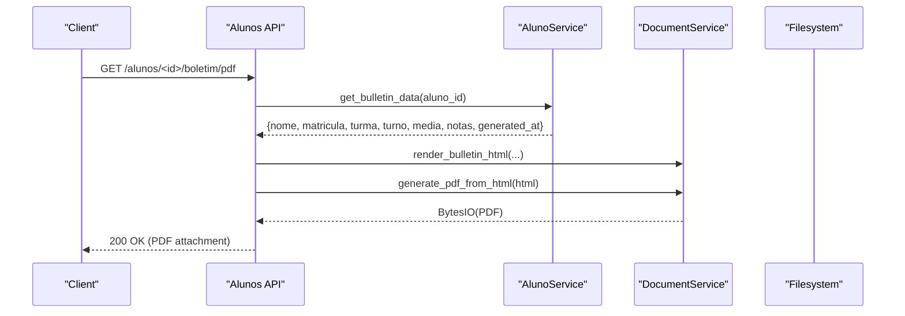
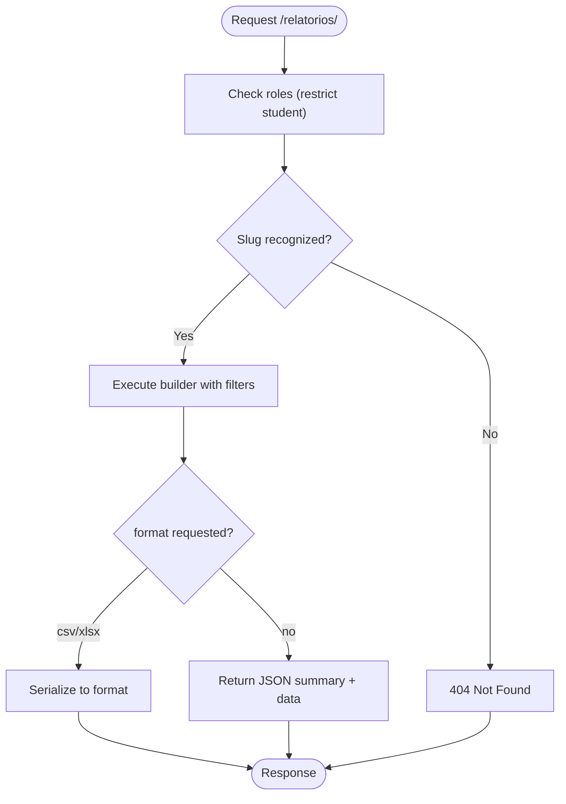
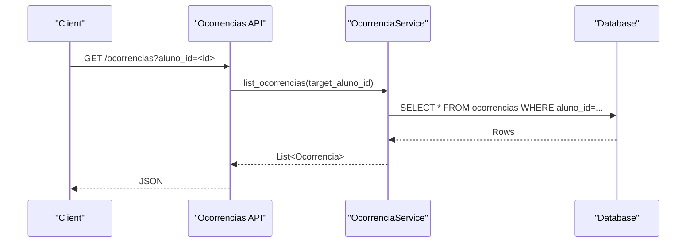
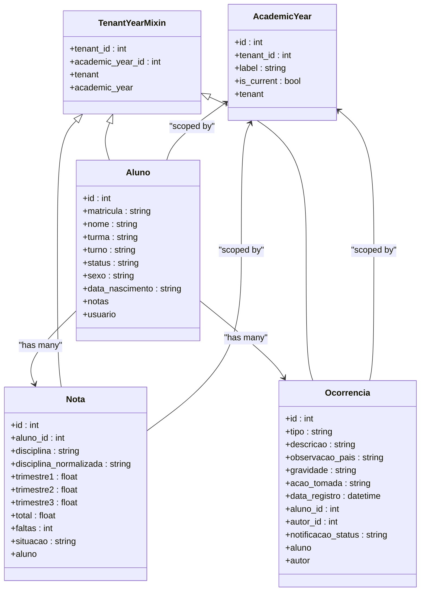
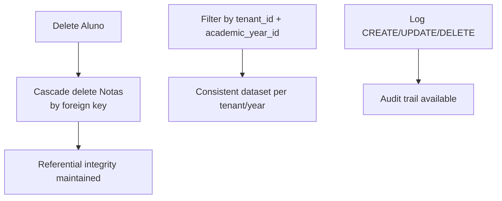
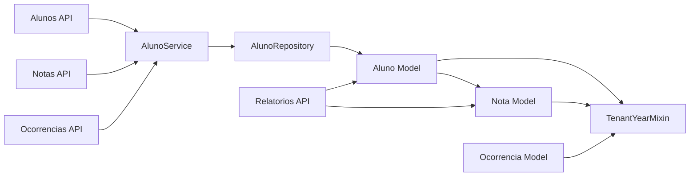

# Student Integration & Workflows

<cite>
**Referenced Files in This Document**
- [backend/app/models/aluno.py](file://backend/app/models/aluno.py)
- [backend/app/models/nota.py](file://backend/app/models/nota.py)
- [backend/app/models/ocorrencia.py](file://backend/app/models/ocorrencia.py)
- [backend/app/models/comunicado.py](file://backend/app/models/comunicado.py)
- [backend/app/models/academic_year.py](file://backend/app/models/academic_year.py)
- [backend/app/models/base_mixin.py](file://backend/app/models/base_mixin.py)
- [backend/app/repositories/aluno_repository.py](file://backend/app/repositories/aluno_repository.py)
- [backend/app/services/aluno_service.py](file://backend/app/services/aluno_service.py)
- [backend/app/services/document_service.py](file://backend/app/services/document_service.py)
- [backend/app/api/v1/alunos.py](file://backend/app/api/v1/alunos.py)
- [backend/app/api/v1/notas.py](file://backend/app/api/v1/notas.py)
- [backend/app/api/v1/ocorrencias.py](file://backend/app/api/v1/ocorrencias.py)
- [backend/app/api/v1/relatorios.py](file://backend/app/api/v1/relatorios.py)
- [backend/app/templates/documents/bulletin.html](file://backend/app/templates/documents/bulletin.html)
</cite>

## Table of Contents
1. [Introduction](#introduction)
2. [Project Structure](#project-structure)
3. [Core Components](#core-components)
4. [Architecture Overview](#architecture-overview)
5. [Detailed Component Analysis](#detailed-component-analysis)
6. [Dependency Analysis](#dependency-analysis)
7. [Performance Considerations](#performance-considerations)
8. [Troubleshooting Guide](#troubleshooting-guide)
9. [Conclusion](#conclusion)
10. [Appendices](#appendices)

## Introduction
This document explains the end-to-end student lifecycle and integration workflows within the platform, covering enrollment, academic tracking, bulletin generation, and reporting. It documents how student data flows through the system, linking academic records, discipline events, and administrative communications. It also details referential integrity, multitenancy and academic-year scoping, cascading operations, audit logging, and error recovery mechanisms. Workflow examples include student onboarding, academic year transitions, and data export processes.

## Project Structure
The student management domain spans models, repositories, services, APIs, and templates:
- Models define entities and relationships (student, grades, incidents, announcements).
- Repositories encapsulate data access and aggregation queries.
- Services orchestrate business logic, validation, and cross-entity operations.
- APIs expose endpoints for CRUD, reports, and document generation.
- Templates render printable documents (e.g., bulletins).

**Diagram sources**
- [backend/app/models/aluno.py:8-36](file://backend/app/models/aluno.py#L8-L36)
- [backend/app/models/nota.py:9-24](file://backend/app/models/nota.py#L9-L24)
- [backend/app/models/ocorrencia.py:9-45](file://backend/app/models/ocorrencia.py#L9-L45)
- [backend/app/models/comunicado.py:8-39](file://backend/app/models/comunicado.py#L8-L39)
- [backend/app/models/academic_year.py:6-16](file://backend/app/models/academic_year.py#L6-L16)
- [backend/app/models/base_mixin.py:4-22](file://backend/app/models/base_mixin.py#L4-L22)
- [backend/app/repositories/aluno_repository.py:8-105](file://backend/app/repositories/aluno_repository.py#L8-L105)
- [backend/app/services/aluno_service.py:15-156](file://backend/app/services/aluno_service.py#L15-L156)
- [backend/app/services/document_service.py:6-27](file://backend/app/services/document_service.py#L6-L27)
- [backend/app/api/v1/alunos.py:12-148](file://backend/app/api/v1/alunos.py#L12-L148)
- [backend/app/api/v1/notas.py:34-190](file://backend/app/api/v1/notas.py#L34-L190)
- [backend/app/api/v1/ocorrencias.py:9-109](file://backend/app/api/v1/ocorrencias.py#L9-L109)
- [backend/app/api/v1/relatorios.py:457-538](file://backend/app/api/v1/relatorios.py#L457-L538)
- [backend/app/templates/documents/bulletin.html](file://backend/app/templates/documents/bulletin.html)

**Section sources**
- [backend/app/models/aluno.py:1-36](file://backend/app/models/aluno.py#L1-L36)
- [backend/app/models/nota.py:1-24](file://backend/app/models/nota.py#L1-L24)
- [backend/app/models/ocorrencia.py:1-45](file://backend/app/models/ocorrencia.py#L1-L45)
- [backend/app/models/comunicado.py:1-39](file://backend/app/models/comunicado.py#L1-L39)
- [backend/app/models/academic_year.py:1-16](file://backend/app/models/academic_year.py#L1-L16)
- [backend/app/models/base_mixin.py:1-22](file://backend/app/models/base_mixin.py#L1-L22)
- [backend/app/repositories/aluno_repository.py:1-105](file://backend/app/repositories/aluno_repository.py#L1-L105)
- [backend/app/services/aluno_service.py:1-156](file://backend/app/services/aluno_service.py#L1-L156)
- [backend/app/services/document_service.py:1-27](file://backend/app/services/document_service.py#L1-L27)
- [backend/app/api/v1/alunos.py:1-148](file://backend/app/api/v1/alunos.py#L1-L148)
- [backend/app/api/v1/notas.py:1-190](file://backend/app/api/v1/notas.py#L1-L190)
- [backend/app/api/v1/ocorrencias.py:1-109](file://backend/app/api/v1/ocorrencias.py#L1-L109)
- [backend/app/api/v1/relatorios.py:1-538](file://backend/app/api/v1/relatorios.py#L1-L538)

## Core Components
- Student entity (Aluno): Stores personal and enrollment attributes, links to grades and user account.
- Grade entity (Nota): Tracks trimester scores, totals, absences, and status per subject.
- Discipline event (Ocorrencia): Records behavioral or academic incidents linked to students and authors.
- Announcement (Comunicado): School-wide or targeted notices authored by staff.
- Academic scoping: TenantYearMixin enforces tenant and academic-year boundaries across entities.
- Repository: Aggregates averages and counts for lists and details, applying tenant/year filters.
- Service: Orchestrates student details, bulletin assembly, and audit logs.
- API: Exposes endpoints for CRUD, grade updates, incident management, reports, and PDF generation.
- Reports: Built-in analytical views for attendance, risk, heatmap, and comparative metrics.

**Section sources**
- [backend/app/models/aluno.py:8-36](file://backend/app/models/aluno.py#L8-L36)
- [backend/app/models/nota.py:9-24](file://backend/app/models/nota.py#L9-L24)
- [backend/app/models/ocorrencia.py:9-45](file://backend/app/models/ocorrencia.py#L9-L45)
- [backend/app/models/comunicado.py:8-39](file://backend/app/models/comunicado.py#L8-L39)
- [backend/app/models/base_mixin.py:4-22](file://backend/app/models/base_mixin.py#L4-L22)
- [backend/app/repositories/aluno_repository.py:12-105](file://backend/app/repositories/aluno_repository.py#L12-L105)
- [backend/app/services/aluno_service.py:15-156](file://backend/app/services/aluno_service.py#L15-L156)
- [backend/app/api/v1/alunos.py:12-148](file://backend/app/api/v1/alunos.py#L12-L148)
- [backend/app/api/v1/notas.py:34-190](file://backend/app/api/v1/notas.py#L34-L190)
- [backend/app/api/v1/ocorrencias.py:9-109](file://backend/app/api/v1/ocorrencias.py#L9-L109)
- [backend/app/api/v1/relatorios.py:442-454](file://backend/app/api/v1/relatorios.py#L442-L454)

## Architecture Overview
The system follows layered architecture:
- Presentation: Flask blueprints expose REST endpoints.
- Business: Services coordinate operations and enforce authorization and validation.
- Persistence: SQLAlchemy ORM with mixins for tenant and academic-year scoping.
- Reporting: SQL queries aggregate data for dashboards and exports.

**Diagram sources**
- [backend/app/api/v1/alunos.py:43-61](file://backend/app/api/v1/alunos.py#L43-L61)
- [backend/app/services/aluno_service.py:63-93](file://backend/app/services/aluno_service.py#L63-L93)
- [backend/app/repositories/aluno_repository.py:76-104](file://backend/app/repositories/aluno_repository.py#L76-L104)

## Detailed Component Analysis

### Student Lifecycle and Enrollment
- Onboarding: Create student records via the Alunos API, validated by Pydantic schemas and persisted by the repository/service layer. Audit actions are logged.
- Enrollment linkage: Students are scoped by tenant and academic year via TenantYearMixin. Enrollment attributes include class and shift.
- Access control: Retrieval restricts students to their own records for student role holders.

**Diagram sources**
- [backend/app/api/v1/alunos.py:63-78](file://backend/app/api/v1/alunos.py#L63-L78)
- [backend/app/services/aluno_service.py:95-105](file://backend/app/services/aluno_service.py#L95-L105)
- [backend/app/repositories/aluno_repository.py:8-10](file://backend/app/repositories/aluno_repository.py#L8-L10)

**Section sources**
- [backend/app/api/v1/alunos.py:12-109](file://backend/app/api/v1/alunos.py#L12-L109)
- [backend/app/services/aluno_service.py:95-105](file://backend/app/services/aluno_service.py#L95-L105)
- [backend/app/models/base_mixin.py:4-22](file://backend/app/models/base_mixin.py#L4-L22)
- [backend/app/models/aluno.py:8-36](file://backend/app/models/aluno.py#L8-L36)

### Academic Tracking and Grade Calculation
- Grade storage: Each subject grade is stored with trimester values, absence count, and computed total.
- Automatic recalculation: When trimester fields change, totals are recalculated from non-null values.
- Filtering and normalization: Disciplines are normalized for consistent reporting.
- Authorization: Only administrators can modify grades.

**Diagram sources**
- [backend/app/api/v1/notas.py:124-187](file://backend/app/api/v1/notas.py#L124-L187)
- [backend/app/models/nota.py:9-24](file://backend/app/models/nota.py#L9-L24)

**Section sources**
- [backend/app/api/v1/notas.py:34-190](file://backend/app/api/v1/notas.py#L34-L190)
- [backend/app/models/nota.py:9-24](file://backend/app/models/nota.py#L9-L24)

### Bulletin Generation and PDF Export
- Data assembly: Service gathers student details, average, and subject grades scoped to tenant and academic year.
- Template rendering: HTML rendered from a Flask template with school name and year label.
- PDF generation: In-memory conversion to PDF for immediate download.

**Diagram sources**
- [backend/app/api/v1/alunos.py:111-145](file://backend/app/api/v1/alunos.py#L111-L145)
- [backend/app/services/aluno_service.py:130-154](file://backend/app/services/aluno_service.py#L130-L154)
- [backend/app/services/document_service.py:18-26](file://backend/app/services/document_service.py#L18-L26)
- [backend/app/templates/documents/bulletin.html](file://backend/app/templates/documents/bulletin.html)

**Section sources**
- [backend/app/api/v1/alunos.py:111-145](file://backend/app/api/v1/alunos.py#L111-L145)
- [backend/app/services/aluno_service.py:130-154](file://backend/app/services/aluno_service.py#L130-L154)
- [backend/app/services/document_service.py:1-27](file://backend/app/services/document_service.py#L1-L27)

### Reporting and Analytics
- Report builders: Predefined aggregations for top classes by attendance, best averages, at-risk students, discipline performance, and comparative efficiency.
- Filters: Turno, serie (grade prefix), turma, and disciplina with tenant and academic-year scoping.
- Export: CSV and XLSX export support for report datasets.

**Diagram sources**
- [backend/app/api/v1/relatorios.py:457-538](file://backend/app/api/v1/relatorios.py#L457-L538)

**Section sources**
- [backend/app/api/v1/relatorios.py:11-538](file://backend/app/api/v1/relatorios.py#L11-L538)

### Disciplinary Record Linkage
- Incidents: Students can accumulate occurrences (warnings, commendations, etc.) linked to author and severity.
- Visibility: Authorization logic allows staff to list all incidents or restrict to a specific student; students see only their own.
- Notifications: A status field tracks notification delivery attempts.

**Diagram sources**
- [backend/app/api/v1/ocorrencias.py:12-37](file://backend/app/api/v1/ocorrencias.py#L12-L37)
- [backend/app/models/ocorrencia.py:9-45](file://backend/app/models/ocorrencia.py#L9-L45)

**Section sources**
- [backend/app/api/v1/ocorrencias.py:9-109](file://backend/app/api/v1/ocorrencias.py#L9-L109)
- [backend/app/models/ocorrencia.py:9-45](file://backend/app/models/ocorrencia.py#L9-L45)

### Class Enrollment and Academic Year Scoping
- Enrollment: Students carry class (turma) and shift (turno) metadata.
- Academic year: TenantYearMixin ensures tenant and academic-year isolation across entities.
- Year selection: API reads current academic year from request context for reports and documents.

**Diagram sources**
- [backend/app/models/base_mixin.py:4-22](file://backend/app/models/base_mixin.py#L4-L22)
- [backend/app/models/aluno.py:8-36](file://backend/app/models/aluno.py#L8-L36)
- [backend/app/models/nota.py:9-24](file://backend/app/models/nota.py#L9-L24)
- [backend/app/models/ocorrencia.py:9-45](file://backend/app/models/ocorrencia.py#L9-L45)
- [backend/app/models/academic_year.py:6-16](file://backend/app/models/academic_year.py#L6-L16)

**Section sources**
- [backend/app/models/base_mixin.py:4-22](file://backend/app/models/base_mixin.py#L4-L22)
- [backend/app/models/aluno.py:8-36](file://backend/app/models/aluno.py#L8-L36)
- [backend/app/models/nota.py:9-24](file://backend/app/models/nota.py#L9-L24)
- [backend/app/models/ocorrencia.py:9-45](file://backend/app/models/ocorrencia.py#L9-L45)
- [backend/app/models/academic_year.py:6-16](file://backend/app/models/academic_year.py#L6-L16)

### Data Consistency, Cascade Operations, and Referential Integrity
- Cascade deletes: Grades are orphaned when a student is deleted, ensuring referential integrity.
- Tenant and academic-year scoping: Queries filter by tenant_id and academic_year_id to prevent cross-contamination.
- Denormalized averages: Repository aggregates averages and absence totals for efficient listing and detail views.
- Audit trail: Actions on students and grades are logged with old/new values for transparency.

**Diagram sources**
- [backend/app/models/nota.py](file://backend/app/models/nota.py#L13)
- [backend/app/repositories/aluno_repository.py:24-39](file://backend/app/repositories/aluno_repository.py#L24-L39)
- [backend/app/services/aluno_service.py:97-127](file://backend/app/services/aluno_service.py#L97-L127)
- [backend/app/api/v1/notas.py:171-179](file://backend/app/api/v1/notas.py#L171-L179)

**Section sources**
- [backend/app/models/nota.py](file://backend/app/models/nota.py#L13)
- [backend/app/repositories/aluno_repository.py:24-39](file://backend/app/repositories/aluno_repository.py#L24-L39)
- [backend/app/services/aluno_service.py:97-127](file://backend/app/services/aluno_service.py#L97-L127)
- [backend/app/api/v1/notas.py:171-179](file://backend/app/api/v1/notas.py#L171-L179)

### Workflow Examples

#### Student Onboarding
- Steps: Validate payload → Create student → Log action → Return created record.
- Controls: JWT roles, Pydantic validation, tenant/year scoping.

**Section sources**
- [backend/app/api/v1/alunos.py:63-78](file://backend/app/api/v1/alunos.py#L63-L78)
- [backend/app/services/aluno_service.py:95-105](file://backend/app/services/aluno_service.py#L95-L105)

#### Academic Year Transition
- Steps: Set current academic year per tenant → All new data scoped automatically → Historical reports filtered by year.
- Controls: AcademicYear entity and TenantYearMixin.

**Section sources**
- [backend/app/models/academic_year.py:6-16](file://backend/app/models/academic_year.py#L6-L16)
- [backend/app/models/base_mixin.py:4-22](file://backend/app/models/base_mixin.py#L4-L22)

#### Data Export Processes
- Steps: Request report → Builder executes scoped SQL → Optional CSV/XLSX serialization → Download response.
- Controls: Role checks, pagination, and robust error handling.

**Section sources**
- [backend/app/api/v1/relatorios.py:457-538](file://backend/app/api/v1/relatorios.py#L457-L538)

## Dependency Analysis
Key dependencies and coupling:
- APIs depend on services for business logic and on repositories for data access.
- Services depend on repositories and logging utilities.
- Models share TenantYearMixin for consistent scoping.
- Reports rely on joins between Aluno and Nota with tenant/year filters.

**Diagram sources**
- [backend/app/api/v1/alunos.py:12-148](file://backend/app/api/v1/alunos.py#L12-L148)
- [backend/app/api/v1/notas.py:34-190](file://backend/app/api/v1/notas.py#L34-L190)
- [backend/app/api/v1/ocorrencias.py:9-109](file://backend/app/api/v1/ocorrencias.py#L9-L109)
- [backend/app/api/v1/relatorios.py:457-538](file://backend/app/api/v1/relatorios.py#L457-L538)
- [backend/app/services/aluno_service.py:15-156](file://backend/app/services/aluno_service.py#L15-L156)
- [backend/app/repositories/aluno_repository.py:8-105](file://backend/app/repositories/aluno_repository.py#L8-L105)
- [backend/app/models/aluno.py:8-36](file://backend/app/models/aluno.py#L8-L36)
- [backend/app/models/nota.py:9-24](file://backend/app/models/nota.py#L9-L24)
- [backend/app/models/ocorrencia.py:9-45](file://backend/app/models/ocorrencia.py#L9-L45)
- [backend/app/models/base_mixin.py:4-22](file://backend/app/models/base_mixin.py#L4-L22)

**Section sources**
- [backend/app/api/v1/alunos.py:12-148](file://backend/app/api/v1/alunos.py#L12-L148)
- [backend/app/api/v1/notas.py:34-190](file://backend/app/api/v1/notas.py#L34-L190)
- [backend/app/api/v1/ocorrencias.py:9-109](file://backend/app/api/v1/ocorrencias.py#L9-L109)
- [backend/app/api/v1/relatorios.py:457-538](file://backend/app/api/v1/relatorios.py#L457-L538)
- [backend/app/services/aluno_service.py:15-156](file://backend/app/services/aluno_service.py#L15-L156)
- [backend/app/repositories/aluno_repository.py:8-105](file://backend/app/repositories/aluno_repository.py#L8-L105)
- [backend/app/models/aluno.py:8-36](file://backend/app/models/aluno.py#L8-L36)
- [backend/app/models/nota.py:9-24](file://backend/app/models/nota.py#L9-L24)
- [backend/app/models/ocorrencia.py:9-45](file://backend/app/models/ocorrencia.py#L9-L45)
- [backend/app/models/base_mixin.py:4-22](file://backend/app/models/base_mixin.py#L4-L22)

## Performance Considerations
- Pagination and limits: Lists enforce maximum page sizes to cap resource usage.
- Aggregation queries: Repository computes averages and totals in SQL to reduce Python overhead.
- Joined loading: Grade listings join with student data to avoid N+1 queries.
- Caching invalidation: Updates trigger cache invalidation to keep derived data consistent.
- Background processing: Report generation is CPU-intensive; offload heavy computations to background jobs for large datasets.

[No sources needed since this section provides general guidance]

## Troubleshooting Guide
- Unauthorized access: Certain roles are restricted from viewing student records or editing grades.
- Validation errors: Pydantic validation returns structured errors for malformed payloads.
- Not found resources: Returns 404 when student, grade, or occurrence is missing.
- Report failures: Errors during report building are logged and returned as 500 responses.
- PDF generation: Errors in HTML-to-PDF conversion raise exceptions indicating generation failure.

**Section sources**
- [backend/app/api/v1/alunos.py:49-51](file://backend/app/api/v1/alunos.py#L49-L51)
- [backend/app/api/v1/notas.py:129-136](file://backend/app/api/v1/notas.py#L129-L136)
- [backend/app/api/v1/relatorios.py:533-535](file://backend/app/api/v1/relatorios.py#L533-L535)

## Conclusion
The platform integrates student records with academic tracking and reporting through a clean separation of concerns. Tenant and academic-year scoping ensures data isolation, while cascade operations and audit logging maintain referential integrity and traceability. APIs provide secure, paginated access to student data, grade management, and rich analytical reports, with PDF generation capabilities for official documents.

## Appendices

### Audit Trail and Error Recovery
- Audit actions: CREATE/UPDATE/DELETE actions are logged with contextual metadata.
- Error recovery: API endpoints return structured errors; report builders log failures and return standardized error responses.

**Section sources**
- [backend/app/services/aluno_service.py:97-127](file://backend/app/services/aluno_service.py#L97-L127)
- [backend/app/api/v1/notas.py:171-179](file://backend/app/api/v1/notas.py#L171-L179)
- [backend/app/api/v1/relatorios.py:533-535](file://backend/app/api/v1/relatorios.py#L533-L535)