# Student Management System

<cite>
**Referenced Files in This Document**
- [aluno.py](file://backend/app/models/aluno.py)
- [aluno.py](file://backend/app/schemas/aluno.py)
- [aluno_repository.py](file://backend/app/repositories/aluno_repository.py)
- [aluno_service.py](file://backend/app/services/aluno_service.py)
- [alunos.py](file://backend/app/api/v1/alunos.py)
- [base.py](file://backend/app/repositories/base.py)
- [base_mixin.py](file://backend/app/models/base_mixin.py)
- [nota.py](file://backend/app/models/nota.py)
- [ocorrencia.py](file://backend/app/models/ocorrencia.py)
- [ocorrencia.py](file://backend/app/schemas/ocorrencia.py)
- [ocorrencia_repository.py](file://backend/app/repositories/ocorrencia_repository.py)
- [turmas.py](file://backend/app/api/v1/turmas.py)
- [turma_service.py](file://backend/app/services/turma_service.py)
- [AlunosPage.tsx](file://frontend/src/features/alunos/AlunosPage.tsx)
- [AlunoForm.tsx](file://frontend/src/features/alunos/AlunoForm.tsx)
- [AlunoDetailPage.tsx](file://frontend/src/features/alunos/AlunoDetailPage.tsx)
- [MeuBoletimPage.tsx](file://frontend/src/features/alunos/MeuBoletimPage.tsx)
</cite>

## Table of Contents
1. [Introduction](#introduction)
2. [Project Structure](#project-structure)
3. [Core Components](#core-components)
4. [Architecture Overview](#architecture-overview)
5. [Detailed Component Analysis](#detailed-component-analysis)
6. [Dependency Analysis](#dependency-analysis)
7. [Performance Considerations](#performance-considerations)
8. [Troubleshooting Guide](#troubleshooting-guide)
9. [Conclusion](#conclusion)
10. [Appendices](#appendices)

## Introduction
This document explains the Student Management System within the platform, focusing on student record lifecycle, personal data handling, enrollment processes, and portal functionality. It covers the complete CRUD operations, data validation, integration with academic tracking (grades), and connections to disciplinary records. Administrators will find practical guidance for managing students, while developers gain technical depth for extending or integrating features.

## Project Structure
The student management system spans backend API endpoints, services, repositories, SQLAlchemy models, Pydantic schemas, and frontend pages. The backend follows a layered architecture:
- API layer: Flask blueprints expose endpoints for listing, retrieving, creating, updating, and deleting students, plus PDF generation.
- Service layer: Orchestrates business logic, pagination, filtering, and computed averages.
- Repository layer: Encapsulates database queries and persistence.
- Model layer: SQLAlchemy ORM models define entities and relationships.
- Schema layer: Pydantic models validate and serialize request/response payloads.
- Frontend: React pages provide search, filtering, forms, and report generation.

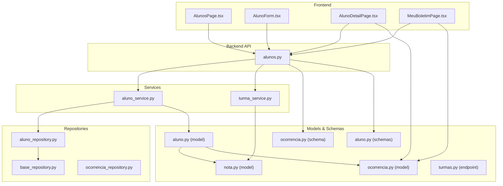

**Diagram sources**
- [alunos.py:12-148](file://backend/app/api/v1/alunos.py#L12-L148)
- [aluno_service.py:15-156](file://backend/app/services/aluno_service.py#L15-L156)
- [aluno_repository.py:8-105](file://backend/app/repositories/aluno_repository.py#L8-L105)
- [base.py:7-41](file://backend/app/repositories/base.py#L7-L41)
- [aluno.py:8-36](file://backend/app/models/aluno.py#L8-L36)
- [nota.py:9-24](file://backend/app/models/nota.py#L9-L24)
- [ocorrencia.py:9-45](file://backend/app/models/ocorrencia.py#L9-L45)
- [aluno.py:18-85](file://backend/app/schemas/aluno.py#L18-L85)
- [ocorrencia.py:5-36](file://backend/app/schemas/ocorrencia.py#L5-L36)
- [turmas.py:11-42](file://backend/app/api/v1/turmas.py#L11-L42)
- [turma_service.py:16-128](file://backend/app/services/turma_service.py#L16-L128)
- [AlunosPage.tsx:51-341](file://frontend/src/features/alunos/AlunosPage.tsx#L51-L341)
- [AlunoForm.tsx:14-293](file://frontend/src/features/alunos/AlunoForm.tsx#L14-L293)
- [AlunoDetailPage.tsx:95-485](file://frontend/src/features/alunos/AlunoDetailPage.tsx#L95-L485)
- [MeuBoletimPage.tsx:49-278](file://frontend/src/features/alunos/MeuBoletimPage.tsx#L49-L278)

**Section sources**
- [alunos.py:12-148](file://backend/app/api/v1/alunos.py#L12-L148)
- [aluno_service.py:15-156](file://backend/app/services/aluno_service.py#L15-L156)
- [aluno_repository.py:8-105](file://backend/app/repositories/aluno_repository.py#L8-L105)
- [base.py:7-41](file://backend/app/repositories/base.py#L7-L41)
- [aluno.py:8-36](file://backend/app/models/aluno.py#L8-L36)
- [nota.py:9-24](file://backend/app/models/nota.py#L9-L24)
- [ocorrencia.py:9-45](file://backend/app/models/ocorrencia.py#L9-L45)
- [aluno.py:18-85](file://backend/app/schemas/aluno.py#L18-L85)
- [ocorrencia.py:5-36](file://backend/app/schemas/ocorrencia.py#L5-L36)
- [turmas.py:11-42](file://backend/app/api/v1/turmas.py#L11-L42)
- [turma_service.py:16-128](file://backend/app/services/turma_service.py#L16-L128)
- [AlunosPage.tsx:51-341](file://frontend/src/features/alunos/AlunosPage.tsx#L51-L341)
- [AlunoForm.tsx:14-293](file://frontend/src/features/alunos/AlunoForm.tsx#L14-L293)
- [AlunoDetailPage.tsx:95-485](file://frontend/src/features/alunos/AlunoDetailPage.tsx#L95-L485)
- [MeuBoletimPage.tsx:49-278](file://frontend/src/features/alunos/MeuBoletimPage.tsx#L49-L278)

## Core Components
- Student entity: Core attributes include registration number, name, class, shift, status, and extensive personal data fields. It maintains relationships to grades and user accounts.
- Academic records: Grades are stored per subject with trimester scores, totals, absences, and status. Aggregations are computed per student.
- Disciplinary records: Offenses are linked to students with severity levels, actions taken, and notification status.
- Service orchestration: Handles pagination, filtering, computed averages, and PDF generation.
- API endpoints: Provide secure access with role-based permissions, input validation, and tenant/year scoping.

**Section sources**
- [aluno.py:8-36](file://backend/app/models/aluno.py#L8-L36)
- [nota.py:9-24](file://backend/app/models/nota.py#L9-L24)
- [ocorrencia.py:9-45](file://backend/app/models/ocorrencia.py#L9-L45)
- [aluno_service.py:15-156](file://backend/app/services/aluno_service.py#L15-L156)
- [alunos.py:15-148](file://backend/app/api/v1/alunos.py#L15-L148)

## Architecture Overview
The system enforces multitenancy and academic year scoping via a shared mixin. Requests are authenticated and authorized, then routed to services that query repositories and models. Results are validated by Pydantic schemas and returned to clients. Frontend pages consume the API for listing, filtering, editing, and generating reports.

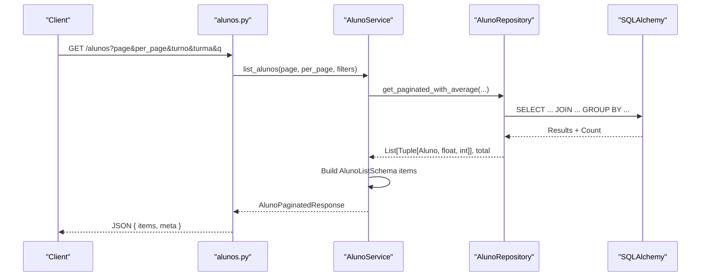

**Diagram sources**
- [alunos.py:18-41](file://backend/app/api/v1/alunos.py#L18-L41)
- [aluno_service.py:20-61](file://backend/app/services/aluno_service.py#L20-L61)
- [aluno_repository.py:12-74](file://backend/app/repositories/aluno_repository.py#L12-L74)

**Section sources**
- [alunos.py:18-41](file://backend/app/api/v1/alunos.py#L18-L41)
- [aluno_service.py:20-61](file://backend/app/services/aluno_service.py#L20-L61)
- [aluno_repository.py:12-74](file://backend/app/repositories/aluno_repository.py#L12-L74)

## Detailed Component Analysis

### Student Entity and Relationships
The student entity encapsulates core and personal data, and connects to academic and user domains.

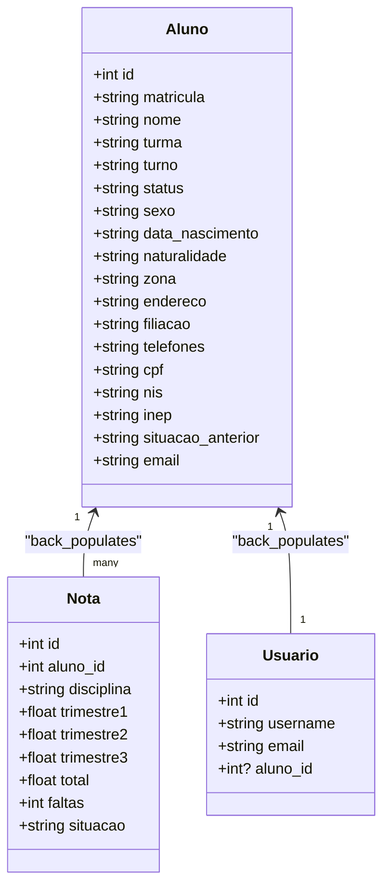

**Diagram sources**
- [aluno.py:8-36](file://backend/app/models/aluno.py#L8-L36)
- [nota.py:9-24](file://backend/app/models/nota.py#L9-L24)
- [aluno.py:8-30](file://backend/app/models/usuario.py#L8-L30)

**Section sources**
- [aluno.py:8-36](file://backend/app/models/aluno.py#L8-L36)
- [nota.py:9-24](file://backend/app/models/nota.py#L9-L24)
- [aluno.py:8-30](file://backend/app/models/usuario.py#L8-L30)

### Academic Records Integration
Grades are aggregated per student for lists and detailed views. The repository computes averages and sums of absences, applying tenant and academic year scoping.

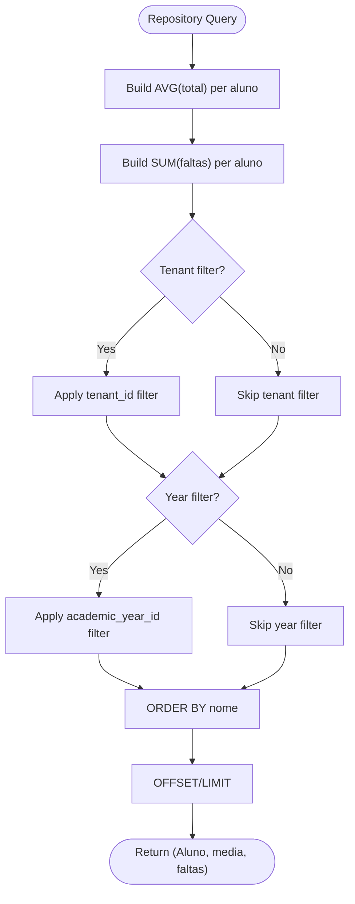

**Diagram sources**
- [aluno_repository.py:12-74](file://backend/app/repositories/aluno_repository.py#L12-L74)

**Section sources**
- [aluno_repository.py:12-74](file://backend/app/repositories/aluno_repository.py#L12-L74)
- [turma_service.py:48-102](file://backend/app/services/turma_service.py#L48-L102)

### Disciplinary Records Integration
Disciplinary records are associated with students and can be filtered by tenant and academic year. The schema exposes display-friendly fields and supports creation with optional notifications.

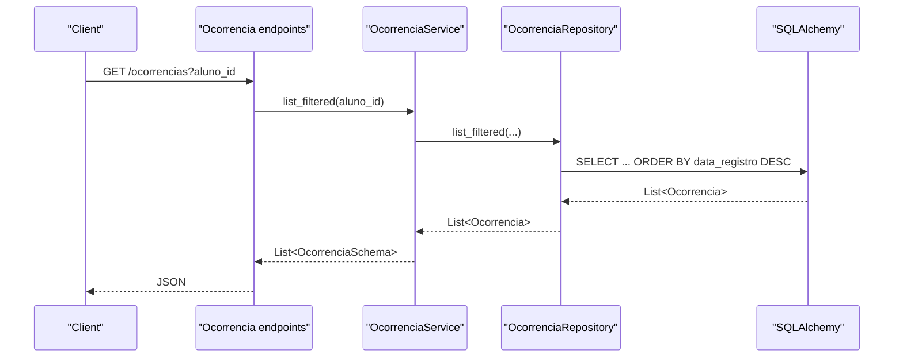

**Diagram sources**
- [ocorrencia_repository.py:12-27](file://backend/app/repositories/ocorrencia_repository.py#L12-L27)
- [ocorrencia.py:5-36](file://backend/app/schemas/ocorrencia.py#L5-L36)

**Section sources**
- [ocorrencia.py:9-45](file://backend/app/models/ocorrencia.py#L9-L45)
- [ocorrencia.py:5-36](file://backend/app/schemas/ocorrencia.py#L5-L36)
- [ocorrencia_repository.py:12-27](file://backend/app/repositories/ocorrencia_repository.py#L12-L27)

### Student CRUD Workflows

#### Create Student
- Endpoint: POST /api/v1/alunos
- Validation: Pydantic AlunoCreate schema
- Persistence: Repository creates Aluno, service logs action
- Response: AlunoListSchema

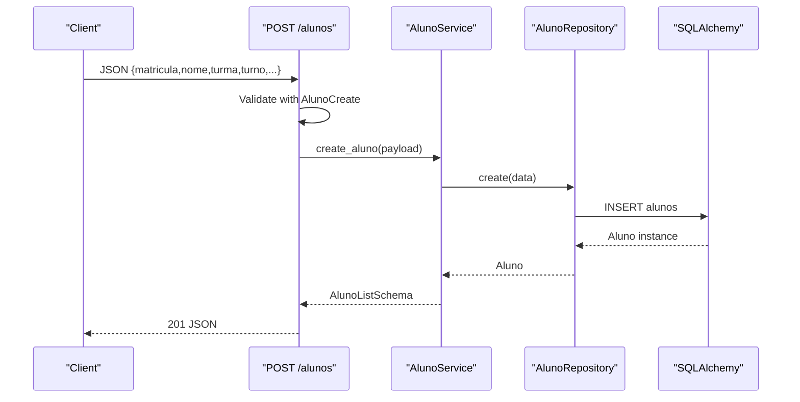

**Diagram sources**
- [alunos.py:66-78](file://backend/app/api/v1/alunos.py#L66-L78)
- [aluno_service.py:95-105](file://backend/app/services/aluno_service.py#L95-L105)
- [aluno_repository.py:19-24](file://backend/app/repositories/aluno_repository.py#L19-L24)

**Section sources**
- [alunos.py:66-78](file://backend/app/api/v1/alunos.py#L66-L78)
- [aluno_service.py:95-105](file://backend/app/services/aluno_service.py#L95-L105)
- [aluno_repository.py:19-24](file://backend/app/repositories/aluno_repository.py#L19-L24)

#### Update Student
- Endpoint: PATCH /api/v1/alunos/{id}
- Validation: Pydantic AlunoUpdate schema
- Persistence: Repository updates fields, service logs action
- Response: AlunoListSchema or 404

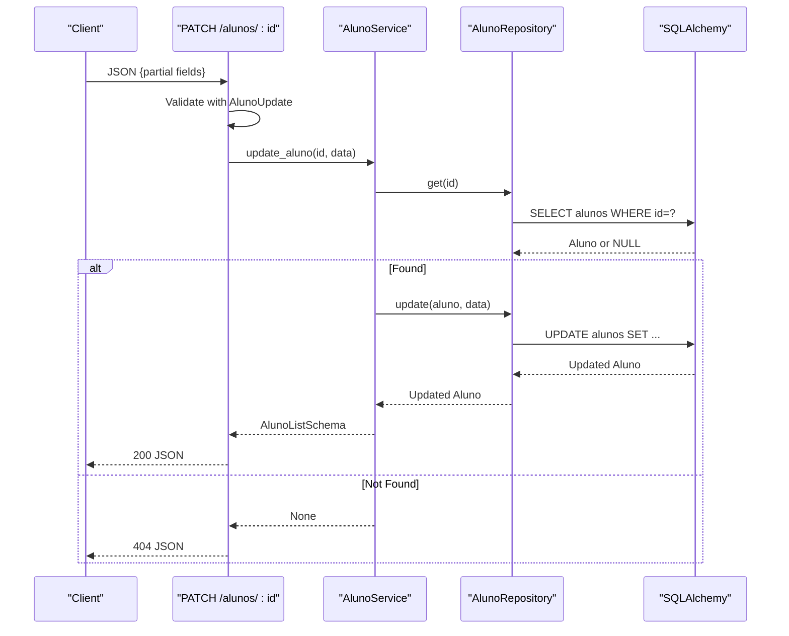

**Diagram sources**
- [alunos.py:83-97](file://backend/app/api/v1/alunos.py#L83-L97)
- [aluno_service.py:107-122](file://backend/app/services/aluno_service.py#L107-L122)
- [aluno_repository.py:26-32](file://backend/app/repositories/aluno_repository.py#L26-L32)

**Section sources**
- [alunos.py:83-97](file://backend/app/api/v1/alunos.py#L83-L97)
- [aluno_service.py:107-122](file://backend/app/services/aluno_service.py#L107-L122)
- [aluno_repository.py:26-32](file://backend/app/repositories/aluno_repository.py#L26-L32)

#### Delete Student
- Endpoint: DELETE /api/v1/alunos/{id}
- Cascade: Grades are deleted via CASCADE on aluno_id
- Response: 204 No Content or 404 Not Found

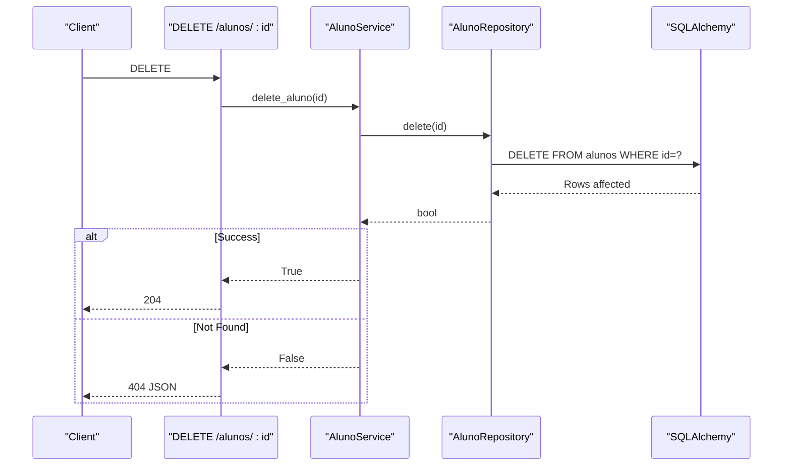

**Diagram sources**
- [alunos.py:99-109](file://backend/app/api/v1/alunos.py#L99-L109)
- [aluno_service.py:124-128](file://backend/app/services/aluno_service.py#L124-L128)
- [aluno_repository.py:34-40](file://backend/app/repositories/aluno_repository.py#L34-L40)

**Section sources**
- [alunos.py:99-109](file://backend/app/api/v1/alunos.py#L99-L109)
- [aluno_service.py:124-128](file://backend/app/services/aluno_service.py#L124-L128)
- [aluno_repository.py:34-40](file://backend/app/repositories/aluno_repository.py#L34-L40)

### Portal Functionality and Search
- Listing and Filtering: Students can be filtered by shift, class, and free-text search across name, registration number, and class. Pagination is supported.
- Detail View: Retrieves student details, average grade, absence count, and ordered grades.
- Personal Data: Extensive personal fields are exposed in detail and editable via forms.
- Reports: PDF generation endpoint produces a transcript-like document for a given student.

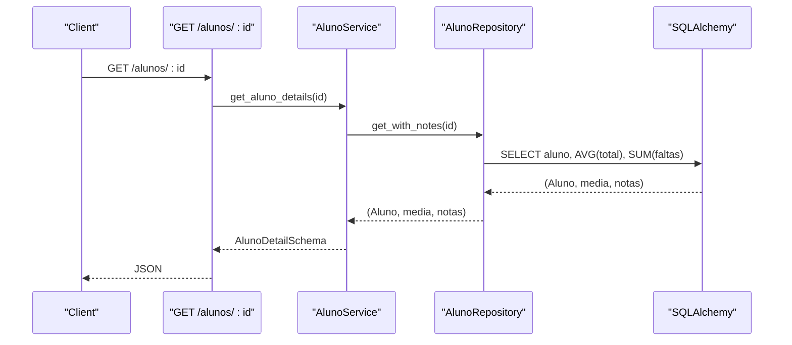

**Diagram sources**
- [alunos.py:43-61](file://backend/app/api/v1/alunos.py#L43-L61)
- [aluno_service.py:63-93](file://backend/app/services/aluno_service.py#L63-L93)
- [aluno_repository.py:76-104](file://backend/app/repositories/aluno_repository.py#L76-L104)

**Section sources**
- [alunos.py:18-61](file://backend/app/api/v1/alunos.py#L18-L61)
- [aluno_service.py:20-93](file://backend/app/services/aluno_service.py#L20-L93)
- [aluno_repository.py:12-104](file://backend/app/repositories/aluno_repository.py#L12-L104)

### Enrollment and Class Integration
- Class lookup: Teachers/coordinators can list classes and retrieve enrolled students per class.
- Academic aggregation: Class detail view aggregates student grades and calculates class-level averages and statuses.

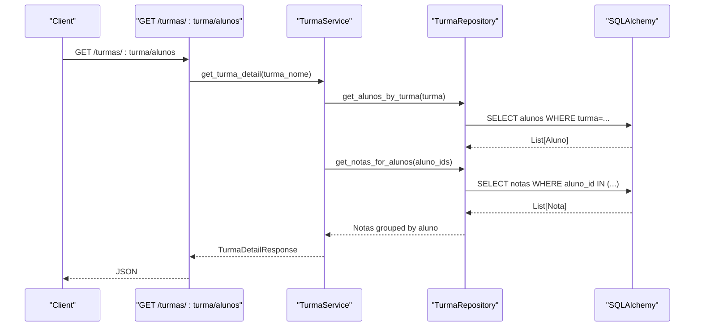

**Diagram sources**
- [turmas.py:24-39](file://backend/app/api/v1/turmas.py#L24-L39)
- [turma_service.py:48-102](file://backend/app/services/turma_service.py#L48-L102)

**Section sources**
- [turmas.py:24-39](file://backend/app/api/v1/turmas.py#L24-L39)
- [turma_service.py:48-102](file://backend/app/services/turma_service.py#L48-L102)

### Frontend Pages and User Interactions
- Student listing: Supports search, shift/class filters, and pagination; displays average and absences.
- Student form: Captures basic and personal data; masks phone numbers; handles create/update.
- Student detail: Shows grades table, personal info, and AI insights; allows PDF download.
- My Transcript: Self-service page for students to view and download transcripts; integrates with disciplinary and announcements.

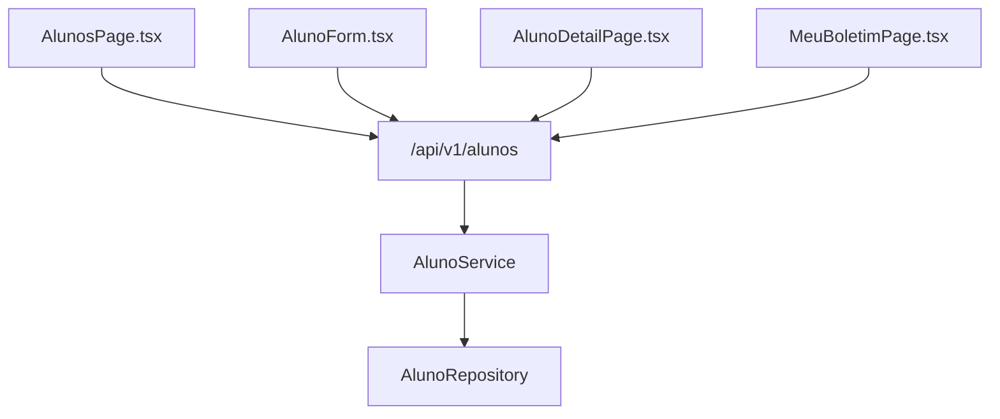

**Diagram sources**
- [AlunosPage.tsx:51-341](file://frontend/src/features/alunos/AlunosPage.tsx#L51-L341)
- [AlunoForm.tsx:14-293](file://frontend/src/features/alunos/AlunoForm.tsx#L14-L293)
- [AlunoDetailPage.tsx:95-485](file://frontend/src/features/alunos/AlunoDetailPage.tsx#L95-L485)
- [MeuBoletimPage.tsx:49-278](file://frontend/src/features/alunos/MeuBoletimPage.tsx#L49-L278)
- [alunos.py:18-148](file://backend/app/api/v1/alunos.py#L18-L148)

**Section sources**
- [AlunosPage.tsx:51-341](file://frontend/src/features/alunos/AlunosPage.tsx#L51-L341)
- [AlunoForm.tsx:14-293](file://frontend/src/features/alunos/AlunoForm.tsx#L14-L293)
- [AlunoDetailPage.tsx:95-485](file://frontend/src/features/alunos/AlunoDetailPage.tsx#L95-L485)
- [MeuBoletimPage.tsx:49-278](file://frontend/src/features/alunos/MeuBoletimPage.tsx#L49-L278)

## Dependency Analysis
- Multitenancy and academic year scoping: Implemented via TenantYearMixin applied to student, grades, and disciplinary models.
- Cohesion: Services encapsulate business logic; repositories isolate persistence; schemas validate inputs/outputs.
- Coupling: API depends on services; services depend on repositories; repositories depend on SQLAlchemy models.
- External integrations: PDF generation uses HTML rendering and PDF conversion; JWT-based authentication and role checks.

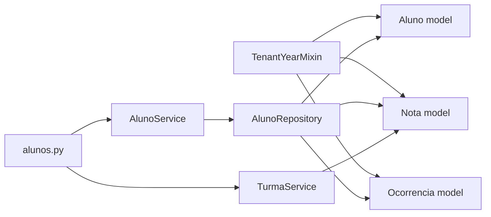

**Diagram sources**
- [base_mixin.py:4-22](file://backend/app/models/base_mixin.py#L4-L22)
- [aluno.py:8-36](file://backend/app/models/aluno.py#L8-L36)
- [nota.py:9-24](file://backend/app/models/nota.py#L9-L24)
- [ocorrencia.py:9-45](file://backend/app/models/ocorrencia.py#L9-L45)
- [alunos.py:12-148](file://backend/app/api/v1/alunos.py#L12-L148)
- [aluno_service.py:15-156](file://backend/app/services/aluno_service.py#L15-L156)
- [aluno_repository.py:8-105](file://backend/app/repositories/aluno_repository.py#L8-L105)
- [turma_service.py:16-128](file://backend/app/services/turma_service.py#L16-L128)

**Section sources**
- [base_mixin.py:4-22](file://backend/app/models/base_mixin.py#L4-L22)
- [aluno.py:8-36](file://backend/app/models/aluno.py#L8-L36)
- [nota.py:9-24](file://backend/app/models/nota.py#L9-L24)
- [ocorrencia.py:9-45](file://backend/app/models/ocorrencia.py#L9-L45)
- [alunos.py:12-148](file://backend/app/api/v1/alunos.py#L12-L148)
- [aluno_service.py:15-156](file://backend/app/services/aluno_service.py#L15-L156)
- [aluno_repository.py:8-105](file://backend/app/repositories/aluno_repository.py#L8-L105)
- [turma_service.py:16-128](file://backend/app/services/turma_service.py#L16-L128)

## Performance Considerations
- Pagination limits: API enforces maximum items per page to prevent heavy loads.
- Aggregation queries: Repository groups by student and joins with grades to compute averages and absences efficiently.
- Tenant/year scoping: Filters reduce result sets early in queries.
- Frontend caching: Queries are configured to refetch on focus/mount to keep data fresh without excessive polling.

[No sources needed since this section provides general guidance]

## Troubleshooting Guide
- Authentication errors: Ensure JWT bearer token is present and roles include permitted roles for the endpoint.
- Authorization errors: Student-only users can only access their own profile; cross-check claims and ID.
- Validation errors: Verify request payloads conform to AlunoCreate/AlunoUpdate schemas; server returns structured error details.
- Not found errors: Deleting or updating a non-existent student returns 404; confirm IDs and tenant/year context.
- PDF generation failures: Confirm the student exists and the tenant/year context is set; check server logs for rendering issues.

**Section sources**
- [alunos.py:46-51](file://backend/app/api/v1/alunos.py#L46-L51)
- [alunos.py:68-72](file://backend/app/api/v1/alunos.py#L68-L72)
- [alunos.py:95-97](file://backend/app/api/v1/alunos.py#L95-L97)
- [alunos.py:121-122](file://backend/app/api/v1/alunos.py#L121-L122)

## Conclusion
The Student Management System provides a robust, secure, and scalable foundation for student lifecycle management. It integrates academic tracking and disciplinary records while offering intuitive administrative and student-facing portals. The layered architecture, strong validation, and tenant/year scoping support reliable operations across diverse environments.

[No sources needed since this section summarizes without analyzing specific files]

## Appendices

### API Endpoints Summary
- GET /api/v1/alunos: List students with pagination and filters
- GET /api/v1/alunos/{id}: Retrieve student detail
- POST /api/v1/alunos: Create student
- PATCH /api/v1/alunos/{id}: Update student
- DELETE /api/v1/alunos/{id}: Delete student
- GET /api/v1/alunos/{id}/boletim/pdf: Download transcript PDF

**Section sources**
- [alunos.py:15-148](file://backend/app/api/v1/alunos.py#L15-L148)

### Data Validation Rules
- Required fields: Registration number, name, class, shift
- Optional fields: Personal data, contact, identifiers, previous year status
- Phone masking: Frontend applies formatting for Brazilian phone numbers

**Section sources**
- [aluno.py:59-80](file://backend/app/schemas/aluno.py#L59-L80)
- [AlunoForm.tsx:28-60](file://frontend/src/features/alunos/AlunoForm.tsx#L28-L60)

### Common Use Cases
- Student search: Use query parameter q to search by name, registration number, or class
- Bulk operations: Use class listing to export student rosters; integrate with external tools
- Data import/export: Use class endpoints to retrieve student lists; combine with grade data for reporting

**Section sources**
- [alunos.py:20-27](file://backend/app/api/v1/alunos.py#L20-L27)
- [turmas.py:24-39](file://backend/app/api/v1/turmas.py#L24-L39)