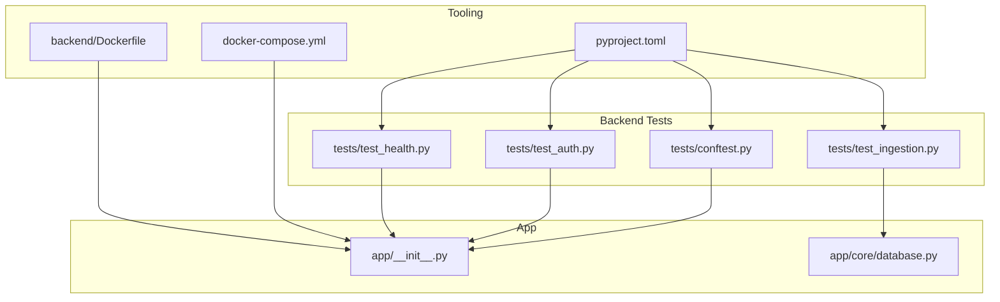
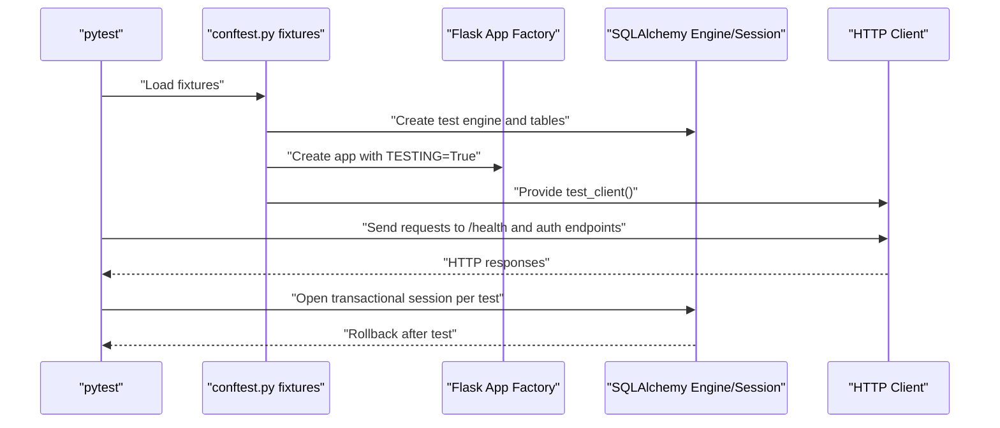
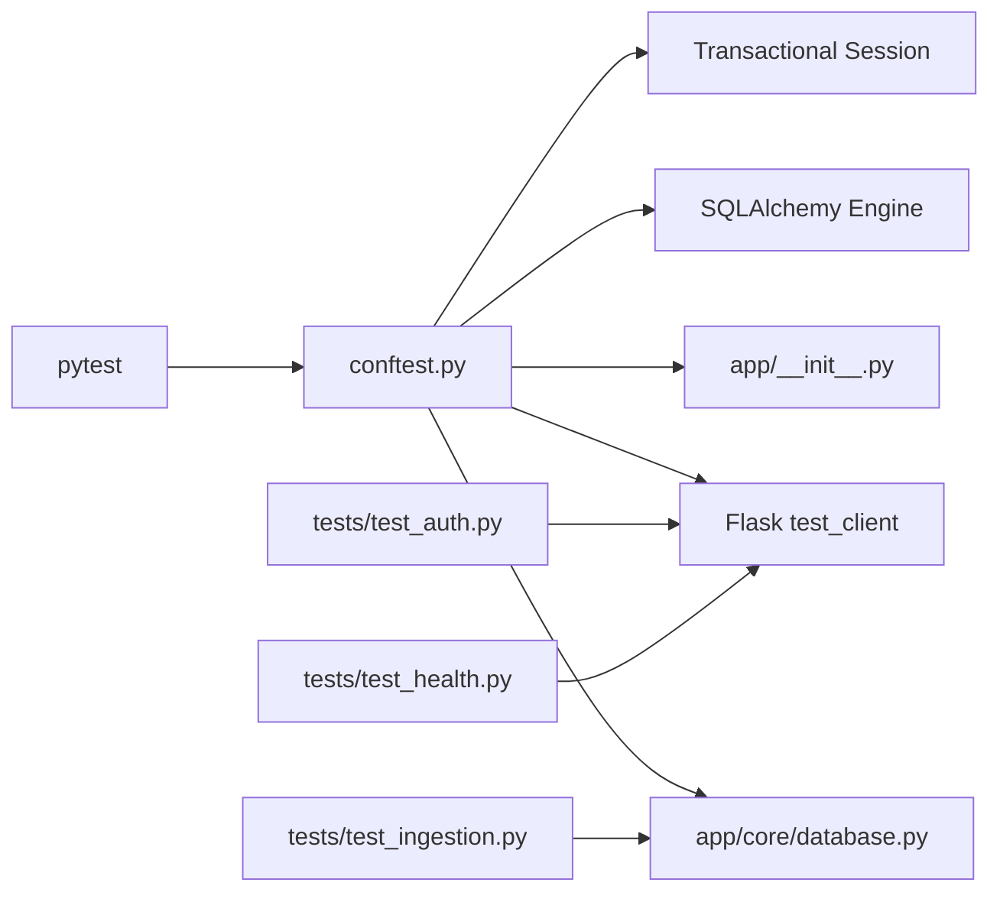

# Testing Strategy

<cite>
**Referenced Files in This Document**
- [conftest.py](file://backend/tests/conftest.py)
- [test_auth.py](file://backend/tests/test_auth.py)
- [test_health.py](file://backend/tests/test_health.py)
- [test_ingestion.py](file://backend/tests/test_ingestion.py)
- [pyproject.toml](file://backend/pyproject.toml)
- [app/__init__.py](file://backend/app/__init__.py)
- [database.py](file://backend/app/core/database.py)
- [docker-compose.yml](file://docker-compose.yml)
- [Dockerfile](file://backend/Dockerfile)
</cite>

## Table of Contents
1. [Introduction](#introduction)
2. [Project Structure](#project-structure)
3. [Core Components](#core-components)
4. [Architecture Overview](#architecture-overview)
5. [Detailed Component Analysis](#detailed-component-analysis)
6. [Dependency Analysis](#dependency-analysis)
7. [Performance Considerations](#performance-considerations)
8. [Troubleshooting Guide](#troubleshooting-guide)
9. [Conclusion](#conclusion)
10. [Appendices](#appendices)

## Introduction
This document defines the comprehensive testing strategy for quality assurance. It covers unit testing methodology, integration testing patterns, and test data management using the existing pytest-based framework. It also documents the testing framework setup, test execution workflows, and continuous integration practices aligned with the repository’s configuration. The content is structured to serve both QA engineers seeking conceptual guidance and developers implementing tests.

## Project Structure
The backend testing setup is organized under backend/tests with a shared pytest configuration and fixtures. The application factory initializes the Flask app, registers blueprints, and exposes health and root endpoints used by tests. The database layer supports multi-tenant filtering and transactional sessions, enabling deterministic unit and integration tests.

**Diagram sources**
- [conftest.py](file://backend/tests/conftest.py)
- [test_auth.py](file://backend/tests/test_auth.py)
- [test_health.py](file://backend/tests/test_health.py)
- [test_ingestion.py](file://backend/tests/test_ingestion.py)
- [pyproject.toml](file://backend/pyproject.toml)
- [app/__init__.py](file://backend/app/__init__.py)
- [database.py](file://backend/app/core/database.py)
- [docker-compose.yml](file://docker-compose.yml)
- [Dockerfile](file://backend/Dockerfile)

**Section sources**
- [pyproject.toml](file://backend/pyproject.toml)
- [conftest.py](file://backend/tests/conftest.py)
- [app/__init__.py](file://backend/app/__init__.py)

## Core Components
- Test framework and configuration: pytest is configured via pyproject.toml with test discovery and options.
- Test fixtures: database engine, Flask app, HTTP client, database session, and reusable domain objects (e.g., admin user) are provided by conftest.py.
- Application endpoints: health and root endpoints are exposed by the app factory and validated by tests.
- Database layer: SQLAlchemy engine and session management support transactional isolation and multi-tenant filtering for deterministic tests.

Key capabilities:
- Session-scoped database engine with SQLite for fast tests and automatic cleanup.
- Function-scoped app and client for isolated HTTP tests.
- Transaction-scoped database sessions with rollback to keep tests independent.
- Predefined admin user fixture and JWT auth header generation for protected endpoints.

**Section sources**
- [pyproject.toml](file://backend/pyproject.toml)
- [conftest.py](file://backend/tests/conftest.py)
- [app/__init__.py](file://backend/app/__init__.py)
- [database.py](file://backend/app/core/database.py)

## Architecture Overview
The testing architecture leverages pytest fixtures to provision a temporary database, a test Flask app, and HTTP client. Unit tests validate pure functions and services, while integration tests exercise API endpoints and database interactions. The database layer enforces multi-tenant filtering during ORM execution, ensuring tests remain isolated by tenant context.

**Diagram sources**
- [conftest.py](file://backend/tests/conftest.py)
- [app/__init__.py](file://backend/app/__init__.py)
- [database.py](file://backend/app/core/database.py)

## Detailed Component Analysis

### Unit Testing Methodology
Unit tests focus on pure functions and services without external dependencies. They rely on pytest fixtures to isolate state and assert deterministic behavior.

- Example: ingestion parsing and record application logic is tested independently of the web layer.
- Test data management: fixtures create minimal, reproducible datasets per test. Cleanup helpers remove test records after completion.

Practical guidance:
- Prefer small, single-purpose assertions.
- Use fixtures to avoid repeated setup/teardown.
- Keep unit tests free of network or filesystem dependencies.

**Section sources**
- [test_ingestion.py](file://backend/tests/test_ingestion.py)

### Integration Testing Patterns
Integration tests validate end-to-end flows across the HTTP API, authentication, and database persistence.

- Health endpoint validation ensures runtime readiness.
- Authentication tests verify login, password change, and protected resource access.
- File upload tests validate multipart form handling with generated tokens.

Patterns:
- Use the app factory and test client to simulate real requests.
- Leverage admin user and auth headers fixtures to access protected endpoints.
- Assert HTTP status codes and JSON payload shapes.

**Section sources**
- [test_health.py](file://backend/tests/test_health.py)
- [test_auth.py](file://backend/tests/test_auth.py)
- [conftest.py](file://backend/tests/conftest.py)

### Test Data Management
Test data is managed through fixtures and transactional sessions to guarantee isolation and repeatability.

- Session-scoped database engine with SQLite file and automatic cleanup.
- Function-scoped sessions wrapped in transactions with rollback after each test.
- Domain-specific fixtures (e.g., admin user) encapsulate common setup logic.

Best practices:
- Create minimal test records and clean them up deterministically.
- Use transactional sessions to avoid cross-test contamination.
- Avoid relying on persistent state between tests.

**Section sources**
- [conftest.py](file://backend/tests/conftest.py)
- [database.py](file://backend/app/core/database.py)

### Test Execution Workflows
The repository defines a pytest configuration that discovers tests under the tests directory and applies common options.

- Discovery: tests are located automatically under backend/tests.
- Options: quiet output and disabled warnings improve readability.
- Dev dependencies: pytest, pytest-cov, ruff, mypy, and httpx are available for local development and CI.

Execution tips:
- Run the full suite locally or in CI using the configured pytest settings.
- Use coverage reporting to track test completeness.
- Combine linting and type checking with pytest to enforce quality gates.

**Section sources**
- [pyproject.toml](file://backend/pyproject.toml)

### Continuous Integration Practices
While the repository does not include a GitHub Actions workflow file, the Docker Compose configuration and Dockerfile define the runtime environment suitable for CI pipelines.

- Docker Compose provisions PostgreSQL and Redis, ensuring external dependencies are available for integration tests.
- The backend Dockerfile installs Python dependencies and sets up the application entrypoint.
- CI can orchestrate test jobs using these services and run pytest against the backend container.

Recommended CI stages:
- Setup: install dependencies and start services with Docker Compose.
- Test: run pytest with coverage collection.
- Lint and type check: integrate ruff and mypy.
- Artifacts: publish coverage reports and test logs.

**Section sources**
- [docker-compose.yml](file://docker-compose.yml)
- [Dockerfile](file://backend/Dockerfile)
- [pyproject.toml](file://backend/pyproject.toml)

## Dependency Analysis
The testing stack depends on the application factory, database layer, and Flask testing utilities. Fixtures coordinate these dependencies to provide isolated, repeatable tests.

**Diagram sources**
- [conftest.py](file://backend/tests/conftest.py)
- [app/__init__.py](file://backend/app/__init__.py)
- [database.py](file://backend/app/core/database.py)
- [test_auth.py](file://backend/tests/test_auth.py)
- [test_health.py](file://backend/tests/test_health.py)
- [test_ingestion.py](file://backend/tests/test_ingestion.py)

**Section sources**
- [conftest.py](file://backend/tests/conftest.py)
- [app/__init__.py](file://backend/app/__init__.py)
- [database.py](file://backend/app/core/database.py)

## Performance Considerations
- Use SQLite in-memory or file-backed engines for unit and integration tests to minimize overhead.
- Keep fixtures minimal and reuse where possible to reduce startup time.
- Prefer transactional sessions to avoid expensive database resets between tests.
- Limit external service calls in tests; stub or mock when feasible.

## Troubleshooting Guide
Common issues and resolutions:
- Database contention or stale state: ensure each test uses a transactional session and relies on fixtures for setup.
- Authentication failures: verify the auth headers fixture generates a valid token and that the login endpoint responds as expected.
- Health check failures: confirm the app factory registers the /health endpoint and that the test client targets the correct route.
- Fixture scoping problems: align fixture scopes with test needs (session vs function) to avoid unintended sharing.

**Section sources**
- [conftest.py](file://backend/tests/conftest.py)
- [test_health.py](file://backend/tests/test_health.py)
- [test_auth.py](file://backend/tests/test_auth.py)

## Conclusion
The repository establishes a solid foundation for quality assurance using pytest, fixtures, and a clear separation between unit and integration concerns. By leveraging transactional sessions, deterministic fixtures, and the Flask test client, teams can implement robust tests that validate both individual units and end-to-end flows. Extending this with CI pipelines that provision dependencies via Docker Compose and enforce linting/type checks will create a complete quality gate for production releases.

## Appendices

### Practical Examples Index
- Unit test example: ingestion record parsing and application logic.
  - [test_ingestion.py](file://backend/tests/test_ingestion.py)
- Integration test example: health endpoint and authentication flows.
  - [test_health.py](file://backend/tests/test_health.py)
  - [test_auth.py](file://backend/tests/test_auth.py)
- Test fixtures and database setup.
  - [conftest.py](file://backend/tests/conftest.py)
- Framework configuration and discovery.
  - [pyproject.toml](file://backend/pyproject.toml)