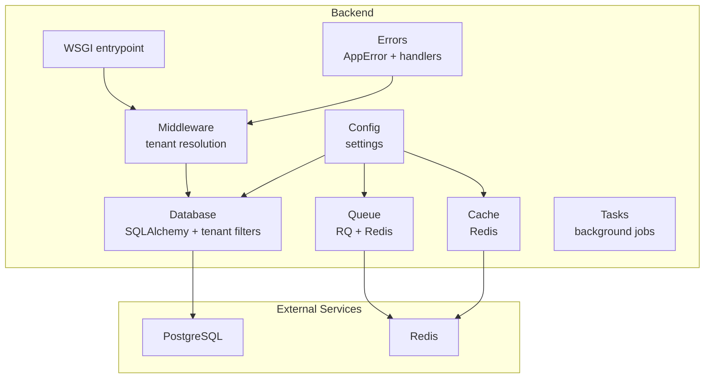
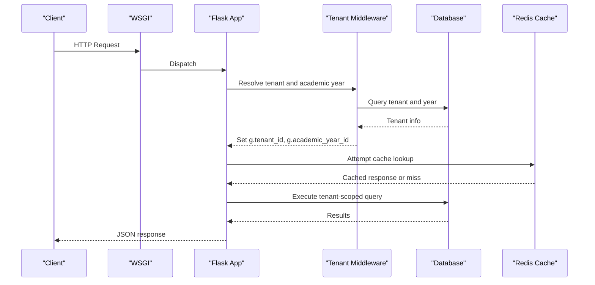
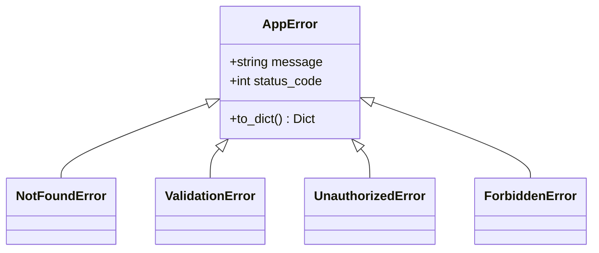
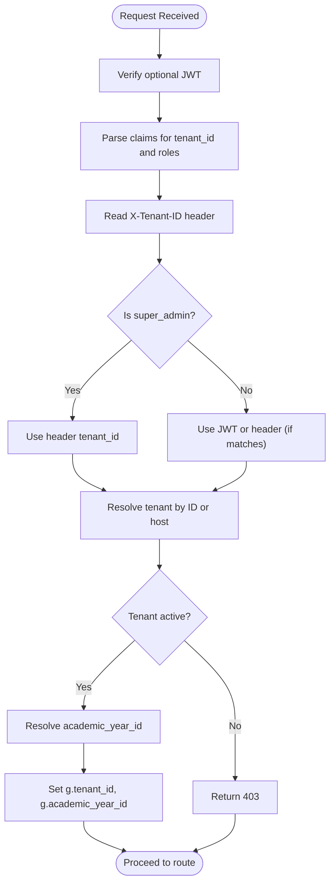
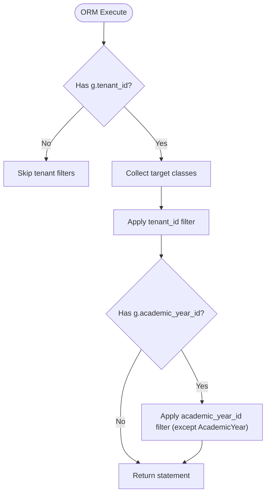
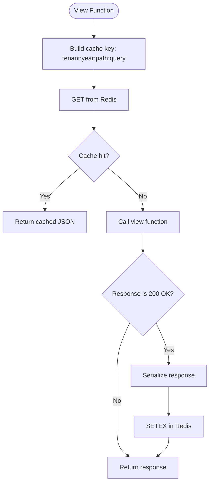
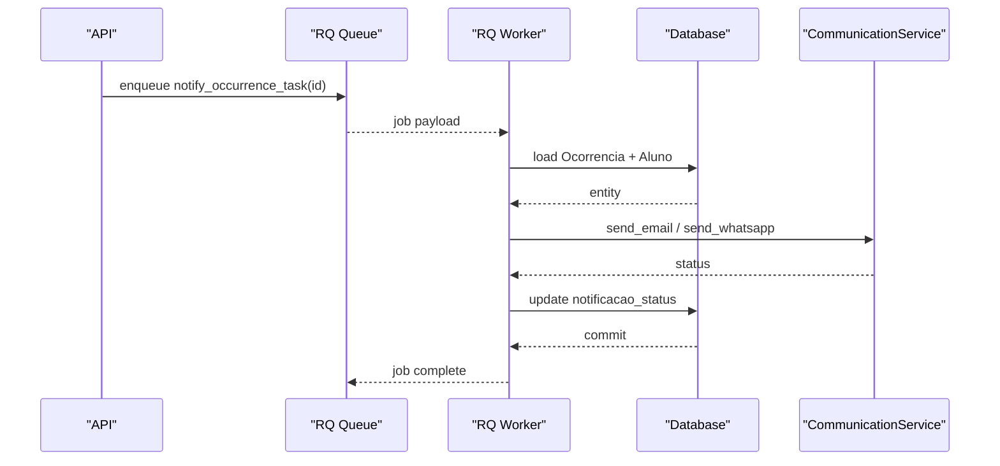
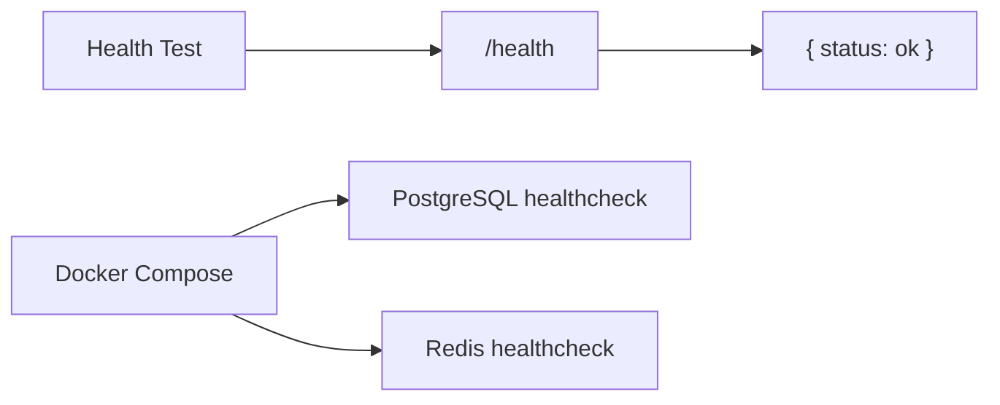
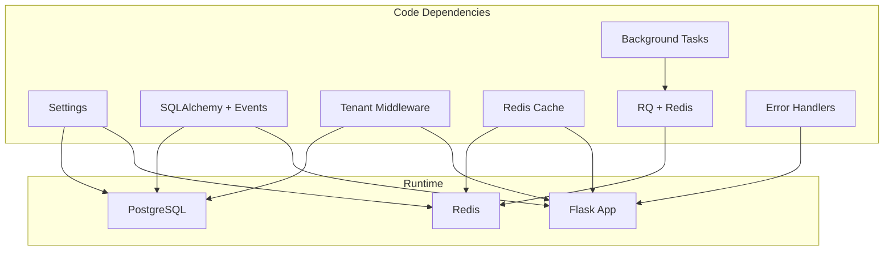

# Troubleshooting & Maintenance

<cite>
**Referenced Files in This Document**
- [backend/app/core/exceptions.py](file://backend/app/core/exceptions.py)
- [backend/app/core/handlers.py](file://backend/app/core/handlers.py)
- [backend/app/core/middleware.py](file://backend/app/core/middleware.py)
- [backend/app/core/cache.py](file://backend/app/core/cache.py)
- [backend/app/core/database.py](file://backend/app/core/database.py)
- [backend/app/core/queue.py](file://backend/app/core/queue.py)
- [backend/app/core/tasks.py](file://backend/app/core/tasks.py)
- [backend/app/core/config.py](file://backend/app/core/config.py)
- [backend/app/wsgi.py](file://backend/app/wsgi.py)
- [backend/tests/test_health.py](file://backend/tests/test_health.py)
- [backend/pyproject.toml](file://backend/pyproject.toml)
- [docker-compose.yml](file://docker-compose.yml)
</cite>

## Table of Contents
1. [Introduction](#introduction)
2. [Project Structure](#project-structure)
3. [Core Components](#core-components)
4. [Architecture Overview](#architecture-overview)
5. [Detailed Component Analysis](#detailed-component-analysis)
6. [Dependency Analysis](#dependency-analysis)
7. [Performance Considerations](#performance-considerations)
8. [Troubleshooting Guide](#troubleshooting-guide)
9. [Conclusion](#conclusion)
10. [Appendices](#appendices)

## Introduction
This document provides operational support and maintenance guidance for the ColaboraEdu platform. It focuses on diagnosing common issues, resolving problems efficiently, optimizing performance, and establishing robust monitoring and maintenance procedures. The content aligns with the codebase’s terminology, including error logs, performance metrics, system health checks, and multitenant context handling.

## Project Structure
The backend is a Flask application with modular components for configuration, database, caching, queues, and tenant-aware middleware. Operational concerns span error handling, health checks, caching, background tasks, and containerized deployment with healthchecks.

**Diagram sources**
- [backend/app/core/config.py:9-60](file://backend/app/core/config.py#L9-L60)
- [backend/app/core/database.py:36-130](file://backend/app/core/database.py#L36-L130)
- [backend/app/core/middleware.py:6-125](file://backend/app/core/middleware.py#L6-L125)
- [backend/app/core/cache.py:1-65](file://backend/app/core/cache.py#L1-L65)
- [backend/app/core/queue.py:1-12](file://backend/app/core/queue.py#L1-L12)
- [backend/app/core/tasks.py:1-78](file://backend/app/core/tasks.py#L1-L78)
- [backend/app/core/handlers.py:1-33](file://backend/app/core/handlers.py#L1-L33)
- [backend/app/wsgi.py:1-5](file://backend/app/wsgi.py#L1-L5)

**Section sources**
- [backend/app/core/config.py:9-60](file://backend/app/core/config.py#L9-L60)
- [backend/app/core/database.py:36-130](file://backend/app/core/database.py#L36-L130)
- [backend/app/core/middleware.py:6-125](file://backend/app/core/middleware.py#L6-L125)
- [backend/app/core/cache.py:1-65](file://backend/app/core/cache.py#L1-L65)
- [backend/app/core/queue.py:1-12](file://backend/app/core/queue.py#L1-L12)
- [backend/app/core/tasks.py:1-78](file://backend/app/core/tasks.py#L1-L78)
- [backend/app/core/handlers.py:1-33](file://backend/app/core/handlers.py#L1-L33)
- [backend/app/wsgi.py:1-5](file://backend/app/wsgi.py#L1-L5)

## Core Components
- Configuration and secrets management with environment-specific validation.
- Database layer with automatic tenant and academic-year scoping.
- Tenant-aware middleware for context resolution and enforcement.
- Centralized error handling with structured JSON responses.
- Redis-backed caching with tenant-aware keys and invalidation.
- Background job queue using RQ with Redis transport.
- Health-check testing and containerized deployment with healthchecks.

**Section sources**
- [backend/app/core/config.py:9-60](file://backend/app/core/config.py#L9-L60)
- [backend/app/core/database.py:36-130](file://backend/app/core/database.py#L36-L130)
- [backend/app/core/middleware.py:6-125](file://backend/app/core/middleware.py#L6-L125)
- [backend/app/core/handlers.py:1-33](file://backend/app/core/handlers.py#L1-L33)
- [backend/app/core/cache.py:1-65](file://backend/app/core/cache.py#L1-L65)
- [backend/app/core/queue.py:1-12](file://backend/app/core/queue.py#L1-L12)
- [backend/tests/test_health.py:1-10](file://backend/tests/test_health.py#L1-L10)

## Architecture Overview
The backend initializes configuration, registers error handlers, and applies tenant context middleware to all requests. Database queries are automatically scoped to the current tenant and academic year. Caching and background tasks rely on Redis connectivity. The WSGI entrypoint exposes the Flask app for production.

**Diagram sources**
- [backend/app/wsgi.py:1-5](file://backend/app/wsgi.py#L1-L5)
- [backend/app/core/middleware.py:6-125](file://backend/app/core/middleware.py#L6-L125)
- [backend/app/core/database.py:36-130](file://backend/app/core/database.py#L36-L130)
- [backend/app/core/cache.py:1-65](file://backend/app/core/cache.py#L1-L65)

## Detailed Component Analysis

### Error Handling and Diagnostics
- Centralized error classes encapsulate status codes and structured payloads.
- Global error handlers convert exceptions to JSON responses with consistent shapes.
- Validation errors are normalized for client consumption.

**Diagram sources**
- [backend/app/core/exceptions.py:3-34](file://backend/app/core/exceptions.py#L3-L34)

**Section sources**
- [backend/app/core/exceptions.py:3-34](file://backend/app/core/exceptions.py#L3-L34)
- [backend/app/core/handlers.py:5-33](file://backend/app/core/handlers.py#L5-L33)

### Tenant Resolution and Multitenancy
- Resolves tenant and academic year from JWT claims, headers, or host.
- Enforces tenant activation and academic year defaults.
- Stores resolved context in Flask’s global object for downstream use.

**Diagram sources**
- [backend/app/core/middleware.py:6-125](file://backend/app/core/middleware.py#L6-L125)

**Section sources**
- [backend/app/core/middleware.py:6-125](file://backend/app/core/middleware.py#L6-L125)

### Database Layer and Automatic Scoping
- Uses SQLAlchemy with a session factory and scoped sessions.
- Registers an ORM execution event to inject tenant_id and academic_year_id filters for select statements.
- Skips filtering for specific models (e.g., AcademicYear) to allow listing and switching.

**Diagram sources**
- [backend/app/core/database.py:39-102](file://backend/app/core/database.py#L39-L102)

**Section sources**
- [backend/app/core/database.py:36-130](file://backend/app/core/database.py#L36-L130)

### Caching Strategy
- Decorator caches API responses in Redis keyed by tenant and academic year.
- Ignores cache misses or failures gracefully.
- Provides a tenant-scoped invalidation utility.

**Diagram sources**
- [backend/app/core/cache.py:10-56](file://backend/app/core/cache.py#L10-L56)

**Section sources**
- [backend/app/core/cache.py:1-65](file://backend/app/core/cache.py#L1-L65)

### Background Jobs and Queue
- Uses Redis as the RQ broker.
- Defines a background task to send notifications for student occurrences.
- Task updates occurrence status based on delivery outcomes.

**Diagram sources**
- [backend/app/core/queue.py:1-12](file://backend/app/core/queue.py#L1-L12)
- [backend/app/core/tasks.py:6-78](file://backend/app/core/tasks.py#L6-L78)

**Section sources**
- [backend/app/core/queue.py:1-12](file://backend/app/core/queue.py#L1-L12)
- [backend/app/core/tasks.py:1-78](file://backend/app/core/tasks.py#L1-L78)

### Health Checks and Monitoring
- Tests verify a /health endpoint returns a successful JSON response.
- Docker Compose defines healthchecks for PostgreSQL and Redis.
- Production WSGI entrypoint exposes the Flask app.

**Diagram sources**
- [backend/tests/test_health.py:4-10](file://backend/tests/test_health.py#L4-L10)
- [docker-compose.yml:14-18](file://docker-compose.yml#L14-L18)
- [docker-compose.yml:74-78](file://docker-compose.yml#L74-L78)

**Section sources**
- [backend/tests/test_health.py:1-10](file://backend/tests/test_health.py#L1-L10)
- [docker-compose.yml:14-18](file://docker-compose.yml#L14-L18)
- [docker-compose.yml:74-78](file://docker-compose.yml#L74-L78)
- [backend/app/wsgi.py:1-5](file://backend/app/wsgi.py#L1-L5)

## Dependency Analysis
Operational dependencies include external systems and internal modules. The backend relies on PostgreSQL for persistence and Redis for caching and queuing. Container orchestration defines healthchecks and startup order.

**Diagram sources**
- [backend/pyproject.toml:15-41](file://backend/pyproject.toml#L15-L41)
- [docker-compose.yml:20-64](file://docker-compose.yml#L20-L64)
- [backend/app/core/config.py:13-14](file://backend/app/core/config.py#L13-L14)
- [backend/app/core/config.py](file://backend/app/core/config.py#L14)

**Section sources**
- [backend/pyproject.toml:15-41](file://backend/pyproject.toml#L15-L41)
- [docker-compose.yml:20-64](file://docker-compose.yml#L20-L64)

## Performance Considerations
- Caching: Use the cache decorator to reduce repeated compute and DB load. Tune timeouts per endpoint and monitor cache hit rates. Invalidate tenant-wide caches after bulk updates.
- Database: Ensure tenant and academic-year filters are applied consistently. Avoid N+1 queries by eager-loading related entities. Use pagination for large lists.
- Queues: Scale workers horizontally; monitor queue length and job latency. Retry failed jobs with exponential backoff.
- Logging: Configure log level appropriately for environments. Use structured logging for observability and correlation IDs.
- Health: Leverage container healthchecks to auto-heal unhealthy instances. Monitor external service readiness before startup.

[No sources needed since this section provides general guidance]

## Troubleshooting Guide

### Common Issues and Resolution Strategies
- Tenant not identified or access disabled
  - Symptoms: 404 “Inquilino não identificado ou inválido” or 403 “Acesso desativado para esta instituição”
  - Causes: Missing or invalid JWT, incorrect X-Tenant-ID header, inactive tenant
  - Actions:
    - Verify JWT presence and claims (tenant_id, roles)
    - Confirm X-Tenant-ID header matches JWT for non-super-admins
    - Check tenant activation status and host resolution logic
- Validation errors
  - Symptoms: 422 with field-level details
  - Causes: Pydantic validation failure
  - Actions:
    - Inspect returned details array for field names and messages
    - Fix payload according to schema expectations
- Internal server errors
  - Symptoms: 500 “Erro interno do servidor”
  - Causes: Unhandled exceptions in request lifecycle
  - Actions:
    - Review server logs for stack traces
    - Ensure error handlers are registered and logging is configured
- Cache unavailability
  - Symptoms: Cache misses or degraded performance
  - Causes: Redis downtime or network issues
  - Actions:
    - Verify Redis healthcheck and connectivity
    - Confirm cache key composition and tenant/year context
    - Manually invalidate tenant cache if stale data is suspected
- Background job failures
  - Symptoms: Occurrence notifications stuck or partially sent
  - Causes: Missing recipient contact info, external service outages
  - Actions:
    - Inspect task logs and job queue status
    - Requeue failed jobs and verify CommunicationService endpoints
    - Update occurrence status accordingly

**Section sources**
- [backend/app/core/middleware.py:68-72](file://backend/app/core/middleware.py#L68-L72)
- [backend/app/core/handlers.py:13-23](file://backend/app/core/handlers.py#L13-L23)
- [backend/app/core/handlers.py:29-32](file://backend/app/core/handlers.py#L29-L32)
- [backend/app/core/cache.py:29-36](file://backend/app/core/cache.py#L29-L36)
- [backend/app/core/tasks.py:12-19](file://backend/app/core/tasks.py#L12-L19)

### Diagnostic Procedures
- Verify tenant context
  - Check request headers (X-Tenant-ID, X-Academic-Year-ID) and JWT claims
  - Confirm middleware resolution and global context availability
- Test health endpoints
  - Run health check test to validate server readiness
  - Confirm container healthchecks for Postgres and Redis
- Inspect logs
  - Adjust LOG_LEVEL in settings
  - Search for error patterns and timestamps correlating with incidents
- Validate configuration
  - Ensure environment-specific secrets meet production requirements
  - Confirm database and Redis URLs are reachable

**Section sources**
- [backend/app/core/middleware.py:6-125](file://backend/app/core/middleware.py#L6-L125)
- [backend/tests/test_health.py:4-10](file://backend/tests/test_health.py#L4-L10)
- [backend/app/core/config.py:44-51](file://backend/app/core/config.py#L44-L51)
- [docker-compose.yml:14-18](file://docker-compose.yml#L14-L18)
- [docker-compose.yml:74-78](file://docker-compose.yml#L74-L78)

### Performance Tuning Examples
- Enable caching for frequently accessed endpoints
  - Wrap views with the cache decorator and tune timeout
  - Monitor cache hit ratio and adjust TTLs
- Optimize database queries
  - Use tenant-scoped filters implicitly via middleware
  - Paginate large result sets and avoid N+1 queries
- Scale background processing
  - Increase worker replicas
  - Monitor queue backlog and job duration percentiles
- Improve error visibility
  - Log detailed context for exceptions
  - Correlate logs with request IDs for tracing

**Section sources**
- [backend/app/core/cache.py:10-56](file://backend/app/core/cache.py#L10-L56)
- [backend/app/core/database.py:39-102](file://backend/app/core/database.py#L39-L102)
- [backend/app/core/queue.py:1-12](file://backend/app/core/queue.py#L1-L12)

### Preventive Maintenance Strategies
- Regular cache audits
  - Periodically invalidate tenant caches after bulk data changes
  - Monitor and alert on cache miss spikes
- Database maintenance
  - Schedule vacuum/analyze for large tables
  - Review slow query logs and add indexes as needed
- Queue hygiene
  - Archive or purge old failed jobs
  - Monitor queue depth and redelivery limits
- Security hardening
  - Rotate SECRET_KEY and JWT_SECRET_KEY regularly
  - Enforce minimum key lengths in production
- Environment readiness
  - Validate healthchecks before traffic switchovers
  - Use staging deploys to catch configuration drift

**Section sources**
- [backend/app/core/cache.py:58-65](file://backend/app/core/cache.py#L58-L65)
- [backend/app/core/config.py:44-51](file://backend/app/core/config.py#L44-L51)
- [docker-compose.yml:37-41](file://docker-compose.yml#L37-L41)
- [docker-compose.yml:58-62](file://docker-compose.yml#L58-L62)

## Conclusion
Effective operations for ColaboraEdu require disciplined handling of multitenant context, robust error reporting, resilient caching, and reliable background processing. By following the diagnostic procedures, performance tuning steps, and preventive maintenance strategies outlined here, administrators can maintain system stability, improve responsiveness, and accelerate incident resolution.

[No sources needed since this section summarizes without analyzing specific files]

## Appendices

### Practical Example: Diagnosing a Tenant Resolution Issue
- Steps:
  - Confirm JWT presence and claims (tenant_id, roles)
  - Verify X-Tenant-ID header value and permissions
  - Check middleware logs for resolution path taken
  - Validate tenant activation and host mapping
- Outcome:
  - Correct header vs. JWT mismatch for non-super-admins
  - Resolution: Align header with JWT or escalate to super_admin

**Section sources**
- [backend/app/core/middleware.py:23-46](file://backend/app/core/middleware.py#L23-L46)
- [backend/app/core/middleware.py:51-72](file://backend/app/core/middleware.py#L51-L72)

### Practical Example: Tuning Cache Performance
- Steps:
  - Identify high-latency endpoints and enable caching
  - Set appropriate TTLs and monitor hit rate
  - Invalidate tenant cache after bulk updates
- Outcome:
  - Reduced DB load and improved response times

**Section sources**
- [backend/app/core/cache.py:10-56](file://backend/app/core/cache.py#L10-L56)
- [backend/app/core/cache.py:58-65](file://backend/app/core/cache.py#L58-L65)

### Practical Example: Investigating Background Job Failures
- Steps:
  - Inspect worker logs for task execution
  - Verify recipient contact info and external service status
  - Requeue failed jobs and update occurrence status
- Outcome:
  - Notifications retried and occurrence status updated

**Section sources**
- [backend/app/core/tasks.py:12-19](file://backend/app/core/tasks.py#L12-L19)
- [backend/app/core/tasks.py:66-77](file://backend/app/core/tasks.py#L66-L77)